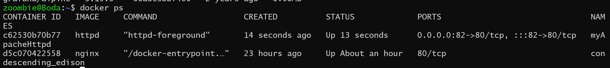
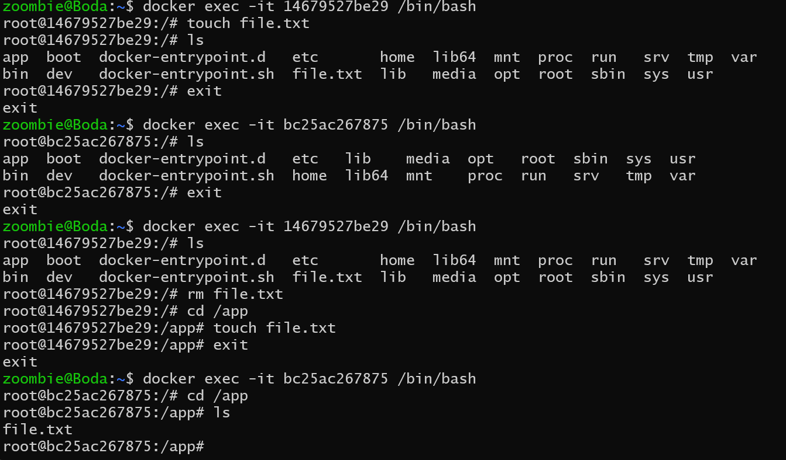

## Task_1

**problem statement:**
make a apache httpd container, run it in the background, map host port 82 to the running container, view container logs after it runs.

```bash
# 1- run image httpd
docker run httpd
# 2- use`-d` to run it in the background, map host port 82 to the running container(80)
docker run -p -d --name myApacheHttpd  82:80 httpd
# 3- docker ps to see all containers that are running
```



```bash
# 4- When I talk to localhost:80
```


## Task_2

**problem statement:**
create two containers that share a named volume called vol1, start two containers from the nginx image and map the volume to the /app on them both, create a file from the first container and make sure you can read it from the other container.

```bash
# first create volume that name vol1
docker create volume vol1

# Run a container named container_2 and mount it at this path
docker run --name=container_2 -v vol1:/app nginx

# Run a container named container_1 and mount it at this path
docker run --name=container_1 -v vol1:/app nginx

# Enter one of them
docker exec -it container_1 /bin/bash

# Create file.txt in /app
touch /app/file.txt

# Open another container
docker exec -it container_2 /bin/bash
# To access file.txt that was created in container_1
ls /app
```



## Task_3

**problem statement:**
Write a docker file with a run command to create a file, build the image and run two containers from it, make them in the same custom network.

```bash
# Dockerfile
FROM ubuntu:latest
RUN touch file.txt

# Build this Dockerfile to create an image.
docker build -t  my_own_image .

# create network
docker network create my_cust_network

# create two containers on same network
docker run --network=my_cust_network my_own_image
docker run --network=my_cust_network my_own_image
```

## Task_4

Make a dockerfile for this app.py build and run it remove the image you just build, and then write a docker compose file containing two services, one should be for your app.py and one for nginx, use version 2 of docker compose file and modify your python code to print the IP of the machine with a hostname equal to the nginx container name.
