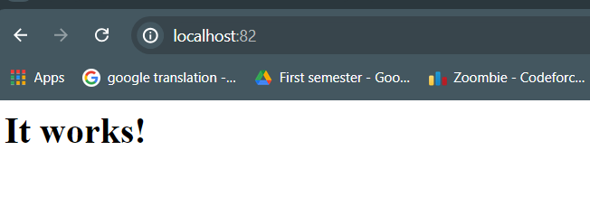

## Task_1

**problem statement:**
make a apache httpd container, run it in the background, map host port 82 to the running container, view container logs after it runs.

```bash
# 1- run image httpd
docker run httpd
# 2- use`-d` to run it in the background, map host port 82 to the running container(80)
docker run -p -d --name myApacheHttpd  82:80 httpd
# 3- docker ps to see all containers that are running
```


```bash
# 4- When I talk to localhost:80
```



## Task_2

**problem statement:**
create two containers that share a named volume called vol1, start two containers from the nginx image and map the volume to the /app on them both, create a file from the first container and make sure you can read it from the other container.

```bash
# first create volume that name vol1
docker create volume vol1

# Run a container named container_2 and mount it at this path
docker run --name=container_2 -v vol1:/app nginx

# Run a container named container_1 and mount it at this path
docker run --name=container_1 -v vol1:/app nginx

# Enter one of them
docker exec -it container_1 /bin/bash

# Create file.txt in /app
touch /app/file.txt

# Open another container
docker exec -it container_2 /bin/bash
# To access file.txt that was created in container_1
ls /app
```


