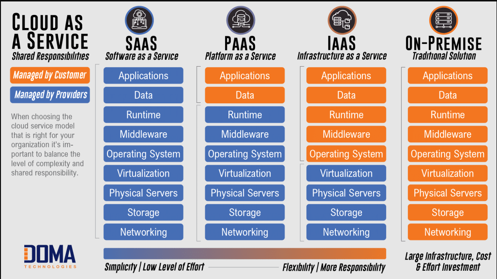
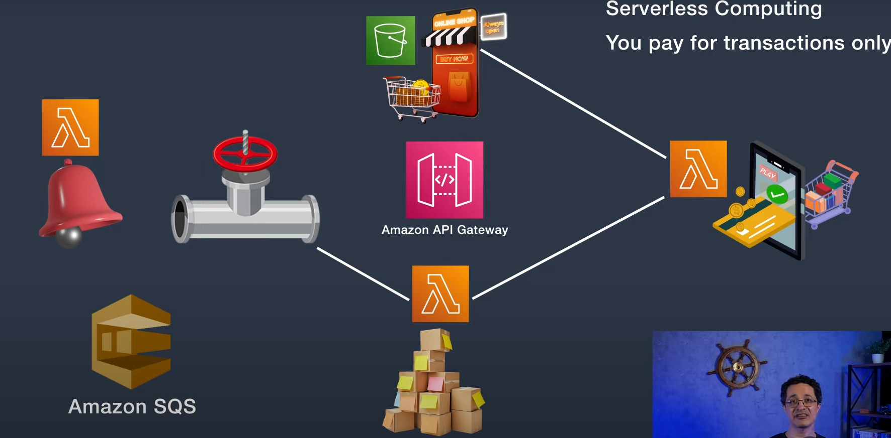
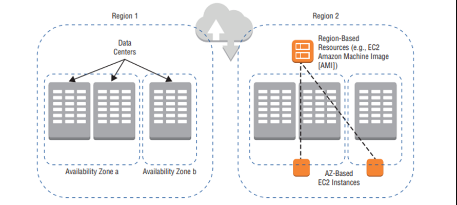

## Six benefits of using the cloud 

- `Trade capital expense for variable expense`

  Instead of making large upfront investments in hardware and infrastructure (capital expenses), you pay only for the resources you actually use (variable expenses). This reduces financial risk and allows you to allocate funds more flexibly.

- `Benefits from massive economies of scale`
  
  Cloud providers operate at a large scale, which allows them to reduce costs and pass on the savings to customers. You gain access to the same infrastructure and services used by large companies, often at a fraction of the cost.

- `Stop guessing capacity`
  
  With the cloud, you don’t need to estimate your capacity requirements ahead of time. You can scale resources up or down based on demand, ensuring you have the right capacity without overprovisioning or underprovisioning.

- `Increased speed and agility`
  
  The cloud enables faster deployment of resources and applications, reducing the time needed to bring new products or services to market. It also provides tools and platforms that accelerate development and innovation.

- `Stop spending money running and maintaining data centers`
  
  You no longer need to invest in and manage physical data centers, including costs associated with power, cooling, and maintenance. The cloud provider handles all of these, allowing you to focus on your core business activities.

- `Go global in minutes`
  
  Cloud services are available in multiple regions worldwide. You can quickly deploy your applications and services across these regions, providing a global reach and ensuring low latency and high availability for your users, no matter where they are located.
  
## Virtualization

`Virtualization` is a technology that allows you to create multiple simulated environments or "virtual" resources from a single, physical hardware system. It involves using software to create an abstraction layer over physical hardware, enabling the creation of virtual machines (VMs) or virtual resources like storage, networks, and servers.

## Cloud models

- `Private Cloud`
  
  A private cloud is a cloud environment that is exclusively used by a single organization. It can be hosted on-premises in the organization's own data center or by a third-party provider.

- `Public Cloud`
  
   A public cloud is a cloud environment where resources and services are made available to multiple organizations (or the general public) over the internet by a third-party provider (such as AWS, Microsoft Azure, or Google Cloud).

- `Hybrid Cloud`
  
  A hybrid cloud combines elements of both private and public clouds, allowing data and applications to be shared between them. This provides greater flexibility and optimization by balancing workloads across both environments.

**`VPN`**

VPN is more like a secure bridge between the user's device and the internet, rather than an intermediary between two users.

## Cloud Service Model

- Software as a Service (`SaaS`)
  
  SaaS provides software applications over the internet on a subscription basis. The software is hosted and maintained by a third-party provider and accessed through a web browser or application.

- Platform as a Service (`PaaS`)
  
  PaaS provides a platform allowing developers to build, deploy, and manage applications without dealing with the underlying infrastructure. It offers a complete development and deployment environment.

- Infrastructure as a Service (`IaaS`)
  
   IaaS provides virtualized computing resources over the internet. It offers fundamental infrastructure components such as virtual machines, storage, and networks on a pay-as-you-go basis.

## AWS Desgin Principles

1.  **Operational Excellence** 
   
    - `use automation whenever possible`
      
      Leverage automated tools and scripts to reduce manual effort, minimize errors, and enhance efficiency across operations.

    - `Monitor and track everything`
      
      Implement comprehensive monitoring and logging systems to ensure visibility into system performance, security, and potential issues.

    - `Continuous improvement` 
      
      Regularly assess and refine processes to enhance operational effectiveness and achieve better outcomes over time.

2. **Security**
   
   - `Use least privilege access`
     
     Grant users and systems only the permissions necessary to perform their tasks, reducing the risk of unauthorized access.

   - `Use Multifactor Authentication(MFA)`
     
     Require multiple forms of verification to strengthen security by ensuring that users are who they claim to be.

   - `Use IAM(Identity & Access Management)`
     
     Implement policies and tools to manage and control user identities, access rights, and privileges within your systems.

   - `Protect data in-transit and at rest`
     
     Encrypt data both while it is being transferred across networks and when stored to prevent unauthorized access or tampering.

   - `Monitor and audit continuosly`
     
     Regularly review and analyze security logs and activities to detect and respond to potential threats in real time.

3. **Reliability**
   
   - `Implement Disaster Recovery techniques`
     
     Establish processes and tools to restore critical systems and data in case of failure or disaster.
     
   - `Make use of Autoscaling`
     
     Automatically adjust resources to meet changing demands, ensuring consistent performance and cost-efficiency.

   - `Test and validate regularly`
     
     Conduct routine checks and simulations to ensure systems function as expected under different scenarios and recover quickly after failures.
  
4. **Performance Efficiency**
   
   - `Choose the right tool for the job`
     
     Select the most suitable technologies and tools to match the specific needs of your application or workload to ensure optimal performance.
     
   - `Optimzie resource utilization and implement scaling`
     
     Efficiently manage and allocate resources while implementing dynamic scaling techniques to handle varying workloads without over-provisioning.
     
   - `Use performance benchmarks`
     
     Regularly measure and evaluate system performance against established benchmarks to identify bottlenecks and areas for improvement.

5. **Cost Optimization**
   
   - `Use the right instance` (e.g. EC2 instances)

      Select the most suitable instance types (e.g., EC2 instances) based on workload requirements to avoid over-provisioning and reduce costs.
  
   - `Use AWS cost saving plans`(e.g. Reserved Instances, Spot instances, etc.)
      Take advantage of cost-saving options such as Reserved Instances, Spot Instances, or Savings Plans to lower expenses by committing to specific usage levels.

   - `Monitor and track costs`

      Regularly review and analyze usage patterns and expenses using AWS cost management tools to identify opportunities for further cost reduction
  
6. **Sustainability**
   
   - User environment-friendly resources
  
      Choose resources with lower environmental impact, such as energy-efficient hardware or renewable energy-powered servers.

   - Terminate any unused(idle) resources

      Regularly monitor and shut down any resources that are not in use to minimize energy consumption and reduce costs.
## Scaling Methods

1. **Vertical Scaling (Scaling Up/Down)**
   
   - `Definition`: Increasing or decreasing the capacity of a single machine (server or node) by adding more resources like CPU, RAM, or storage.
   - `Benefits`: Simple to implement, no changes to the application code, and can offer better performance for single-threaded applications.
   - `Drawbacks`: Limited by the physical capacity of a machine, potential downtime during upgrades, and does not provide redundancy or high availability.

2. **Horizontal Scaling (Scaling Out/In)**
   
   - `Definition`: Adding or removing machines (servers or nodes) to or from a system or cluster.
   - `Benefits`: Supports high availability and redundancy, can handle large-scale workloads, and is more fault-tolerant.
   - `Drawbacks`: More complex to manage and may require changes in the application architecture to handle distributed computing.

  
    
Let's discuss two cases of horizontal scaling.

    1. Horizontal Scaling for a Stateless Application
    
         - `Definition`: A stateless application does not maintain any client-specific state between requests. Each request is independent and can be handled by any instance of the application.
         
         - `Benefits`: Stateless applications are easier to scale horizontally because there is no need to worry about data consistency or session persistence across instances.
  
    2. Horizontal Scaling for a Stateful Application
         
         - `Definition`: A stateful application maintains client-specific state (like sessions, data, or user information) that needs to persist across multiple requests. This state might be stored in a database or a persistent storage(like `Amazon ElasticCached`).
         - `Challenges`: Stateful scaling is more complex due to the need for data consistency, potential data replication issues, and the requirement for managing persistent storage.

    `Tip` Amazon ElasticCache ---> is a managed service for Redis and MemCached

    **An example that specifies the database**

    For horizontal scaling of a database, Amazon offers a service called Relational Database Service (RDS(Sql) --> manual Scaling). To scale horizontally, AWS can scale RDS up by increasing its resources or scale out by adding read replicas.

    Adding read replicas means creating additional copies of a database instance that are configured to handle read-only queries. These replicas are synchronized with the primary database instance, allowing them to serve the same data.

    For AutoScaling use DynamoDB(No Sql) Service.

3. **Auto-scaling**
   
   - `Definition`: Automatically adjusting the number of resources allocated to a service based on predefined policies, such as CPU usage or memory consumption thresholds.
   - `Benefits`: Provides dynamic and cost-efficient scaling, reduces manual intervention, and ensures optimal performance.
   - `Drawbacks`: Requires careful configuration of thresholds and policies to avoid under-provisioning or over-provisioning.

4. **Distributed Processing** 
   
   Distributed processing refers to a computing model where tasks or data are spread across multiple machines or nodes to improve performance, reliability, and scalability. In a distributed system, each machine (or node) works on a portion of the task, and they often communicate with each other to complete the overall workload.

   AWS service(Elastic Map Reduce(EMR))

## Service lanuch methods

**Bootstrapping**: Lanuching(for example, Ec2) using the GUI or a command.

**Golden image**: a pre-made template that can be used to launch instances(EC2).

**Hybrid**: mixing Bootstrapping and Golden image e.g. Amazon's Elastic Beanstalk service.

## Coupling  Methods

### Loose Coupling 

A loosely coupled application refers to a system where the components are independent, allowing for easier maintenance, scalability, and modification without affecting the whole system.

**Example**: Consider a microservices architecture for an e-commerce application. Each service (e.g., user authentication, order processing, inventory management, notification) runs independently, communicating via APIs or message queues.

   - Order Processing: When a user places an order, the Order Processing Service handles the order details.
   - Inventory Management: The Order Processing Service sends a request to the Inventory Management Service to update stock levels.
   - Notification: After the Inventory Management Service updates the stock, it publishes an event (e.g., "InventoryUpdated"). The Notification Service listens for this event and sends a notification to the user about the status of their order.
   Changes to the Order Processing Service, such as updating the database schema, won't directly impact other services because they are loosely coupled and only interact through well-defined interfaces.

**`Hint`** If you need to scale one of these services, you are not forced to scale all the services.

Let's discuss two cases of Service Calling.

1. **Synchronous Service Calls**

   - `Definition`: Synchronous service calls require the caller to wait until the called service responds before proceeding. This can lead to higher latency but ensures that the caller gets a response before moving on.
   - `Pros`: Ensures consistency and immediate feedback; easier to reason about the flow of operations.
   - `Cons`: Can lead to increased latency and potential bottlenecks if services are slow or unresponsive.

2. **Asynchronous Service Calls**
   
   - `Definition`: Asynchronous service calls allow the caller to continue processing without waiting for a response from the called service. This improves responsiveness and scalability but requires handling eventual consistency.

   - `Pros`: Better scalability and responsiveness; avoids blocking operations; allows for more flexible error handling and retry mechanisms.
   - `Cons`: More complex to implement and manage; requires handling eventual consistency and potential race conditions.
   - `Solution`: Using a messaging queue, such as Amazon SQS, ensures that services are loosely coupled and can operate independently.

### Tight Coupling

Tight Coupling refers to a scenario where components of a system are highly dependent on each other, meaning changes to one component often require changes to others.

**Example of Tight Coupling in ATMs:**

In a traditional ATM system, the ATM hardware is tightly coupled with a specific bank's backend system.

Scenario:

  - ATM: The ATM terminal is designed to communicate directly with the bank's central system using a proprietary protocol.
  - Bank Backend System: The backend system processes transactions, such as withdrawals and balance inquiries, specifically for that bank.

## Serverless Computing

Serverless Computing is a cloud computing model where the cloud provider manages the infrastructure, including servers, allowing developers to focus on writing and deploying code. With serverless computing, you do not need to manage or provision machines; the provider handles scaling, managing, and running your code automatically in response to events.

Popular serverless platforms include `AWS Lambda`, `Azure Functions`, and `Google Cloud Functions`.

Lambda functions can invoke other Lambda functions using Amazon API Gateway to facilitate communication between them.

`Amazon S3 buckets` can be configured to host static websites, such as HTML, CSS, and JavaScript files, directly from the bucket. This allows you to use S3 for serving web content without needing a traditional web server.

## AWS Global Infrastructure

- `Region`: A geographic area that contains multiple availability zones.
  
- `Avilability zone(AZ)`: A distinct, isolated location within a region, with its own power, cooling, and networking.
  
- `Data Center`: A physical facility within an availability zone that houses servers and storage systems.

**Summary**: Regions are large geographic areas with multiple AZs, which are independent locations within a region. Each AZ contains multiple data centers that house the physical hardware.

Amazon CloudFront: Geographically distributed data centers that deliver static content with low latency to end users.

`Amazon CloudFront`, a CDN managed by AWS, uses edge locations to cache copies of your content, enabling faster delivery to users at any location.

Location Name: Edge Location

Type of Service: CDN

Service Name in AWs: Amazon CloudFront

## AWS Accelerate program

The AWS Accelerate Program is designed to help organizations quickly adopt and scale their use of AWS services.

***Not to be confused with AWS Accelerate Program!***

## AWS Edge Computing Solutions

- **`Amazon Global Accelerator Edge Locations`**

  Amazon Global Accelerator is a service designed to improve the availability and performance of your applications for users around the world

  1. Global Deployment: 
    
    Deploy your application in multiple AWS regions around the world to ensure redundancy and low-latency access for users.

  2. Optimal Region Selection: 
    
    Amazon Global Accelerator uses its global network of edge locations to direct user traffic to the optimal AWS region based on factors like health, geography, and routing policies.

  3. Improved Performance: 
    
    By leveraging the AWS global network, Global Accelerator reduces latency and improves the performance of your application by directing traffic through the AWS global backbone.

  4. High Availability: 
    
    If there are issues in one region, Global Accelerator can automatically redirect traffic to a healthy region, enhancing the availability of your application.

- **`AWS Outposts Edge Locations`**

  AWS Outposts extend AWS infrastructure to on-premises environments, including edge locations for localized processing and storage. These are used for applications requiring low latency and local data processing.

  While the hardware and software are provided and maintained by AWS, you are responsible for managing the operational aspects of the Outposts once they are installed.

  The Outposts hardware is physically installed in your on-premises data center or other facilities, bringing AWS services closer to your on-premises environment.

- **`Local Zone`**
  
  AWS Local Zones are a type of infrastructure deployment that brings AWS services closer to end-users in specific geographic locations.

  Local Zones offer a subset of AWS services, such as compute, storage, and networking, allowing you to run applications that need to stay close to end-users while leveraging AWS infrastructure.

  AWS is responsible for the management and maintenance of the Local Zones, including the hardware, software, and networking infrastructure.

  The infrastructure is physically hosted in a specific geographic location chosen by AWS, but it is designed to serve applications in that region with reduced latency.

- **`AWS Wavelength`**
  
  AWS Wavelength extends AWS infrastructure to telecom networks, providing ultra-low latency access for mobile and edge applications.

## AWS System Manager

AWS Systems Manager is a service that helps manage your infrastructure on AWS and beyond. It provides a unified interface to automate operational tasks, such as managing and configuring both AWS and on-premises resources in hybrid environments

1. `Automation`: Automates common maintenance and deployment tasks.
2. `Run Command`: Runs scripts and commands on EC2 instances and on-premises servers without needing SSH access.
3. `Patch Manager`: Automates patching for AWS and non-AWS resources.

In computing, a **`patch`** refers to a small update or piece of code applied to a software program to fix bugs, improve functionality, or address security vulnerabilities.

Fine-grained control of resources using tags.

Notifications about resource deviation from policy.

Can take corrective actions against resources 

Remote SSH login using the browser(no need for SSH client)

## AWS License Manager

AWS License Manager is a service that helps you manage and track software licenses for both AWS and on-premises environments. It is used to simplify the process of tracking software usage and ensuring compliance with licensing agreements.

**Key Features and Use Cases:**

- `License Tracking`: Monitors usage of software licenses like Windows, SQL Server, and Oracle, ensuring compliance and preventing overuse.
- `Automated Enforcement`: Automatically enforces licensing rules to prevent violations, such as exceeding license limits.

- AWS License Manager allows you to import 3rd-party licenses.

## AWS Certificate Manager

AWS Certificate Manager (ACM) is a service that simplifies the process of provisioning, managing, and deploying SSL/TLS certificates for securing your websites, applications, and resources on AWS.

- Can issue X.509 certificates signed by AWS(free for AWS services)

- Can issue private X.509 certificates 

- Private certificates can be used even in non-AWS enironments

## AWS Managed Services(AMS)

A bundle of services that AWS provides to help users manage their infrastructure on AWS 

For example, organizations that want help migrate to AWS but do not have the required expertise and man power.

AWS offers automated tools to help as well as human engineers.

Navy Blue (#1E3A8A): A strong, professional color that stands out without being too harsh.
Dark Slate Gray (#2F4F4F): A dark gray with a hint of green that is easy on the eyes.
Dark Goldenrod (#B8860B): A darker shade of yellow that provides a warm contrast and maintains readability.
Teal (#008080): A balanced color that is both vibrant and calming, good for highlighting.
Royal Blue (#4169E1): A bright and engaging shade of blue that is readable against both light and dark backgrounds.