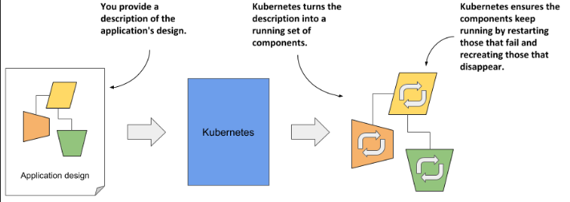
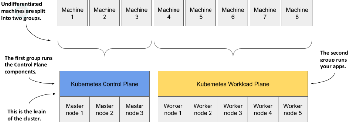

> # Definition of Kubernetes

Kubernetes is a software system for automating the deployment and management of complex, large-scale application systems composed of computer processes running in containers.

`What is the meaning of deployment?`

"deployment" refers to the process of delivering and installing a software application or system to its intended environment, where it becomes operational for end-users.

> # What is Kubernetes useful for, and why should I use it?

## Abstracting away the infrastructure

Kubernetes acts as an intermediary layer between you and the underlying hardware, allowing you to focus on developing and managing your applications without needing to handle the complexities of the infrastructure.

## Standardizing how we deploy applications

Kubernetes standardizes application deployment by abstracting the underlying infrastructure, allowing you to use a single manifest for consistent deployment across corporate data centers and cloud providers, enabling focus on application and business logic.

`What is the meaning of 'manifest'?`

A manifest in Kubernetes is a configuration file that defines the desired state of an application, including details like container images, resources, and settings. It allows for consistent and reproducible deployment across different environments.

## Deploying applications declaratively

Kubernetes uses a declarative model to define applications, where you describe the components, and Kubernetes ensures the application runs and remains healthy by managing and restarting components as needed.

When you update the description, Kubernetes automatically reconfigures the running application to match the new specifications.

> # Understanding Kubernetes

## Kubernetes is like an operating system for computer clusters

Kubernetes, like an operating system for a computer, schedules application components onto the cluster’s computers and serves as an interface between the application and the cluster’s hardware.

## The Process of Handling and Key Functions Provided by Kubernetes

It eliminates the need for application developers to implement infrastructure-related mechanisms within their applications, allowing them to rely on Kubernetes to handle these aspects instead.

**This includes things like:**

- `Service discovery` is a mechanism that allows applications to find and use services provided by other applications, helping them locate and connect with these services efficiently.

- `Horizontal scaling` involves replicating your application to adjust to fluctuations in load. This means that if there is an increase in load on a specific application, Kubernetes can replicate the application to handle the increased demand.

- `Load balancing` is the process of spreading incoming requests evenly across all available copies or replicas of an application. This prevents any single instance from becoming overloaded, improving the application's performance, reliability, and ability to handle increased traffic effectively

- `self-healing` keeping the system healthy by automatically restarting failed applications and moving them to healthy nodes after their nodes fail,

- `leader election` a mechanism that decides which instance of the application should be active while the others remain idle but ready to take over if the active instance fails.

## How Kubernetes fits into a computer cluster

You begin with a set of machines, which you split into two groups: master nodes and worker nodes. The master nodes run the Kubernetes Control Plane, which manages the entire system, while the worker nodes run your applications.

For smaller setups, you can use just one master node, but for more reliable systems, you need at least three master nodes. The number of worker nodes you need depends on how many applications you’re running.

## Reducing costs via better infrastructure utilization

Finding the best setup for many application components and server nodes can be complex and time-consuming for humans. Kubernetes simplifies this by efficiently combining applications on the same servers, improving hardware use and allowing you to run more applications on fewer servers.

## Automatically adjusting to changing load

Kubernetes manages your applications by automatically monitoring their load and adjusting the number of instances as needed to handle sudden spikes in demand. When used on cloud infrastructure, Kubernetes can also expand your cluster by adding more nodes through the cloud provider’s API, ensuring you always have enough capacity for your applications.

## The architecture of a Kubernetes cluster

**A Kubernetes cluster has two main parts:**

1. `Master nodes`: These are the brains of the system and control everything in the cluster.
2. `Worker nodes`: These run your applications and handle the actual work."

### Control Plane components

### Worker Node components
