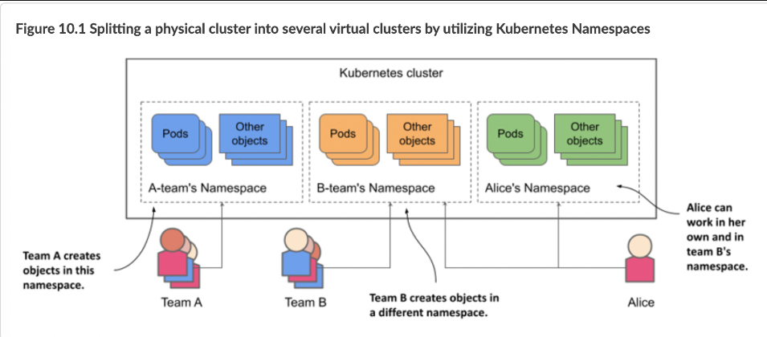
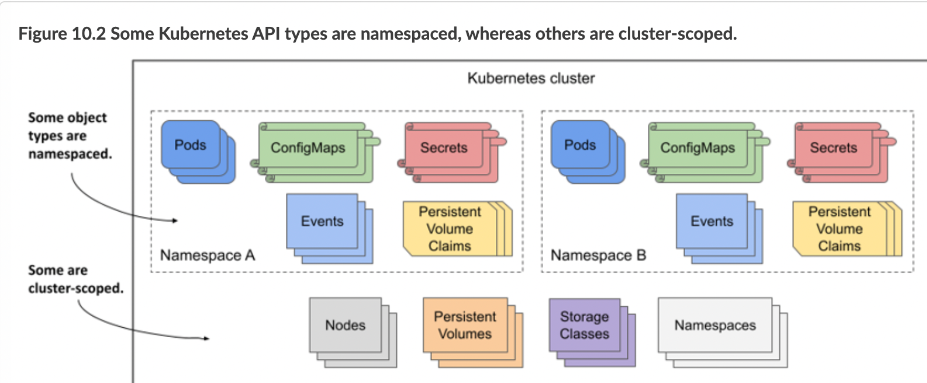
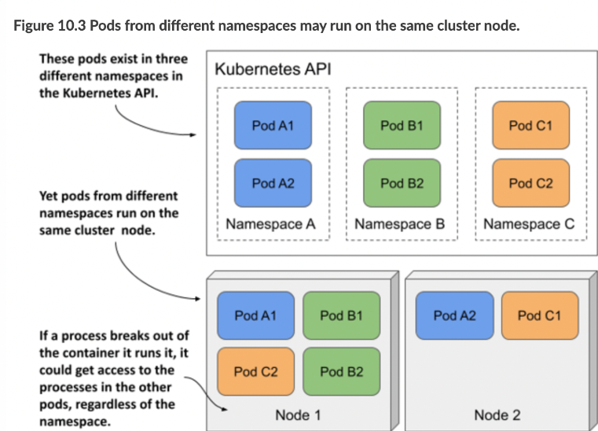

> # Organizing objects into Namespaces

**Why is it important to understand namespaces? That's the question I want to ask you now**

Imagine that your organization is running a single Kubernetes cluster that’s used by multiple engineering teams. Each of these teams deploys the entire Kiada application suite to develop and test it. You want each team to only deal with their own instance of the application suite - each team only wants to see the objects they’ve created and not those created by the other teams. This is achieved by creating objects in separate Kubernetes namespaces.

Namespaces provide a scope for object names, different teams can use the same names for their objects when they create them in their respective namespaces

`NOTE`

Namespaces in Kubernetes help organize Kubernetes API objects into non-overlapping groups. They have nothing to do with Linux namespaces, which help isolate processes running in one container from those in another, as you learned in chapter 2.

<p align = "center">
    
    </p>

`NOTE`

Most Kubernetes API object types are namespaced, but a few are not. Pods, ConfigMaps, Secrets, PersistentVolumeClaims, and Events are all namespaced. Nodes, PersistentVolumes, StorageClasses, and Namespaces themselves are not.

<p align = "center">
    
    </p>

## Listing namespaces and the objects they contain

- Listing namespaces

  ```yaml
  # The short form for namespace is ns.
  sudo kubectl get ns
  ```

  `NOTE`

  You have been working in the default namespace

- Listing objects in a specific namespace
  ```yaml
  # You can also use -n instead of --namespace.
  sudo kubectl get po --namespace kube-system
  ```
- Listing objects across all namespaces
  ```yaml
  # configMap, secret, pod, deployment, ....
  # you can also type -A instead of --all-namespaces
  sudo kubectl get <object> --all-namespaces
  ```
  The --all-namespaces option is handy when you want to see all objects in the cluster, regardless of namespac

## Creating namespaces

`NOTE`

The names of most objects must conform to the naming conventions for DNS subdomain names, as specified in RFC 1123, that is, they may contain only lowercase alphanumeric characters, hyphens, and dots, and must start and end with an alphanumeric character. The same applies to namespaces, but they may not contain dots.

- Creating a namespace with kubectl create namespace

  ```bash
  kubectl create namespace <name-of-namespace>
  ```

- Creating a namespace from a manifest file

  ```yaml
  apiVersion: v1
  kind: Namespace
  metadata:
    name: kiada-test2
  ```

  **To create this namespace using a manifest file, use the following command:**

  ```bash
  kubectl apply -f <manifest-name>.yaml
  ```

## Managing objects in other namespaces

- To create any object, such as a deployment, pod, or ConfigMap, for a specific namespace.

  **you can specify the --namespace argument (or the shorter -n option)**

  ```bash
  kubectl apply -f kiada-ssl.yaml -n kiada-test1
  ```

- Specifying the namespace in the object manifest

  The object manifest can specify the namespace of the object in the namespace field in the manifest’s metadata section.

  ```yaml
  apiVersion: v1
  kind: Pod
  metadata:
    name: kiada-ssl
    namespace: kiada-test2
  ```

## Making kubectl default to a different namespace

To switch to a different namespace, update the current context.

```bash
kubectl config set-context --current --namespace kiada-test1
```

`Hint:`

To quickly switch to a different namespace, you can set up the following alias: alias kns='kubectl config set-context --current --namespace '. You can then switch between namespaces with kns some-namespace

## Understanding the (lack of) isolation between namespaces

You created several pods in different namespaces so far. You already know how to use the --all-namespaces option (or -A for short) to list pods across all namespaces

```bash
# -A ==> --all-namespaces
sudo kubectl get po -A
```

### Understanding the runtime isolation between pods in different namespaces

When users use namespaces in a single physical cluster, it creates the effect of having separate virtual clusters, allowing them to create objects without naming conflicts. However, since the physical nodes are shared, the isolation between their pods is not as strong as it would be if they were on different physical clusters with separate nodes.

<p align = "center">
    
    </p>

### Understanding network isolation between namespaces

By default, Kubernetes doesn't provide network isolation between pods in different namespaces, allowing applications to communicate across namespaces. However, you can use NetworkPolicy to control and restrict this communication.

### Using namespaces to separate production, staging and development environments?

Because namespaces don’t provide true isolation, you should not use them to split a single physical Kubernetes cluster into the production, staging, and development environments. Hosting each environment on a separate physical cluster is a much safer approach.

## Deleting namespaces

you delete the Namespace object, all the objects you created in that namespace are automatically deleted

```bash
sudo kubectl delete ns <name-of-namespace>
```

The command blocks until everything in the namespace and the namespace itself are deleted.

**Issue:**

if you interrupt the command and list the namespaces before the deletion is complete, you’ll see that the namespace’s status is Terminating

**Explanation:**

- The reason I show this is because you will eventually run the delete command and it will never finish.

- The reason a namespace can’t be deleted is because one or more objects created in it can’t be deleted.

`NOTE`

Remember that the kubectl get all command lists only some types of objects. For example, it doesn’t list secrets. Even though the command doesn’t return anything, this doesn’t mean that the namespace is empty.
