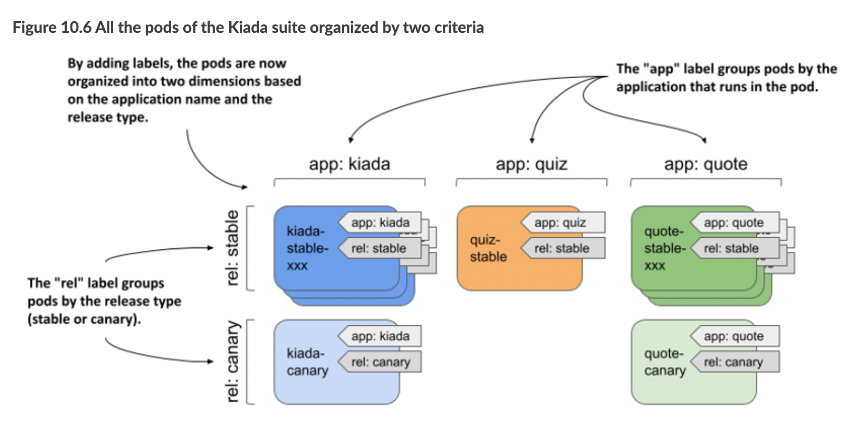

> # Organizing pods with labels

## Introducing labels

Labels in Kubernetes are key-value pairs used to organize and identify API objects within a cluster. They allow users to define an object's role in the system. Each object can have multiple labels, but each label key must be unique within that object. Labels are typically added when creating objects but can also be modified later.

### Using labels to provide additional information about an object

**What is the meaning of a canary release?**

A `canary` release is a deployment pattern where you deploy a new version of an application alongside the stable version, and direct only a small portion of requests to the new version to see how it behaves before rolling it out to all users. This prevents a bad release from being made available to too many users.

**What is the meaning of stable release?**

A `stable` release is a version of an application that has been thoroughly tested and is considered reliable for production use.

**Let's discuss a situation where using labels is beneficial**

Let's imagine a scenario with three services (`Kiada`, `Quote`, and `Quiz`), where some services have both `stable` and `canary` releases. While pod names can indicate the service and release type, it's not always practical to include all this information in the name. Instead, labels like "app" (to indicate the application) and "rel" (to indicate the release type) can be used. These labels help easily identify and manage pods without relying on complex naming conventions.

<p align = "center">
    
    </p>

### Understanding how labels keep objects organized

The illustration shows only the Kiada pods, but if you add the same two labels to all pods, it helps users quickly identify the application and release type for any pod they encounter. This labeling system solves the problem of understanding pod details at a glance without needing to rely on complex or lengthy names.

<p align = "center">
    
    </p>

## Attaching labels to pods

- Defining labels in object manifests

  ```yaml
  apiVersion: v1
  kind: Pod
  metadata:
  name: kiada-stable-001
  labels:
    app: kiada
    rel: stable
  ```

- Displaying object labels

  ```bash
  # template for show label
  sudo kubectl describe <object> <name>

  # for example
  sudo kubectl describe pod <pod-name>
  ```

- Check the labels of all pods in the namespace

  ```bash
  sudo kubectl get pods --show-labels
  ```

- List all pods along with specific label or labels

  ```bash
    # To display pods with the "app" label
    sudo kubectl get pods -L app

    # To display pods with multiple labels (e.g., "app", "rel", and "template")
    sudo kubectl get pods -L app,rel,template
  ```

- Adding labels to an existing object

  - First way
    You can edit the object’s manifest file, add labels to the metadata section, and reapply the manifest using `kubectl apply`.
  - Second way
    ```bash
    sudo kubectl label pods kiada app=kiada rel=stable
    ```

- Changing labels of an existing object

  ```bash
  sudo kubectl label pods kiada app=kiada rel=stable --overwrite
  ```

- Labelling all objects of a kind

  ```bash
  # Add a label to all objects of a specified type (e.g., pod, deployment, secret, configMap, etc.)
  sudo kubectl label <object> --all <label-name>=<label-value>

  ```

- Removing a label from an object

  - To remove the label from an object

    ```bash
    # The '-' sign is used to delete a specific label from an object.
    # The name of the label is suit
    kubectl label pod kiada-canary suite-
    ```

  - To remove the label from all other pods

    ```bash
    kubectl label pods --all suit-
    ```

## Label syntax rules

- Valid label keys
    <p align = "center">
    
    </p>

- Valid label Values
    <p align = "center">
        
        </p>
