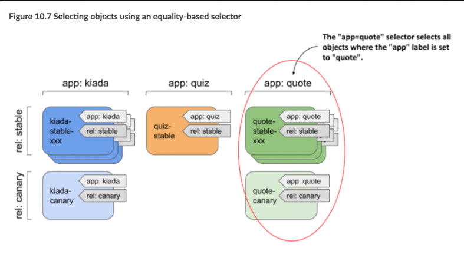
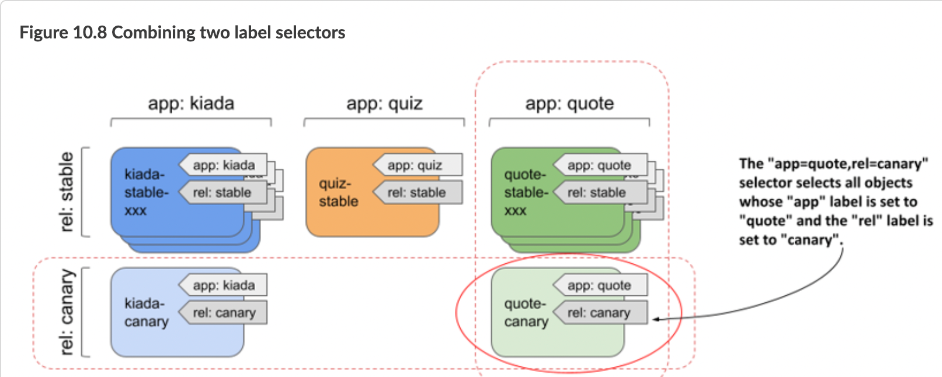
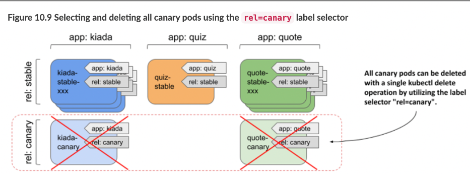

> # Filtering using selectors

## Filtering objects with label selectors

The greatest power of using labels comes from their ability to filter and select subsets of objects based on specific criteria through label selectors. This allows you to perform operations on groups of objects that share particular labels, enabling efficient management and organization of resources.

- Introducing equality-based selectors

  Applying the label selector app=quote to all pods selects all pods with the label app=quote, including both stable instances and the canary instance.

    <p align = "center">
        
        </p>

- Introducing set-based selectors

  For example, a set-based label selector can filter objects to include those with a label having specific values, such as app in (quiz, quote), or exclude those with certain values, such as app notin (kiada)

- Combining multiple selectors

  When you filter objects, you can combine multiple selectors. To be selected, an object must match all of the specified selectors

    <p align = "center">
        
        </p>

## Using label selectors for object management with kubectl

### Filtering the list of objects using label selectors

- To apply a label selector to kubectl get, specify it with the --selector argument (or the short equivalent -l)

  - To select all pods that have an app label
    ```bash
    # app => label name
    sudo kubectl get pods -l app
    ```
  - To select all pods that do not have an app label
    ```bash
    # app => label name
    sudo kubectl get pods -l '!app'
    ```
  - To select pods with a specific label
    ```bash
        sudo kubectl get pods -l app=quote
    ```
  - To select pods with multiple labels
    ```bash
    sudo kubectl get pods -l app=quote,rel=stable
    ```
  - To select pods with a specific label with multiple values

    ```bash
    kubectl get po -l 'app in (quiz, quote)' -L app
    ```

  The `-L` app option in the command displays the value of the app label for each pod (see the APP column in the output).

### Deleting objects using a label selector

<p align = "center">
    
    </p>

```bash
kubectl delete po -l rel=canary
```

The output of the command shows that both the kiada-canary and quote-canary pods have been deleted

## Utilizing label selectors within Kubernetes API objects(This section is not important yet❌)

You’ve learned how to use labels and selectors with kubectl to organize your objects and filter them, but selectors are also used within Kubernetes API objects.

For example, you can specify a node selector in each Pod object to specify which nodes the pod can be scheduled to.

### Using label selectors to schedule pods to specific nodes

For example is if you want to schedule front-end pods to some nodes and back-end pods to others. Or if you want to deploy a separate set of application instances for each customer and want each set to run on its own set of nodes for security reasons.
