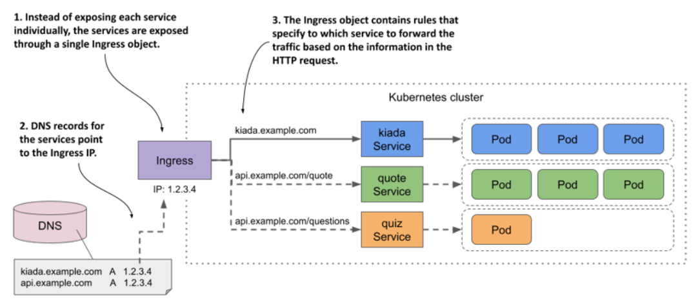
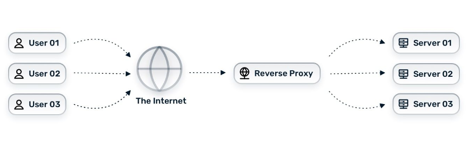
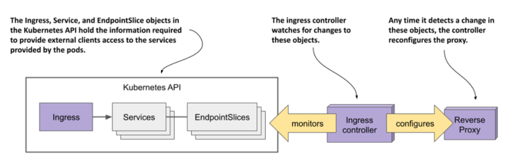
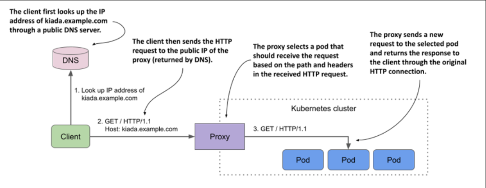

> # Introducing Ingresses

In Kubernetes, an Ingress is a way for external clients to access the services of applications running in the cluster. The Ingress function consists of the following three components:

- The Ingress API object, which is used to define and configure an ingress.
- An L7 load balancer or reverse proxy that routes traffic to the backend services.
- The ingress controller, which monitors the Kubernetes API for Ingress objects and deploys and configures the load balancer or reverse proxy.

`NOTE`

L4 and L7 refer to layer 4 (Transport Layer; TCP, UDP) and layer 7 (Application Layer; HTTP) of the Open Systems Interconnection Model (OSI Model).

`NOTE`

Unlike a forward proxy, which routes and filters outgoing traffic and is typically located in the same location as the clients it serves, a reverse proxy handles incoming traffic and routes it to one or more backend servers. A reverse proxy is located near those servers.

## Let us remember the load balancer

A LoadBalancer distributes incoming traffic across multiple instances of a service to ensure high availability and scalability.

LoadBalancer is typically used to distribute traffic to multiple instances of a single application or service, not multiple applications.

## The difference between ingress and loadBalancer

Using an Ingress instead of a LoadBalancer in Kubernetes offers several advantages, especially in terms of flexibility, cost-efficiency, and manageability:

1. Cost Efficiency
   - LoadBalancer: Provisioning a LoadBalancer for each service can become expensive, especially in cloud environments where each LoadBalancer is typically a chargeable resource.
   - Ingress: With Ingress, you can use a single LoadBalancer to handle traffic for multiple services, reducing the number of LoadBalancers required and thus saving costs.
2. Advanced Routing Capabilities

   - LoadBalancer: Typically routes traffic to a single service or set of endpoints without advanced routing rules.
   - Ingress: Supports more complex routing rules, such as directing traffic based on HTTP hostnames, URL paths, and headers. This allows you to serve multiple applications (or versions) under different domains or paths using a single ingress point.

3. Centralized Traffic Management

- LoadBalancer: Each service would need its own LoadBalancer, making it harder to manage and update traffic rules.

  "making it harder to manage and update traffic rules," that is mean If each service has its own LoadBalancer, you would need to configure and maintain traffic rules separately for each one. This can become complex and time-consuming, especially as the number of services grows, compared to managing all traffic rules centrally through a single Ingress.

- Ingress: Consolidates traffic management in one place, simplifying the configuration and maintenance of routing rules. This centralization is particularly beneficial for managing large applications with many services.

4. SSL Termination

   - LoadBalancer: Typically, SSL termination (decrypting HTTPS traffic) would need to be configured for each LoadBalancer separately.
   - Ingress: Allows you to centralize SSL termination, managing certificates and HTTPS traffic at a single ingress point.

5. Path-Based Routing

   - LoadBalancer: Does not inherently support path-based routing (e.g., routing example.com/api to one service and example.com/web to another).
   - Ingress: Enables path-based routing, allowing you to serve different parts of your application from different services using the same domain.

6. Host-Based Routing

   LoadBalancer: Does not support routing based on the host header (e.g., routing api.example.com to one service and web.example.com to another).
   Ingress: Easily handles host-based routing, making it easier to manage applications with multiple subdomains or domains.

7. Scalability and Flexibility

   - LoadBalancer: Less flexible in handling complex traffic patterns and scaling.
   - Ingress: Provides a more scalable solution by allowing more sophisticated routing, better integration with cloud-native traffic management tools, and easier updates as your application grows.

## Introducing the Ingress object kind

When you want to expose a set of services externally, you create an Ingress object and reference the Service objects in it. Kubernetes uses this Ingress object to configure an L7 load balancer (an HTTP reverse proxy) that makes the services accessible to external clients through a common entrypoint.

`NOTE`

If you expose a Service through an Ingress, you can usually leave the Service type set to ClusterIP

### Exposing services through an Ingress object

</p

## Installing an ingress controller

There are many different ingress implementations to choose from. They all provide the type of traffic routing explained in the previous section, but each provides different additional features. In all the examples in this chapter
