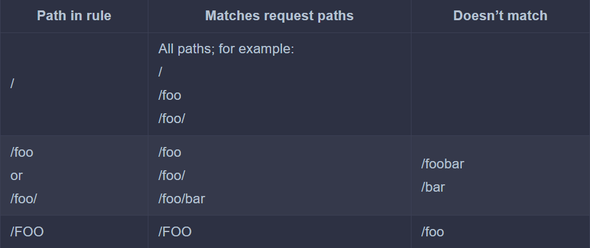

> # Creating and using Ingress objects

In this section, you’ll learn how to use an Ingress to expose the services of the Kiada suite.

## Exposing a service through an Ingress

`NOTE`

You can use ing as a shorthand for ingress

**The kiada service manifest**

```yaml
apiVersion: v1
kind: Service
metadata:
  name: kiada
spec:
  type: ClusterIP
  selector:
    app: kiada
  ports:
    - name: http
      port: 80
      targetPort: 8080
    - name: https
      port: 443
      targetPort: 8443
```

- Creating the Ingress object

  **An Ingress object exposing the kiada service at kiada.example.com**

  ```yaml
  apiVersion: networking.k8s.io/v1
  kind: Ingress
  metadata:
    name: kiada-example-com
  spec:
    rules:
      - host: kiada.example.com
        http:
          paths:
            - path: /
              pathType: Prefix
              backend:
                service:
                  name: kiada
                  port:
                    number: 80
  ```

  The Ingress object in the listing defines a single rule. The rule states that all requests for the host kiada.example.com should be forwarded to port 80 of the kiada service, regardless of the requested path (as indicated by the path and pathType fields).

  <p align = "center">
  
  </p

- Inspecting an Ingress object to get its public IP address

  - You can see its basic information by listing Ingress objects in the current namespace
    ```bash
    sudo kubectl get ingresses
    ```
  - To see the Ingress object in detail

    ```bash
    sudo kubectl describe ingress(ing) <ingress-name>
    ```

  - You can also find the IP address in the Ingress object’s status
    ```bash
    sudo kubectl get ing kiada -o yaml
    ```

- Adding the ingress IP to the DNS

  After you add an Ingress to a production cluster, the next step is to add a record to your Internet domain’s DNS server. In these examples, we assume that you own the domain example.com. To allow external clients to access your service through the ingress, you configure the DNS server to resolve the domain name kiada.example.com to the ingress IP 11.22.33.44.

- Accessing services through the ingress

To access a service() through an Ingress, ensure the Host header in your HTTP request matches one of the Ingress rules. If using curl, you can specify the Ingress IP (`172.29.134`) and set the Host header to `ecommerce-applicatio`n without changing your DNS settings or `/etc/hosts` file.

  <p align = "center">
  
  </p

The `--resolve` option adds the hostname `ecommerce-application` to the DNS cache. This ensures that `ecommerce-application` resolves to the ingress IP. Curl then opens the connection to the ingress and sends the HTTP request. The Host header in the request is set to `ecommerce-application` and this allows the ingress to forward the request to the correct service.

Of course, if you want to use your web browser instead, you can’t use the --resolve option. Instead, you can add the following entry to your /etc/hosts file.

## Path-based ingress traffic routing

You have already set up an Ingress object for the kiada service. Now, you'll create an additional Ingress object to handle the quote and quiz services.

This new Ingress object will make both services accessible via the same host, api.example.com. It will route requests based on the path in the HTTP request: requests with the path /quote will be forwarded to the quote service, while requests with paths starting with /questions will be directed to the quiz service.

  <p align = "center">
  
  </p

**Ingress mapping request paths to different services**

```yaml
apiVersion: networking.k8s.io/v1
kind: Ingress
metadata:
  name: api-example-com
spec:
  rules:
    - host: api.example.com
      http:
        paths:
          - path: /quote
            pathType: Exact
            backend:
              service:
                name: quote
                port:
                  name: http
          - path: /questions
            pathType: Prefix
            backend:
              service:
                name: quiz
                port:
                  name: http
```

After you create the Ingress object from the manifest in the previous listing, you can access the two services it exposes as follows (replace the IP with that of your ingress):

```bash
curl --resolve api.example.com:80:11.22.33.44 api.example.com/quote
curl --resolve api.example.com:80:11.22.33.44 api.example.com/questions/random
```

If you want to access these services with your web browser, add api.example.com to the line you added earlier to your `/etc/hosts` file:

```bash
11.22.33.44    kiada.example.com api.example.com
```

- Understanding how the path is matched

  The pathType field specifies how the path in the request is matched with the paths in the ingress rule

  <p align = "center">
  
  </p

- Matching paths using the Exact path type

  <p align = "center">
  
  </p

- Matching paths using the Prefix path type

  <p align = "center">
    
    </p

- Matching paths using the ImplementationSpecific path type

  The `ImplementationSpecific` path type is, as the name implies, dependent on the implementation of the ingress controller. With this path type, each controller can set its own rules for matching the request path

## Using multiple rules in an Ingress object

**Problem:**

In the previous sections, you created two Ingress objects to access the Kiada suite services. In most Ingress implementations, each Ingress object requires its own public IP address, which likely means you're now using two public IP addresses. This approach can be costly and inefficient.

**Normal Solution:**

Typically, each service would have its own Ingress object with a dedicated public IP address. While this method works, it can lead to increased costs and unnecessary consumption of IP addresses.

**Optimized Solution:**

To reduce costs and resource usage, it's better to consolidate the Ingress objects into a single one. This allows multiple services to share a single public IP address, streamlining the deployment and making it more cost-effective.

### Creating an Ingress object with multiple rules

Because an Ingress object can contain multiple rules, it’s trivial to combine multiple objects into one. All you have to do is take the rules and put them into the same Ingress object,

```yaml
apiVersion: networking.k8s.io/v1
kind: Ingress
metadata:
  name: kiada
spec:
  rules:
    - host: kiada.example.com
      http:
        paths:
          - path: /
            pathType: Prefix
            backend:
              service:
                name: kiada
                port:
                  name: http
    - host: api.example.com
      http:
        paths:
          - path: /quote
            pathType: Exact
            backend:
              service:
                name: quote
                port:
                  name: http
          - path: /questions
            pathType: Prefix
            backend:
              service:
                name: quiz
                port:
                  name: http
```

**Description:**

This single Ingress object handles all traffic for all services in the Kiada suite yet only requires a single public IP address.

  <p align = "center"></p

---

### Using wildcards in the host field

The `host` field in the ingress rules supports the use of wildcards. This allows you to capture all requests sent to a host that matches `*.example.com` and forward them to your services

**Examples of using wildcards in the ingress rule’s host field**

<p align = "center">
    
    </p

---

## Setting the default backend

If the client request doesn’t match any rules defined in the Ingress object, the response 404 Not Found is normally returned. However, you can also define a default backend to which the ingress should forward the request if no rules are matched. The default backend serves as a catch-all rule.

<p align = "center">
    
    </p

A service named fun404 is used as the default backend

- Specifying the default backend in an Ingress object

  You specify the default backend in the spec.defaultBackend field

  ```yaml
  apiVersion: networking.k8s.io/v1
  kind: Ingress
  metadata:
    name: kiada
  spec:
    defaultBackend:
      service:
        name: fun404
        port:
          name: http
  ```

- Creating the service and pod for the default backend

  The kiada Ingress object is configured to forward requests that don’t match any rules to a service called fun404. You need to create this service and the underlying pod. You can find an object manifest with both object definitions in the file all.my-default-backend.yaml

  ```yaml
  apiVersion: v1
  kind: Pod
  metadata:
    name: fun404
    labels:
      app: fun404
  spec:
    containers:
      - name: server
        image: luksa/static-http-server
        args:
          - --listen-port=8080
          - --response-code=404
          - --text=This isn't the URL you're looking for.
        ports:
          - name: http
            containerPort: 8080
  ---
  apiVersion: v1
  kind: Service
  metadata:
    name: fun404
    labels:
      app: fun404
  spec:
    selector:
      app: fun404
    ports:
      - name: http
        port: 80
        targetPort: http
  ```

  After applying both the Ingress object manifest and the Pod and Service object manifest, you can test the default backend by sending a request that doesn’t match any of the rules in the ingress. For example:

  ```bash
  $ curl api.example.com/unknown-path --resolve api.example.com:80:11.22.33.44
  This isn't the URL you're looking for.
  ```
