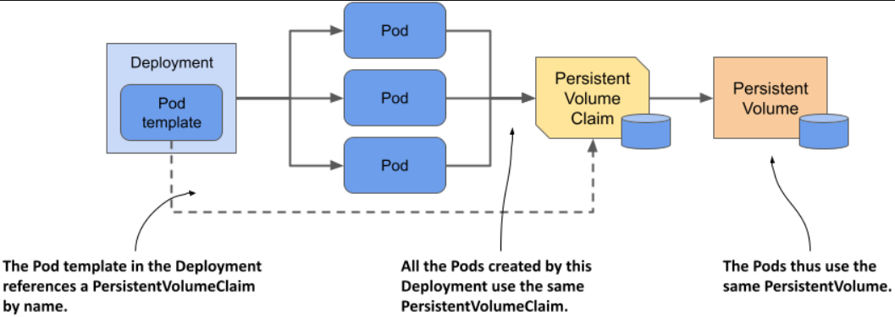
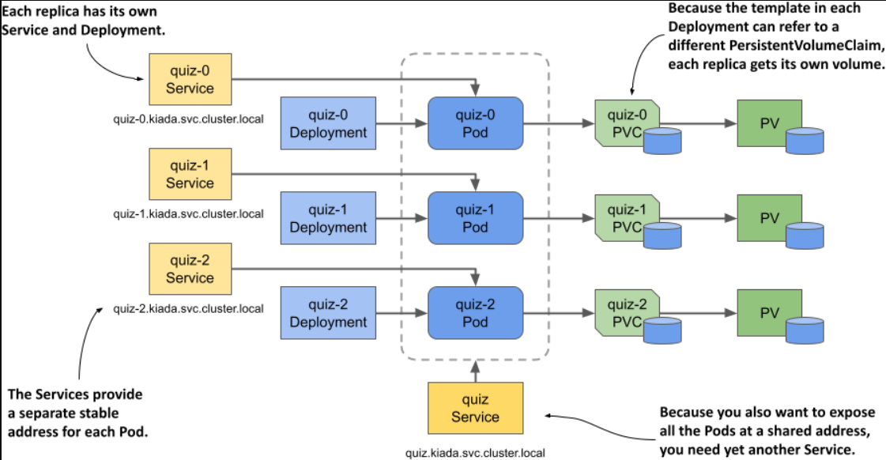
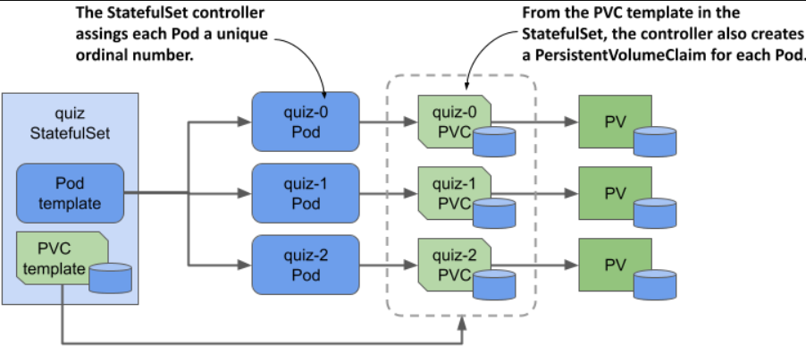
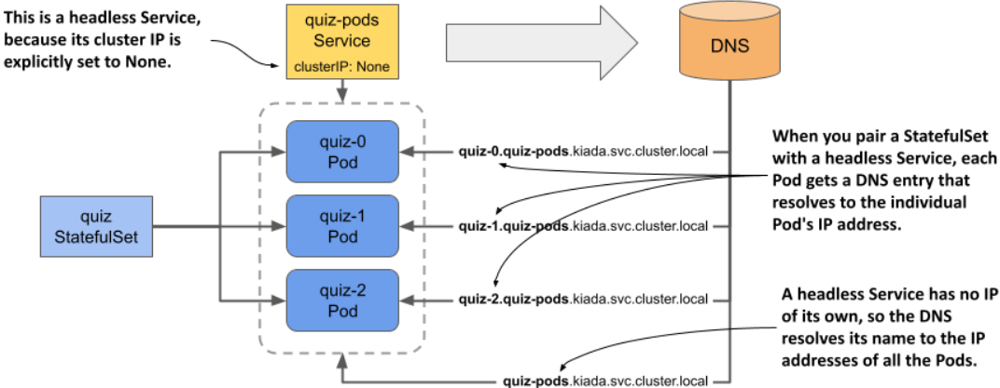
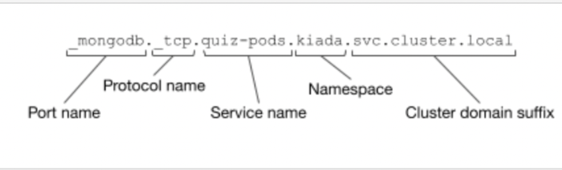

> # Introducing StatefulSets

Before you learn about StatefulSets and how they differ from Deployments, it’s good to know how the requirements of stateful workloads differ from those of their stateless counterparts.

## Understanding stateful workload requirements

A `stateful workload` is a piece of software that must store and maintain state in order to function.

This state must be maintained when the workload is restarted or relocated. This makes stateful workloads much more difficult to operate.

`Stateful workloads` are challenging to scale in Kubernetes because each replica in a StatefulSet maintains its own state, which is often stored in files or persistent storage. Unlike stateless workloads, where replicas can be easily added or removed without concern for state, scaling `stateful workloads` requires careful management of the state associated with each replica.

Let’s look at these two options to understand the issues associated with both.

### Sharing state across multiple Pod replicas

In Kubernetes, while PersistentVolumes with the ReadWriteMany access mode allow data sharing across multiple Pods, most cloud environments only support ReadWriteOnce or ReadOnlyMany, preventing multiple Pods on different nodes from accessing the same volume in read/write mode.

`Note`
Pods on different nodes can’t read and write to the same PersistentVolume.

example in this part not added ❌

  <p align = "center">
  
  </p

---

### Using a dedicated PersistentVolume for each replica

To deploy a MongoDB replica set in Kubernetes, you need to set up multiple MongoDB instances with their own storage volumes and stable addresses to ensure data replication and connectivity. You need to ensure that:

- Each Pod has its own PersistentVolume.
- Each Pod is addressable by its own unique address.
- When a Pod is deleted and replaced, the new Pod is assigned the same address and PersistentVolume.

You can’t do this with a single Deployment and Service, but you can do it by creating a separate Deployment, Service, and PersistentVolumeClaim for each replica.

  <p align = "center">
  
  </p

**For this approach**

If you need to increase the number of replicas, you can’t use the `kubectl scale command`; you have to create additional Deployments, Services, and PersistentVolumeClaims, which adds to the complexity.

Even though this approach is feasible, it’s complex and it would be difficult to operate this system. Fortunately, Kubernetes provides a better way to do this with a single Service and a single StatefulSet object.

## Comparing StatefulSets with Deployments

This difference is best explained with the Pets vs. Cattle analogy that you may have heard of.

`NOTE`
StatefulSets were originally called PetSets. The name comes from this Pets vs. Cattle analogy.

### Deploying Pods with a StatefulSet

As with Deployments, in a StatefulSet you specify a Pod template, the desired number of replicas, and a label selector. However, you can also specify a PersistentVolumeClaim template. Each time the StatefulSet controller creates a new replica, it creates not only a new Pod object, but also one or more PersistentVolumeClaim objects.

Pods created by a StatefulSet in Kubernetes are unique and maintain state consistency, as each Pod and its associated PersistentVolumeClaim have a distinct ordinal number, ensuring that the same state is preserved even if a Pod is deleted and recreated

  <p align = "center">
  
  </p

Another notable difference between Deployments and StatefulSets is that, by default, the Pods of a StatefulSet aren't created concurrently. Instead, they’re created one at a time, similar to a rolling update of a Deployment. When you create a StatefulSet, only the first Pod is created initially. Then the StatefulSet controller waits until the Pod is ready before creating the next one.

A StatefulSet can be scaled similarly to a Deployment, with new Pods and PersistentVolumeClaims created when scaling up, and Pods deleted when scaling down, while PersistentVolumeClaims are retained or deleted based on the configured policy.

## Creating a StatefulSet

- Creating the governing Service

  - A headless Service associated with a StatefulSet provides Pods with network identity by creating DNS records that resolve to the IPs of all matching Pods, rather than a single cluster IP address.

  - A headless Service in Kubernetes facilitates direct communication between Pods by creating DNS records for each Pod, without using a cluster IP address.

    <p align = "center">
    
    </p

    **Example for Headless Service**

    ```yaml
    apiVersion: v1
    kind: Service
    metadata:
      name: quiz-pods
    spec:
      clusterIP: None
      publishNotReadyAddresses: true
      selector:
        app: quiz
      ports:
    - name: mongodb
      port: 27017
    ```

    **Explanation of some points in this manifest**

    the clusterIP field is set to None, which makes this a headless Service. If you set publishNotReadyAddresses to true, the DNS records for each Pod are created immediately when the Pod is created, rather than only when the Pod is ready.

- Creating the StatefulSet

  **Let's look at a manifest for a StatefulSet**

  ```yaml
  apiVersion: apps/v1
  kind: StatefulSet
  metadata:
  spec:
    serviceName: quiz-pods
    podManagementPolicy: Parallel
      spec:
        containers:
        - name: quiz-api
          # Add your container specification here
        - name: mongo
          image: mongo:5
          command:
          - mongod
          - --bind_ip
          - 0.0.0.0
          - --replSet
          - quiz
          volumeMounts:
          - name: db-data
            mountPath: /data/db
        volumes:
        - name: db-data
          persistentVolumeClaim:
            claimName: db-data
    volumeClaimTemplates:
    - metadata:
        name: db-data
        labels:
          app: quiz
      spec:
        resources:
          requests:
            storage: 1Gi
        accessModes:
        - ReadWriteOnce
  ```

  - in the `serviceName` field, for example, you specify the name of the headless Service that governs this StatefulSet.

  - By setting podManagementPolicy to Parallel, the StatefulSet controller creates all Pods simultaneously. Alternatively, with OrderedReady, Pods are created sequentially, with each Pod being created only after the previous one is running and ready.

  - In the volumeClaimTemplates field of a StatefulSet, you define templates for PersistentVolumeClaims. Unlike Pod templates where you omit the name, you must specify the name in the PersistentVolumeClaim template, and it must match the name used in the volumes section of the Pod template.

## Inspecting the StatefulSet, Pods, and PersistentVolumeClaims

`NOTE` The shorthand for StatefulSets is `sts`.

- You can use the `kubectl rollout status` command to check its status

  ```bash
  sudo kubectl rollout status sts <name-stateful-set>
  ```

- Listing all StatefulSets

  ```bash
  kubectl get sts
  ```

- You can examine an object in detail with the kubectl describe command
  ```bash
  sudo kubectl describe sts <stateful-set-name>
  ```
- Use the kubectl get command to print the Pod manifest

  ```bash
  sudo kubectl get pod <pod-name> -o wide
  ```

  ```yaml
  apiVersion: v1
  kind: Pod
  metadata:
    labels:
      app: quiz
      controller-revision-hash: quiz-7576f64fbc
      statefulset.kubernetes.io/pod-name: quiz-0
      ver: "0.1"
    name: quiz-0
    namespace: kiada
    ownerReferences:
  - apiVersion: apps/v1
    blockOwnerDeletion: true
    controller: true
    kind: StatefulSet
    name: quiz
  spec:
    containers:
    ...
    volumes:
    - name: db-data
      persistentVolumeClaim:
        claimName: db-data-quiz-0
  status:
    ...
  ```

  **Some important points in this YAML file**

  - The label `controller-revision-hash` serves the same purpose as the label pod-template-hash on the Pods of a ReplicaSet. It allows the controller to determine to which revision of the StatefulSet a particular Pod belongs.

  - The label `statefulset.kubernetes.io/pod-name` specifies the Pod name and allows you to create a Service for a specific Pod instance by using this label in the Service’s label selector.

  - Since this Pod object is managed by the StatefulSet, the `ownerReferences` field indicates this fact. Unlike Deployments, where Pods are owned by `ReplicaSets`, which in turn are owned by the Deployment, StatefulSets own the Pods directly. The StatefulSet takes care of both replication and updating of the Pods.

## Understanding the role of the headless Service

Distributed applications need peer discovery to find other members in a cluster. Instead of querying the Kubernetes API, which ties the application to Kubernetes, it's better to use DNS for this purpose. For example, a MongoDB client needs the addresses of all replicas to connect and write data, so these addresses should be specified in the connection string.

- Exposing stateful Pods through DNS individually

  In Kubernetes, a Service object provides a stable IP address for a set of Pods and resolves the Service name to this IP address. In contrast, a headless Service resolves the name to the IPs of the individual Pods. When used with a StatefulSet, each Pod gets its own A or AAAA DNS record, resolving directly to its IP address. For example, with the quiz StatefulSet and quiz-pods headless Service, quiz-0 will have its own IP address record.

  **Pod is resolvable at the following address:**
  <p align = "center">
    
    </p

- Exposing stateful Pods via SRV records

  `SRV `refers to a type of DNS record used to specify the location (hostname and port) of servers for specific services. SRV records are used by applications like MongoDB to discover services within a network.

  For MongoDB, the SRV record helps the client to automatically discover the addresses and port numbers of the MongoDB instances, so you don’t have to specify them manually.

  <p align = "center">
    
    </p

  Using SRV records allows the MongoDB connection string to be much simpler. Regardless of the number of replicas in the set

  ```bash
  mongodb+srv://quiz-pods.kiada.svc.cluster.local
  ```

  Instead of specifying the addresses individually, the mongodb+srv scheme tells the client to find the addresses by performing an SRV lookup for the domain name \_mongodb.\_tcp.quiz-pods.kiada.svc.cluster.local
