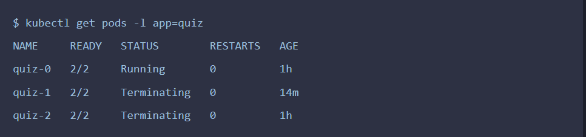
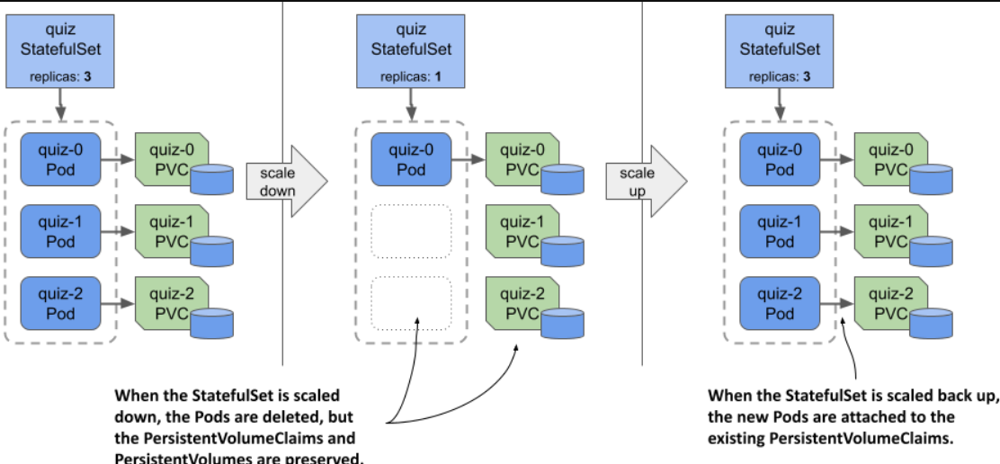
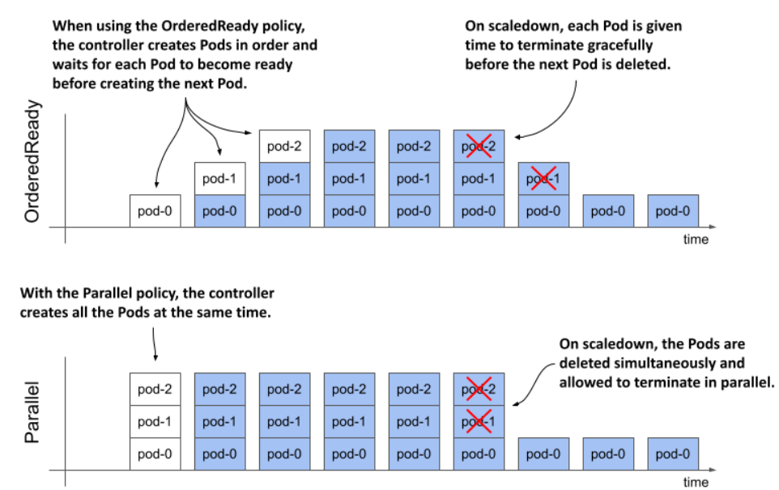

> # Understanding StatefulSet behavior

## Understanding how a StatefulSet replaces missing Pods

- Unlike Pods created by a ReplicaSet, StatefulSet Pods are uniquely named, each with its own PersistentVolumeClaim(s), and if a Pod is deleted and replaced, it retains the same identity and is re-associated with its original PersistentVolumeClaim(s).

- The IP address of the new Pod might be different, but that doesn’t matter because the DNS records have been updated to point to the new address. Clients using the Pod’s hostname to communicate with it won’t notice any difference.

- In general, this new Pod can be scheduled to any cluster node if the PersistentVolume bound to the PersistentVolumeClaim represents a network-attached volume and not a local volume. If the volume is local to the node, the Pod is always scheduled to this node.

- Like the ReplicaSet controller, its StatefulSet counterpart ensures that there are always the desired number of Pods configured in the replicas field

## Understanding how a StatefulSet handles node failures

StatefulSets provide stricter guarantees for concurrent Pod execution by avoiding concurrency in Pod operations, preventing issues that could occur from multiple Pods starting, stopping, or being replaced simultaneously.

- Understanding the at-most-one semantics of StatefulSets

  A StatefulSet guarantees at-most-one semantics for its Pods by using an ordinal-based naming scheme, ensuring that no two Pods with the same name and identity run simultaneously in the same namespace.

  When a node running Pods managed by a ReplicaSet stops reporting to the Kubernetes control plane, the ReplicaSet controller may create replacement Pods on other nodes, potentially leading to duplicate Pods. If the StatefulSet controller did the same, it could result in two Pods with the same identity running concurrently.❌

- Disconnecting a node from the network

  - If the node's network interface is down, the Kubelet running on the node can no longer contact the Kubernetes API server and tell it that the node and all its Pods are still running. The Kubernetes control plane soon marks the node as NotReady

  - Pod that was running on this node changes to Terminating

- Understanding why the StatefulSet controller doesn’t replace the Pod

  At this point I’d like to point out that the Pod’s containers are still running. The node isn’t down, it only lost network connectivity. The same thing happens if the Kubelet process running on the node fails, but the containers keep running.

  The StatefulSet controller avoids deleting and recreating a Pod when the Kubelet is down to prevent two instances of the same workload with the same identity from running concurrently on different nodes.

- Manually deleting the Pod

  In a `StatefulSet`, if a `node fails` and the Pod is stuck in the "Terminating" state with the Kubelet not reporting its termination, you may need to manually force-delete the Pod using the --force and --grace-period 0 options. This is necessary because the usual deletion process relies on the Kubelet to confirm the Pod's termination, which won't happen if the Kubelet is down. However, this method risks leaving containers running indefinitely if the `node hasn't truly failed`. Thus, it is crucial to ensure the node's failure before using force deletion.

  ```bash
  sudo kubectl delete pods <pod-name> --force --grace-period 0
  ```

- Recreating the Pod

  After you delete the Pod, it’s replaced by the StatefulSet controller, but the Pod may not start.
  There are two possible scenarios. Which one occurs depends on whether the replica’s PersistentVolume is a local volume

  `Hint` The Pod needs access to the same PersistentVolume in these two scenarios.

  - Local Volume on the Failed Node:

    - `Outcome`: The Pod remains in the Pending state and cannot be scheduled.
    - `Reason`: The Pod can only run on the original node where the local volume is located, and since this node is unreachable, scheduling fails.

  - Network-Attached Volume:
    - `Outcome`: The Pod is scheduled on another node but may fail to run if the volume cannot be detached from the failed node and attached to the new node.
    - `Status`: The Pod will show ContainerCreating if it’s trying to start but can't access the volume.

- Deleting the PersistentVolumeClaim to get the new Pod to run

  If a Pod can't attach to the same volume, and the workload can regenerate its data, you can:

  - Delete the PersistentVolumeClaim (PVC): This allows a new PVC to be created and bound to a new PersistentVolume.
  - Delete the Pod: Since StatefulSet controllers create PVCs only when creating Pods, you need to delete the Pod so that a new one is created with a new PVC.

  A new PersistentVolumeClaim and a new Pod are created. The PersistentVolume bound to the claim is empty, but MongoDB replicates the data automatically.

- Fixing the node

  you can save yourself all that trouble if you can fix the node.

  When the node is back online, the deletion of the Pod is complete, and the new quiz-1 Pod is created. In a kind cluster, the Pod is scheduled to the same node because the volume is local.

## Scaling a StatefulSet

Just like ReplicaSets and Deployments, you can also scale StatefulSets. When you scale up a StatefulSet, the controller creates both a new Pod and a new PersistentVolumeClaim. But what happens when you scale it down? Are the PersistentVolumeClaims deleted along with the Pods?

- Scaling down

  **To scale a StatefulSet**

  ```bash
  sudo kubectl delete sts <pod-name> --replicas <number-of-replicas>
  ```

  When scaling down a StatefulSet, Pods with the highest ordinal numbers are deleted first to ensure that ordinal numbers remain sequential and start from zero.

  For example, when scaling down from 3 replicas to 1 replica, the last two Pods (with the highest ordinal numbers) are terminated.

     <p align = "center">
       
       </p

  **what happens to the PersistentVolumeClaims?**

  PersistentVolumeClaims for StatefulSet Pods are preserved during scaling down to avoid data loss. By default, claims are retained(`persistentVolumeClaimRetentionPolicy`), but you can configure the StatefulSet to delete them or manually delete them if needed

- Scaling up

  Since PersistentVolumeClaims are preserved when you scale down a StatefulSet, they can be reattached when you scale back up.

  Each Pod is associated with the same PersistentVolumeClaim as before, based on the Pod’s ordinal number.

  <p align = "center">
       
       </p

---

## Changing the PersistentVolumeClaim retention policy

you can configure the StatefulSet to automatically delete the PersistentVolumeClaim by setting the `persistentVolumeClaimRetentionPolicy` field. In this field, you specify the retention policy to be used during scale down and when the StatefulSet is deleted.

```yaml
apiVersion: apps/v1
kind: StatefulSet
metadata:
  name: quiz
spec:
  persistentVolumeClaimRetentionPolicy:
    whenScaled: Delete
    whenDeleted: Retain
  ...
```

The `whenScaled` and `whenDeleted` fields are self-explanatory. Each field can either have the value Retain, which is the default, or Delete.

- whenScaled

  - `Delete`:

    When the StatefulSet is scaled down (i.e., reducing the number of replicas), the PVCs associated with the removed Pods are also deleted. This helps in cleaning up unused PVCs and associated storage resources.

  - `Retain`:

    When the StatefulSet is scaled down, the PVCs associated with the removed Pods are retained. This is useful if you want to preserve the data and manually manage or reuse the PVCs.

- whenDeleted

  - `Delete`:

    When a Pod is deleted, its associated PVCs are also deleted. This is less common because it can lead to data loss if the PVCs are tied to important data. Typically used when you want to ensure that PVCs are cleaned up along with the Pod.

  - `Retain`:

    When a Pod is deleted, its associated PVCs are retained. This ensures that the data stored in the PVCs is not lost and can be manually managed or reattached to new Pods later.

`NOTE`

If you want to delete a StatefulSet but keep the Pods and the PersistentVolumeClaims, you can use the --cascade=orphan option. In this case, the PersistentVolumeClaims will be preserved even if the retention policy is set to Delete.

## Using the OrderedReady Pod management policy

- Introducing the two Pod management policies

  StatefulSets originally deployed Pods sequentially to maintain backward compatibility, and the default podManagementPolicy remains OrderedReady, but this can be changed to Parallel to allow Pods to be created and deleted concurrently.

  <p align = "center">
  
  </p

  ***

  - `OrderedReady` Pods are created and deleted one at a time in order, with the controller waiting for each Pod to be ready before proceeding to the next, and deletes Pods in reverse order when scaling down.

  - `Parallel` All Pods are created and deleted at the same time. The controller doesn’t wait for individual Pods to be ready.

- Here's an example of a StatefulSet with the podManagementPolicy option specified

  ```yaml
  apiVersion: apps/v1
  kind: StatefulSet
  metadata:
    name: quiz
  spec:
    podManagementPolicy: OrderedReady
    minReadySeconds: 10
    serviceName: quiz-pods
    replicas: 3
    ...
  ```

- Updating a stuck StatefulSet with the OrderedReady policy

  Pods are created sequentially with a 10-second delay between each, ensuring that each Pod is fully ready before the next is started, which helps avoid race conditions using the `minReadySeconds` option.

- Blocked scale-downs

  Another feature of the OrderedReady Pod management policy is that the controller blocks the scale-down operation if not all replicas are ready

- Ordered removal of Pods when deleting the StatefulSet

  The OrderedReady policy controls the order of Pod creation, scaling, and replacement in a StatefulSet, but it doesn’t apply when deleting the StatefulSet. To delete Pods in order, first scale the StatefulSet down to zero, wait for all Pods to finish, and then delete the StatefulSet.
