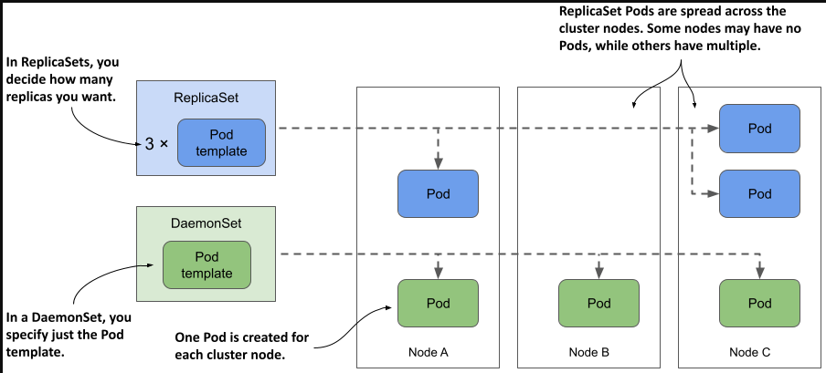
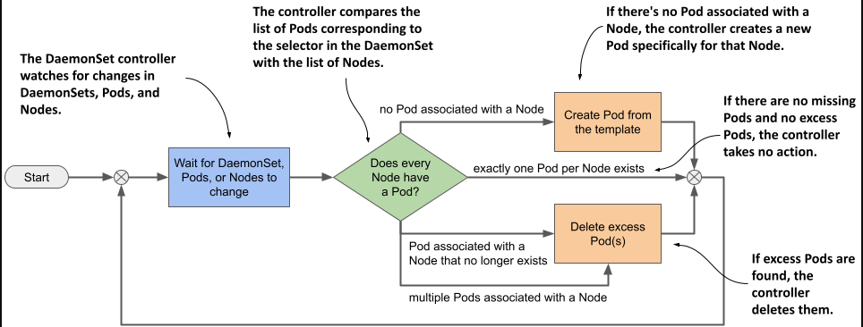
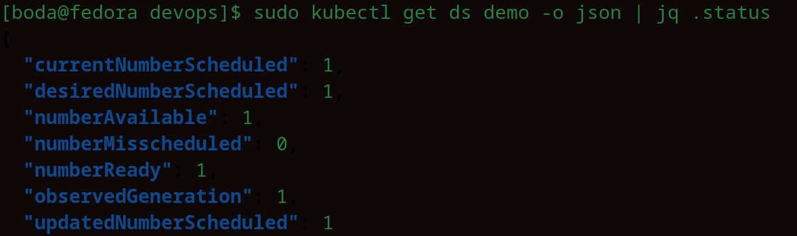
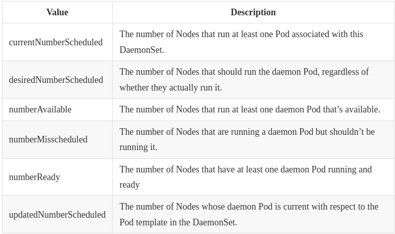

> # Introducing DaemonSets

A DaemonSet is an API object that ensures that exactly one replica of a Pod is running on each cluster node. By default, daemon Pods are deployed on every node, but you can use a node selector to restrict deployment to some of the nodes.


## Understanding the DaemonSet object

single instance of the Pod. Unlike Deployments or ReplicaSets, which specify a desired number of replicas, a DaemonSet ensures that exactly one Pod runs per node. This contrasts with ReplicaSets, where multiple Pods might run on the same node.


<p align = "center">

</p

---

### What type of workloads are deployed via DaemonSets and why

A DaemonSet is used to deploy infrastructure Pods that provide system-level services to each cluster node. These services include log collection for system processes and Pods, monitoring daemons, network and storage tools, software package management, and interfaces for attached devices.

The Kube Proxy component, which is responsible for routing traffic for the Service objects you create in your cluster, is usually deployed via a DaemonSet in the kube-system Namespace. 

The Container Network Interface (CNI) plugin that provides the network over which the Pods communicate is also typically deployed via a DaemonSet.

### Understanding the operation of the DaemonSet controller

Just like ReplicaSets and StatefulSets, a DaemonSet contains a Pod template and a label selector that determines which Pods belong to the DaemonSet. In each pass of its reconciliation loop, the DaemonSet controller finds the Pods that match the label selector, checks that each node has exactly one matching Pod, and creates or removes Pods to ensure that this is the case.

<p align = "center">

</p

---

## Deploying Pods with a DaemonSet

A DaemonSet object manifest looks very similar to that of a ReplicaSet, Deployment, or StatefulSet

- Manfiest for DaemonSet

    ```yaml
    apiVersion: apps/v1
    kind: DaemonSet
    metadata:
    name: demo
    spec:
    selector:
        matchLabels:
        app: demo
    template:
        metadata:
        labels:
            app: demo
        spec:
        containers:
        - name: demo
            image: busybox
            command:
            - sleep
            - infinity
    ```
- Quickly inspecting a DaemonSet

    ```s
    kubectl get ds
    ```
    	
    `NOTE`
    The shorthand for DaemonSet is ds.

- Inspecting a DaemonSet in detail
  
    ```s
    kubectl describe ds <name-of-daemonSet>
    ```
- Understanding a DaemonSet’s status

    During each reconciliation, the DaemonSet controller reports the state of the DaemonSet in the object’s status section.

    when you use this command :

    ```s
    sudo kubectl get ds <name-of-daemonSet> -o yaml
    ```
    or use this 

    ```s
    sudo kubectl get ds <name-of-daemonSet> -o json | jq .status  
    ```

    <p align = "center">
    
    </p

    The status fields for a DaemonSet refer to the number of Nodes, not Pods, because a DaemonSet is designed to run one Pod per Node. However, during an update, more than one Pod may run temporarily on a Node (new and old versions). The status is focused on the number of Nodes served by the DaemonSet, rather than the total number of Pods.

    <p align = "center">
    
    </p