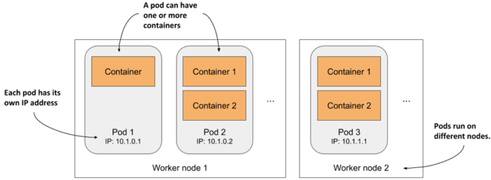
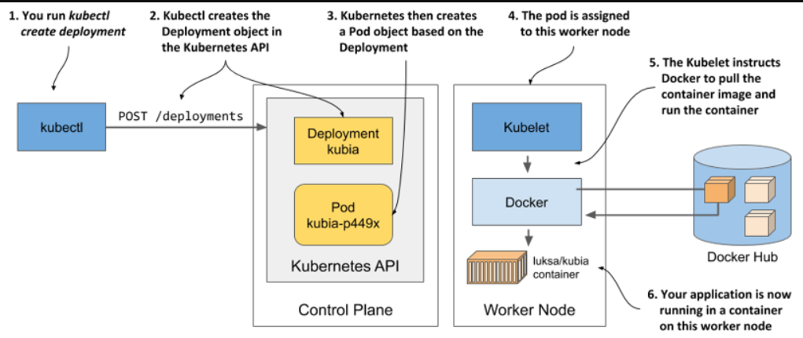
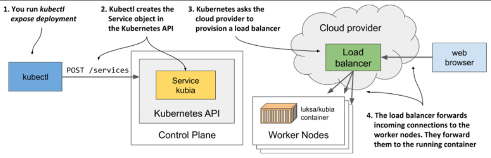
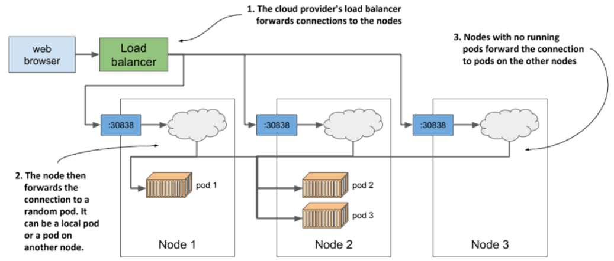

> # Deploying a Kubernetes cluster

Kubernetes has more than one distribution, and we will use the K3s distribution.

## What is the K3s distribution?

K3s is a lightweight Kubernetes distribution designed to reduce the complexity and resource requirements of running a Kubernetes cluster. It's particularly well-suited for development, testing, and edge computing environments due to its ease of installation and minimal resource demands. K3s is packaged as a single binary under 100 MB, making it simple to deploy and manage, and it includes built-in components such as containerd for container runtime and Flannel for networking.

## Why use the K3s distribution?

If you're looking to learn Kubernetes, K3s is a lightweight distribution that's a good choice because it's simple to install, requires fewer resources, and is designed to be easy to set up and run. This makes it ideal for development, testing, and edge computing environments where traditional Kubernetes setups might be too resource-intensive or complex.

> # Interacting with Kubernetes

> # Running your first application on Kubernetes and important commands to interact with Kubernetes.

## Deploying Your Application

- First, keep in mind that to deploy your first app, you need to prepare a JSON or YAML file that describes all the components of your application and then apply that file to your cluster.

- To deploy an application, you can use the kubectl create deployment command. This command automatically creates a Deployment object for your application in the cluster. This method is easier because you don’t need to know how to write YAML or JSON files to describe the Deployment.

  ```bash
  kubectl create deployment
  ```

- Let’s deploy that application to your Kubernetes cluster.

  `Hint For You:`<br>
  In Kubernetes, a **cluster** is a group of interconnected machines (nodes) that work together to deploy, manage, and scale applications. It includes a master node for management and multiple worker nodes for running the applications.

  `Hint For you: `<br>
  **kubectl** is the command-line tool for interacting with Kubernetes clusters. It allows you to deploy, manage, and troubleshoot applications, view and manage cluster resources, and configure your Kubernetes environment through commands and YAML files.

  ```bash
  kubectl create deployment kubia --image=luksa/kubia:1.0

  # -> Description for this deployment:

  # You want to create a deployment object.
  # You want the object to be called kubia.
  # You want the deployment to use the container image luksa/kubia:1.0. By default, the image is pulled from Docker Hub, but you can also specify the image registry in the image name (for example, quay.io/luksa/kubia:1.0).
  ```

  The Deployment object tells Kubernetes to run the luksa/kubia:1.0 container in your cluster and ensures that the actual state of the cluster matches this desired state.

- To list your deployments in a Kubernetes cluster

  ```bash
  kubectl get deployments
  # -> Response:
  # NAME    READY   UP-TO-DATE   AVAILABLE   AGE
  # kubia   0/1     1            0           6s
  ```

  The description of the response of the above command:

  - The `UP-TO-DATE` column shows how many instances of your application are currently up-to-date with the desired state. If it says 1, it means that one instance of your application is running as expected.

  - The `AVAILABLE` column shows whether your application is fully operational and accessible. If this column indicates 0, it means your application is not yet available to users, likely because it is still being set up or the container is not ready.

  - The `READY` column in the output of the kubectl get deployments command indicates the number of containers in your deployment that are currently ready to serve traffic.

  `Hint For you: `<br>
  Kubernetes doesn’t have a kubectl get containers command because containers are not a top-level object in Kubernetes. Instead, the smallest unit of deployment is a Pod, which can contain one or more containers.

## Let’s Learn About Pods

When you create a Deployment in Kubernetes, it typically creates one or more pods as specified in the Deployment configuration. Each pod can contain one or more containers. So, creating a Deployment results in the deployment of pods, and each of those pods contains the containers defined in your Deployment configuration.

In Kubernetes, you deploy groups of containers called pods, rather than individual containers. A pod is a collection of one or more containers that run together on the same node and share Linux namespaces, such as network and UTS namespaces, allowing them to interact more closely and share resources.

<p align="center">
  
</p>

Each pod in Kubernetes acts as a separate logical unit, containing one or more containers that run applications. Pods can include a single process or multiple processes running in separate containers and are distributed across all worker nodes in the cluster.

Each pod in Kubernetes has its own IP, hostname, and resources. Containers within the same pod are isolated from containers in other pods and only see the resources within their own pod

- Listing pods

  ```bash
  kubectl get pods
  kubectl get po
  # NAME                     READY     STATUS    RESTARTS   AGE
  # kubia-9d785b578-p449x    0/1       Pending   0          1m
  ```

- List the pods along with their IP addresses and the nodes they are assigned to.

```bash
sudo kubectl get pods -o wide
```

- To show information about a specific pod in Kubernetes

  To troubleshoot or get more information about a pod, use the kubectl describe pod <pod-name> command, which displays detailed information and events about the pod.

  ```bash
  kubectl describe pod pod_name
  ```

  The description of the response of the above command:

  - `READY`: The number of containers in the pod that are ready to handle traffic compared to the total number of containers in the pod.
  - `STATUS`: The current state of the pod, indicating whether it’s running, pending, or in another state.
  - `RESTARTS`: The number of times the containers in the pod have been restarted.

## Understanding what happens behind the scenes when you create a deployment

When you ran the kubectl create command, it created a new Deployment object in the cluster by sending an HTTP request to the Kubernetes API server. Kubernetes then created a new Pod object, which was then assigned or scheduled to one of the worker nodes. The Kubernetes agent on the worker node (the Kubelet) became aware of the newly created Pod object, saw that it was scheduled to its node, and instructed Docker to pull the specified image from the registry, create a container from the image, and execute it.

<p align="center">
  
</p>

In Kubernetes, scheduling assigns a pod to a node for immediate execution, similar to how an OS scheduler assigns processes to CPUs. Once a pod is scheduled to a node, it runs only on that node, and if it fails, a new pod instance may be created to replace it, rather than moving the existing pod to another node.

## Exposing your application to the world

To access your running application, you'll need to create a Service object. Pods have internal IP addresses that aren't accessible externally, so a Service exposes them. You can choose from different types of Services; a LoadBalancer type provisions an external load balancer to make the service accessible via a public IP.

- Creating a Service
  The create deployment command that you ran previously created a Deployment object, whereas the expose deployment command creates a Service object.

  ```bash
  kubectl expose deployment kubia --type=LoadBalancer --port 8080
  ```

  `Hint for you: `<br>
  LoadBalancer: Provisions an external load balancer (if supported by your cloud provider), which assigns a public IP address to the Service, making it accessible from outside the cluster.

  This is what running the above command tells Kubernetes:

  - You want to expose all pods that belong to the kubia Deployment as a new service.
  - You want the pods to be accessible from outside the cluster via a load balancer.
  - The application listens on port 8080, so you want to access it via that port.

- Listing services

  ```bash
  kubectl get services
  kubectl get svc
  ```

- List specific service
  ```bash
  kubectl get svc service_name
  ```
- listing the available object types with `kubectl api-resources`

  The kubectl api-resources command lists all available API resources in your Kubernetes cluster, showing which resource types can be managed and their corresponding names.

## Understanding load balancer services

When Kubernetes sets up a LoadBalancer service, it asks the cloud provider to create a load balancer. The cloud provider then gives Kubernetes an IP address for that load balancer. This IP address is used as the external address, allowing applications outside the cluster to communicate with your service using that IP.

<p align="center">
  
</p>

The external IP is now available, indicating that the load balancer is set up and ready to route requests to your application from clients worldwide.

- Accessing your application through the load balancer
  ```bash
  # curl Ip:port number
  curl 35.246.179.22:8080
  ```

## Increasing the number of running application instances(Horizontally scaling the application)

One of the major benefits of running applications in containers is the ease with which you can scale your application deployments. You’re currently running a single instance of your application. Imagine you suddenly see many more users using your application. The single instance can no longer handle the load. You need to run additional instances to distribute the load and provide service to your users. This is known as scaling out.

```bash
kubectl scale deployment kubia --replicas=3
```

Responses correspond to the pod names, with each request being routed to different pods in a random order. This behavior illustrates how Kubernetes services function as load balancers for multiple pod instances.

<p align="center">
  
</p>

## Understanding why you need a service

- Service Object: In Kubernetes, a Service provides a single, stable IP address to communicate with your pods, regardless of the number of replicas.

- Load Balancing: A Service acts as a load balancer, distributing traffic across multiple pods if there are several, or ensuring a stable entry point even if there is only one pod.

- Pod Ephemerality: Pods are ephemeral and can be replaced with new ones that have different IP addresses. This can happen due to node failures, pod deletions, or resource reallocation.

- Stable Access with Services: Using a Service avoids the need to reconfigure clients when pods are replaced. The Service maintains a constant IP address, ensuring continuous access to a healthy pod and balancing the load among pods.

- Client Connection: Clients should connect to the Service's IP rather than directly to individual pods, ensuring reliable and consistent access even as the underlying pods change.
