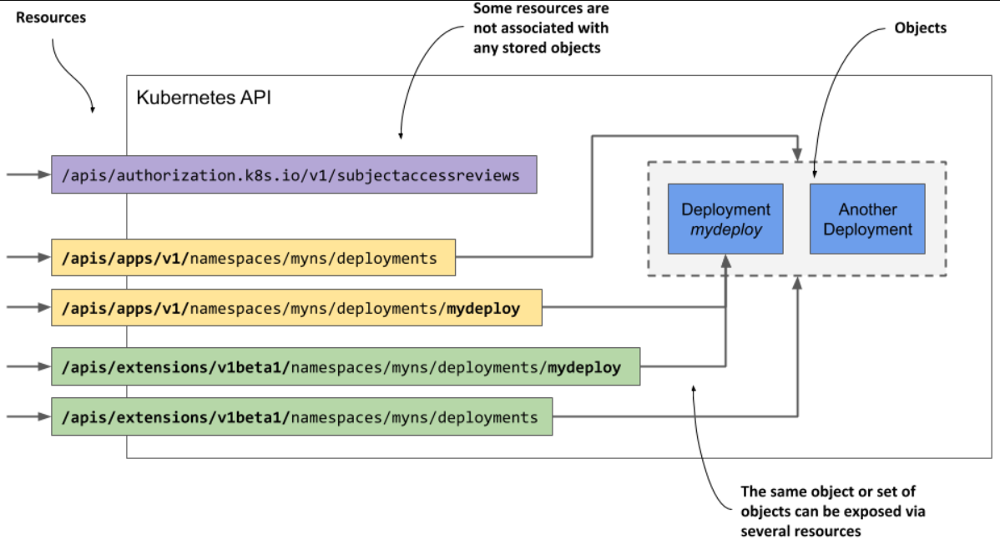

> # Getting familiar with the Kubernetes API

These objects represent the configuration of the entire cluster. They include the applications running in the cluster, their configuration, the load balancers through which they are exposed within the cluster or externally, the underlying servers and the storage used by these applications, the security privileges of users and applications, and many other details of the infrastructure.

<p align="center">
  
</p>

## Introducing the API

The Kubernetes API is the main way to interact with a cluster, and this book focuses on explaining it. Key API objects are covered in later chapters, but a basic introduction is given here. The Kubernetes API is a RESTful API that uses HTTP methods like POST, GET, PUT/PATCH, and DELETE to perform actions (Create, Read, Update, Delete) on resources.

`Hint for you: `<br>
**REST** is Representational State Transfer, an architectural style for implementing interoperability between computer systems via web services using stateless operations.

It is these resources (or objects) that represent the configuration of the cluster. Cluster administrators and engineers who deploy applications into the cluster therefore influence the configuration by manipulating these objects.

## Understanding the difference between resources and objects

In RESTful APIs, the main idea is the "resource," which is uniquely identified by a URI (Uniform Resource Identifier). In Kubernetes, deployments are represented as resources. All deployments in a cluster can be accessed at the URI /api/v1/deployments using a GET request, which returns a list of all deployment instances. Each deployment has its own unique URI, allowing you to get information with a GET request or modify it with a PUT request.

<p align="center">
  
</p>

- single object in Kubernetes can be accessed through multiple resources. For example, a Deployment object called mydeploy can be accessed both as part of a list and individually through different URIs.

- If there are multiple API versions for an object type, a single object can be accessed through multiple resource paths. For instance, before Kubernetes version 1.15, Deployment objects could be accessed via both /apis/apps/v1/deployments and /apis/extensions/v1beta1/deployments, representing the same set of objects with slight differences in their schema.

- Some resources don't correspond to any object. For example, to check if a subject is authorized for an action, a POST request is sent to /apis/authorization.k8s.io/v1/subjectaccessreviews, which doesn't create an object but returns whether the subject is allowed to perform the action.

- This demonstrates that a resource isn't the same as an object. In relational database terms, resources are like views, while object types are like tables. Resources provide a way to interact with objects.

`Hint for you: `<br>
Because the term **resource** can also refer to compute resources, such as CPU and memory, to reduce confusion, the term “objects” is used in this book to refer to **API resources**.

## Understanding how objects are represented

When you send a GET request to the Kubernetes API server, it returns the object in a structured text format, usually JSON, but it can also return YAML if requested. When you update an object using POST or PUT requests, you specify the new state in JSON or YAML. Each object has specific fields based on its type, but many fields and the overall structure are common to all Kubernetes API objects.

## Introducing the main parts of an object

- Type Metadata: This section contains information about the type of object described, including the object type, its group, and the API version.

- Object Metadata: This holds basic details about the object instance, such as its name, creation time, owner, and other identifiers. These fields are the same for all object types.

- Spec: This part specifies the desired state of the object. Its fields vary by object type. For pods, it includes information about the containers, storage volumes, and other operational details.

- Status: This section shows the current actual state of the object. For pods, it includes the pod's condition, container statuses, IP address, the node it's running on, and other relevant information.

<p align="center">
  
</p>

**`Here is an example of a Kubernetes Pod manifest formatted in YAML`**

```yaml
apiVersion: v1
kind: Pod
metadata:
  name: my-pod
  namespace: default
  labels:
    app: my-app
  creationTimestamp: "2024-08-03T12:34:56Z"
  ownerReferences:
    - apiVersion: v1
      kind: ReplicaSet
      name: my-replicaset
spec:
  containers:
    - name: my-container
      image: nginx:latest
      ports:
        - containerPort: 80
      volumeMounts:
        - mountPath: /usr/share/nginx/html
          name: html-volume
  volumes:
    - name: html-volume
      emptyDir: {}
  nodeName: node01
status:
  phase: Running
  conditions:
    - type: Ready
      status: "True"
  hostIP: 192.168.1.10
  podIP: 10.244.1.5
  containerStatuses:
    - name: my-container
      ready: true
      restartCount: 0
```

## Understanding the spec and status sections

The two key parts of a Kubernetes object are the **Spec** (desired state) and **Status** (current state). You write the Spec and read the Status. The Kubernetes Control Plane uses controllers to manage objects, with each controller handling a specific object type, like the Deployment controller for Deployment objects.

the task of a controller is to read the desired object state from the object’s Spec section, perform the actions required to achieve this state, and report back the actual state of the object by writing to its Status section

<p align="center">
  
</p>

All Kubernetes API objects have two metadata sections, but not all have Spec and Status sections. Objects without these sections usually contain static data and don't have a controller, so there's no need to differentiate between the desired and actual state. An example is the Event object, which is created by controllers to give additional information about the objects they manage.
