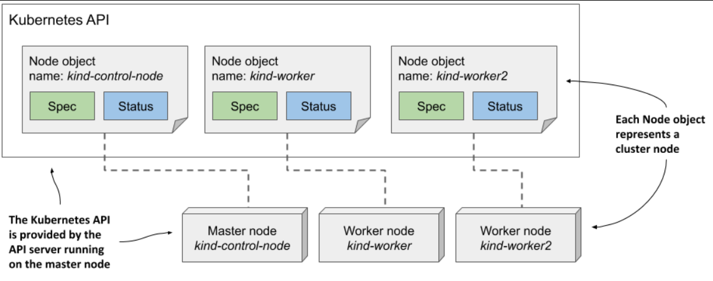
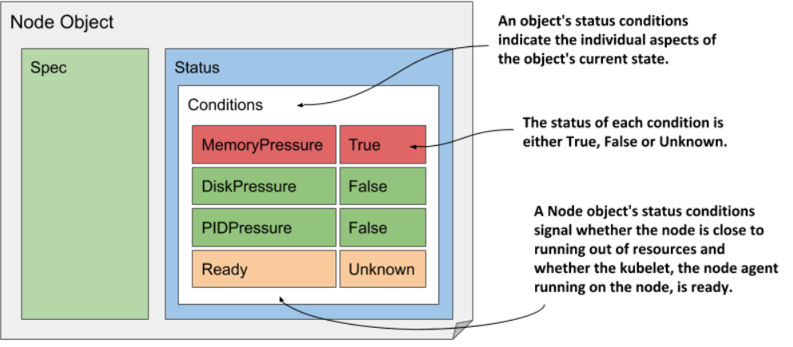

> # Examining an object’s individual properties

The Node object in Kubernetes represents a physical or virtual machine in a cluster. In a Kubernetes cluster provisioned with the kind tool, you can list Node objects using kubectl get nodes, which will display all nodes, including the master and worker nodes.

```bash
sudo kubectl get nodes
```

Node objects are slightly different from other objects because they are usually created by the Kubelet - the node agent running on the cluster node - rather than by users. When you add a machine to the cluster, the Kubelet registers the node by creating a Node object that represents the host. Users can then edit (some of) the fields in the Spec section.

The three Node objects and the actual cluster machines that make up the cluster. Each Node object instance represents one host. In each instance, the Spec section contains (part of) the configuration of the host, and the Status section contains the state of the host.

<p align="center">
  
</p>

## Displaying the complete YAML manifest of an object

```bash
# Use the -o json option to display the object in JSON instead of YAML.
sudo kubectl get node <node-name> -o yaml
# The jq tool is very handy if you want to see only a part of the object’s structure
sudo kubectl get node <node-name> -o json | jq .status.conditions
```

## Accessing the API directly

You can access the Kubernetes API directly using a web browser or the curl command, but since the API server requires TLS and authentication, it can be complex. Fortunately, kubectl provides a proxy that simplifies this process by allowing you to communicate with the API using plain HTTP without worrying about authentication.

```bash
sudo kubectl proxy
```

`Hint for you: `<br>
**TLS** (Transport Layer Security) is a cryptographic protocol designed to provide secure communication over a computer network by encrypting data and ensuring its integrity and authenticity.

A **proxy** is an intermediary server that acts as a gateway between a client and a server, forwarding client requests to the server and returning the server's responses to the client, often used for security, privacy, or performance enhancement.

## Components of a Manifest

- `The Type Metadata fields`

  The apiVersion and kind fields in a Kubernetes object manifest specify the API version and resource type, with the apiVersion determining the schema, or structured format, used to describe the object, though typically only one schema exists per resource type.

  The apiVersion field in Kubernetes manifests indicates both the API group and version, such as apps/v1 for Deployment objects, while core resources like Node use v1, omitting the group because they belong to the core API group.

  The type of object defined in the manifest is specified by the field kind. The object kind in the previous listing is Node, and so far in this book you’ve also dealt with the following kinds: Deployment, Service, and Pod.

- `Fields in the Object Metadata section`

  The metadata section of a Kubernetes object contains instance-specific information, including the name, labels, annotations, and fields like resourceVersion and managedFields.

- `Fields in the Spec section`

  The spec section in a Kubernetes object is unique to each object kind; for Node objects, it includes fields like podCIDR, which specifies the IP range for Pods on that node, while fields like taints are not crucial at this stage.

- `Fields in the Status section`

  The status section in a Kubernetes object shows the last observed state of the resource. For Node objects, it includes the node's IP address, hostname, resource capacity, current conditions, cached container images, operating system, and Kubernetes component versions.

## Using kubectl explain to explore API object fields

The kubectl tool has a nice feature that allows you to look up the explanation of each field for each object type (kind) from the command line. Usually, you start by asking it to provide the basic description of the object kind by running kubectl explain <kind>.

```bash
# The term "kind" refers to different types of resources such as Nodes, Pods, Services, and Deployments.
sudo kubectl explain <kind>
```

You can then drill deeper to find subfields under each specific field.

```bash
sudo kubectl explain <kind>.spec
```

## Understanding Status Conditions

**Understanding an object’s status conditions**

The set of fields in both the spec and status sections is different for each object kind, but the conditions field is found in many of them. It gives a list of conditions the object is currently in. They are very useful when you need to troubleshoot an object, so let’s examine them more closely

Each node has four conditions, each with a type and status (True, False, or Unknown), along with a reason, a message, and timestamps for the last status change (lastTransitionTime) and the last update received (lastHeartbeatTime).

The Ready condition is crucial as it indicates if a node can accept new workloads, while other conditions like MemoryPressure, DiskPressure, and PIDPressure show if the node is running low on resources; checking these conditions is important if a node behaves unexpectedly or if applications crash.

<p align="center">
  
</p>

**Understanding conditions in other object kinds**

A condition list such as that in Node objects is also used in many other object kinds. The conditions explained earlier are a good example of why the state of most objects is represented by multiple conditions instead of a single field.

## Inspecting objects using the kubectl describe command

**Inspecting a Node object**
The kubectl describe command provides a readable summary of Node object details, including the name, IP address, hostname, conditions, and available capacity, similar to the information in the YAML manifest.

```bash
sudo kubectl describe node <node-name>
```

**Inspecting a Pod object**

```bash
sudo kubectl describe pod <node-name>
```
