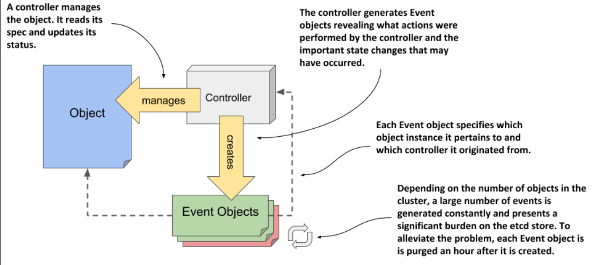

> # Observing cluster events via Event objects

**The main idea of events**

Controllers create events to show what they are doing to match the current state of an object with its desired state. There are two types of events: Normal, for routine actions, and Warning, for issues that stop the controller from making changes. Watching Warning events helps you quickly spot problems in the cluster.

In Kubernetes, events are represented by Event objects, created and accessed via the API. These objects provide details about what happened and the source of the event. Each Event object is deleted one hour after creation to minimize the load on etcd, the data store for Kubernetes API objects.

<p align="center">
  
</p>

When you use kubectl explain to explore the structure of the Event object, you'll notice it lacks spec and status sections. As a result, its fields are not as well-organized as those in objects like the Node object.

```bash
# Listing events using kubectl get events
sudo kubectl get events
# you can enable additional columns by executing the command with the -o wide
sudo kubectl get events -o wide
# Displaying only warning events
# Field selectors are used by the API to provide a way to filter objects
# For warning events
kubectl get ev --field-selector type=Warning
# For Normal events
kubectl get ev --field-selector type=Normal
```

## Understanding what’s in an Event object

- `Name: `The name of this Event object instance. Useful only if you want to retrieve the given object from the API.
- `Type: `The type of the event. Either Normal or Warning.
- `Reason: `The machine-facing description why the event occurred.
- `Source: `The component that reported this event. This is usually a controller.
- `Object: `The object instance to which the event refers. For example, node/xyz.
- `Sub-object: `The sub-object to which the event refers. For example, what container of the pod.
- `Message: `The human-facing description of the event.
- `First seen: `The first time this event occurred. Remember that each Event object is deleted after a while, so this may not be the first time that the event actually occurred.
- `Last seen: `Events often occur repeatedly. This field indicates when this event last occurred.
- `Count: `The number of times this event has occurred.
