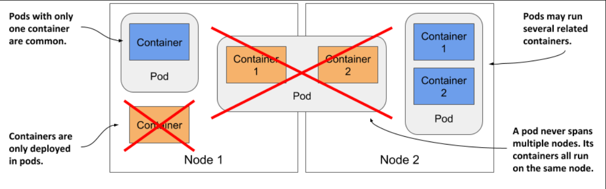
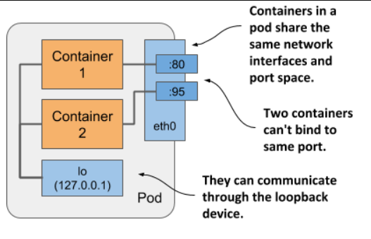
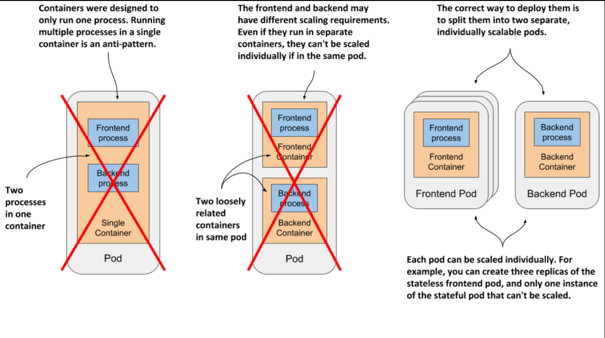
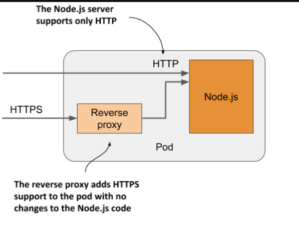

> # Understanding pods

A pod is the basic building block in Kubernetes, representing a group of co-located containers that are deployed and managed as a single unit. While a pod can contain multiple containers, it's common for it to have just one. All containers within a pod run on the same worker node, as a single pod instance does not span multiple nodes.

  

## Understanding why one container shouldn’t contain multiple processes

When an application consists of several processes that communicate via IPC or shared files, it can run within a single container, but managing multiple processes in one container can be challenging.

Containers are designed to run a single process that writes logs to standard output. Running multiple processes in a container can result in intertwined logs, making it difficult to determine which process each log entry belongs to

Containers should run a single process because the container runtime only restarts the container when its root process dies, ignoring any child processes spawned by it

To take full advantage of the features provided by the container runtime, you should consider running only one process in each container.

## Understanding how a pod combines multiple containers

Since running multiple processes in a single container is discouraged, pods were introduced as a higher-level construct that allows related processes to run in separate containers while communicating like processes on a single computer.

Pods allow closely related processes to run together in separate containers while sharing some resources, providing a unified environment and making interconnected containers manageable as a single unit

Containers in a pod share Linux namespaces, such as the network namespace, allowing them to use the same network interfaces, IP addresses, and port space, which is how Kubernetes and the container runtime combine containers into pods.

  

Within a pod, containers share the same network port space, system hostname, and IPC namespace, which allows them to communicate and avoids port conflicts. They also can share a single PID namespace for a unified process tree, but this must be explicitly enabled for each pod.

It’s this sharing of certain namespaces that gives the processes running in a pod the impression that they run together, even though they run in separate containers.

`Hint for you: `
A **namespace** is a method of isolating resources in a computer, so different processes or containers operate in their own separate space without interfering with each other. Within the same namespace, they share certain resources or properties, like network interfaces, file system paths, or process IDs, enabling interaction while remaining isolated from other namespaces.

Each container has its own namespace, such as a Mount namespace for its file system, ensuring it operates in isolation. However, when containers are part of the same pod, they can share certain namespaces, like the network namespace, which allows them to interact with each other in specific ways while maintaining their own isolated environments.

## Splitting a multi-tier application stack into multiple pods

In a containerized system, it's best to run the front-end web server and back-end database in separate containers to align with container design principles, which favor running a single process per container. While you could place these separate containers in the same Kubernetes pod, it's not recommended.

**The reasons the above situation is not recommended is:**

- I’ve explained that all containers of a pod always run co-located, but do the web server and the database have to run on the same computer? The answer is obviously no, as they can easily communicate over the network. Therefore you shouldn’t run them in the same pod.

- If both the front-end and back-end are in the same pod, they run on the same cluster node, which can lead to under utilization of resources in a multi-node cluster; by splitting them into separate pods, Kubernetes can distribute them across nodes, optimizing resource usage.

- Another reason not to use a single pod is related to horizontal scaling: since a pod is the basic unit of scaling, front-end and back-end components should be in separate pods to allow independent scaling, as front-end components often require different scaling than stateful back-end components, which usually cannot be scaled as easily.
  

    
  

**Best Practice**: Deploy the web server and database in separate pods and use Kubernetes services to manage their communication. This approach maximizes flexibility, scalability, and resource efficiency.

## Introducing sidecar containers

**Sidecar** containers are typically used to enhance or extend the functionality of the main application container. They can perform auxiliary tasks such as logging, monitoring, or proxy requests without altering the main application's logic.

An example of a sidecar container is adding a reverse proxy to a pod running a Node.js application that only supports HTTP; the proxy converts HTTPS traffic to HTTP, allowing secure communication without modifying the existing application, with the Node.js container as the primary container and the proxy as the sidecar.

  

    
  

## How to decide whether to split containers into multiple pods

Ask yourself the following questions to take a decision:

1. Do these containers have to run on the same host?
2. Do I want to manage them as a single unit?
3. Do they form a unified whole instead of being independent components?
4. Do they have to be scaled together?
5. Can a single node meet their combined resource needs?

If the answer to all these questions is yes, put them all in the same pod. As a rule of thumb, always place containers in separate pods unless a specific reason requires them to be part of the same pod.
