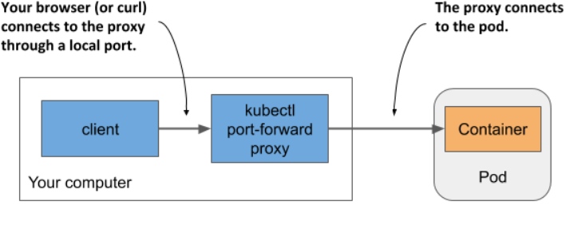
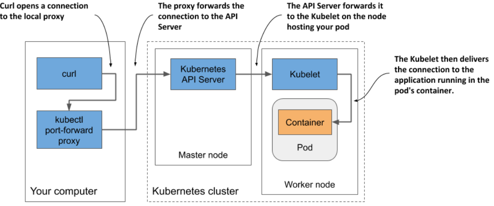

> # Interacting with the application and the pod

Your container is now running. In this section, you’ll learn how to communicate with the application, inspect its logs, and execute commands in the container to explore the application’s environment. Let’s confirm that the application running in the container responds to your requests.

```bash
# To show information about the pod, including its IP address, use this command:
sudo kubectl get pod <pod-name> -o wide
```

## Connecting to the pod from the worker nodes

You may need to use it if there are communication issues and you want to find the cause by first trying the shortest possible communication route.

```bash
curl <ip>:<port>
```

## Connecting from a one-off client pod

To run curl in a one-off pod, use the following command:

```bash
$ kubectl run --image=tutum/curl -it --restart=Never --rm client-pod curl 10.244.2.4:8080
Hey there, this is kubia. Your IP is ::ffff:10.244.2.5.
pod "client-pod" deleted
```

This command runs a pod with a single container created from the tutum/curl image. You can also use any other image that provides the curl binary executable. The -it option attaches your console to the container’s standard input and output, the --restart=Never option ensures that the pod is considered Completed when the curl command and its container terminate, and the --rm options removes the pod at the end. The name of the pod is client-pod and the command executed in its container is curl 10.244.2.4:8080.

Creating a pod just to see if it can access another pod is useful when you’re specifically testing pod-to-pod connectivity.

## Connecting to pods via kubectl port forwarding

During development, the easiest way to talk to applications running in your pods is to use the kubectl port-forward command, which allows you to communicate with a specific pod through a proxy bound to a network port on your local computer

  <p align="center">
    
  </p>

The following command starts a proxy that forwards your computer’s local port 8080 to the kubia pod’s port 8080:

- Port forwarding for a pod

  ```bash
  # Case 1
  # If the application's port inside the pod is 80 (for example, an Nginx server), and you want to forward it to port 8080 on your local machine, use port-forwarding with the correct configuration

  sudo kubectl port-forward nginx1-6d7876f5d4-h4wg9  9000:80

  # output for above command is
  # ... Forwarding from 127.0.0.1:80 -> 9000
  # ... Forwarding from [::1]:80 -> 9000
  # --------------------------------------------------
  # Case 2

  # The application runs on port 8080, and you want to forward this port to 8080 on your local machine.
  kubectl port-forward kubia 8080
  ```

- Port forwarding for a service
  ```bash
  kubectl port-forward service/<service-name> <local-port>:<service-port>
  ```

The curl process connects to the proxy, which connects to the API server, which then connects to the Kubelet on the node that hosts the pod, and the Kubelet then connects to the container through the pod’s loopback device (in other words, through the localhost address)

<p align="center">
  
</p>

## Viewing application logs

**Logs** are records of events, messages, and information generated by applications or systems that help in monitoring, debugging, and analyzing their behavior.
This command lets you see the recent log entries from the specified pod or container.

- Basic command

  ```bash
  # object --> pod, service and deployment.
  sudo kubectl logs <object-name>
  ```

- Streaming logs using kubectl logs -f(--follow)
  to see each request as it comes in

  ```bash
  Streaming logs using kubectl logs -f
  ```

- Displaying the timestamp of each log line

  ```bash
  kubectl logs kubia –-timestamps=true
  ```

- Displaying recent logs
  The first option is when you want to only display logs from the past several seconds, minutes or hours
  ```bash
  kubectl logs kubia --since=2m
  ```
- Displaying logs produced after a specific date

  ```bash
  kubectl logs kubia –-since-time=2020-02-01T09:50:00Z
  ```

- Displaying the last several lines of the log

  ```bash
   kubectl logs kubia –-tail=10
  ```

- Displaying logs for previous(pod, container, ...)

  The kubectl logs command displays only the logs of the current container. To view the logs from the previous container, use the --previous (or -p) option.

  ```bash
  # --previous = -p
  sudo kubectl logs <object-name> --previous
  ```

## Copying files to and from containers

You can use the kubectl cp command to copy files or directories between your local computer and a container in a pod, which is useful for development but not typically recommended for production environments.

- From a Container in pod to Your Local Computer
  ```bash
  kubectl cp kubia:/etc/hosts /tmp/kubia-hosts
  ```
- From Your Local Computer to a Container in pod

  ```bash
   kubectl cp /path/to/local/file kubia:path/in/container
  ```

## Executing commands in running containers

You can use the kubectl exec command to run commands or binaries inside a container, which is useful for debugging and inspecting the container's environment.

**First, you should understand the purpose of the double dash (--)**

`Hint For you: `The double dash (--) in the kubectl exec command separates kubectl options from the command to be run inside the container. If omitted, arguments starting with a dash may be mistakenly interpreted as options for kubectl exec, leading to errors.

- you can list the processes running in the container in the kubia pod by running the following command
  ```bash
  kubectl exec kubia -- ps aux
  ```
- you executed the curl command in a one-off client pod to send a request to your application, but you can also run the command inside the kubia pod itself:
  ```bash
  kubectl exec kubia -- curl -s localhost:8080
  ```
- you’ll see that the -s option can be used to specify the address and port of the Kubernetes API server.

  ```bash
  kubectl exec -it kubia -- bash
  # root@kubia:/#
  ```

you’ll see that the `-s` option can be used to specify the address and port of the Kubernetes API server.

## Not all containers allow you to run shells

Ephemeral containers in Kubernetes let you debug running containers by attaching a temporary container with debugging tools to a production container, which typically has a minimal set of binaries to enhance security and reduce size.

## Attaching to a running container

The kubectl attach command is another way to interact with a running container.

```bash
sudo kubectl attach pod_name
```

## Using kubectl attach to write to the application’s standard input
