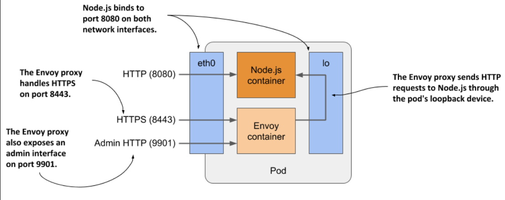
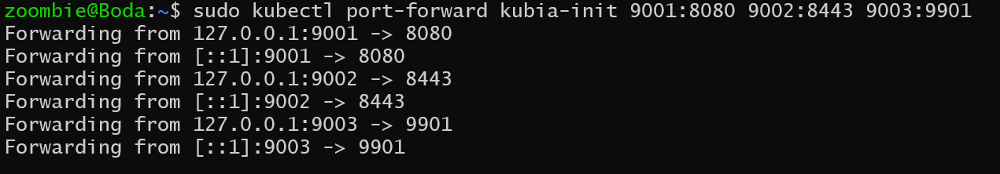
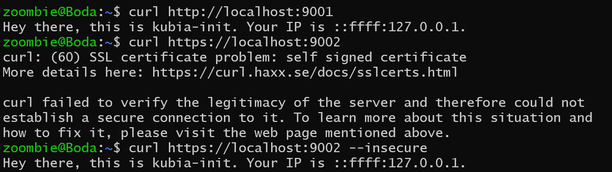

> # Running multiple containers in a pod

The kubia application you deployed in section 5.2 only supports HTTP. Let's add TLS support so it can also serve clients over HTTPS. You could do this by writing additional code, but an easier option exists where you don’t need to touch the code at all.

To enable HTTPS support for the HTTP-only kubia application, you can use a reverse proxy like Envoy in a sidecar container to handle HTTPS requests without modifying the application code.

## Extending the kubia Node.js application using the Envoy proxy

The updated application architecture will have a pod with two containers: Node.js handling HTTP requests directly, and Envoy managing HTTPS requests by forwarding them to Node.js via the localhost IP.

<p align="center">
  
</p>

Envoy also provides a web-based administration interface

## Creating a pod manifest to handle https requests and http requests

```yaml
apiVersion: v1
kind: Pod
metadata:
  name: kubia-ssl
spec:
  containers:
    - name: kubia
      image: luksa/kubia:1.0
      ports:
        - name: http #B
          containerPort: 8080 #B
    - name: envoy
      image: luksa/kubia-ssl-proxy:1.0
      ports:
        - name: https #D
          containerPort: 8443 #D
        - name: admin #E
          containerPort: 9901 #E
```

**Explain the purpose of using ports in the Envoy container**

- Port 8443 (https): Envoy listens on this port for incoming HTTPS requests. It handles the SSL/TLS termination, meaning it decrypts the HTTPS traffic and processes it.

- Port 8080 (http): This is the port used by the kubia container, which only handles HTTP requests. Envoy forwards the decrypted HTTP traffic to this port.

## Creating the pod using manifest

```bash
# -f for file
kubectl apply -f kubia-init.yaml
```

## Communicating with the application

you can use the kubectl port-forward to enable communication with the application in the pod. Because it exposes three different ports

**Let’s try it together:**

1. Running this command
   ```bash
   $ kubectl port-forward kubia-init 9001:8080 9002:8443 9003:9901
   ```
    <p align="center">
    
    </p>
2. Open a new terminal and try connecting to both HTTP and HTTPS. If you receive responses, the task is complete.
<p align="center">

</p>

The `--insecure` flag is used because the server’s certificate isn't trusted, and the domain name doesn’t match.

## Displaying logs of pods with multiple containers

- To display the logs for a specific container
  ```bash
  kubectl logs kubia-init -c kubia
  ```
- To display the logs of both containers with the --all-containers

  ```bash
  kubectl logs kubia-init --all-containers
  ```

## Running commands in containers of multi-container pods

```bash
# -c ===> --container
sudo kubectl exec -it kubia-init -c kubia -- sh
```
