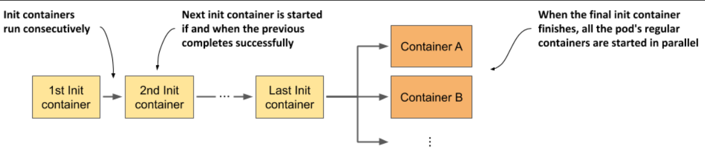

> # Running additional containers at pod startup

When a pod has multiple containers, they all start at the same time. Kubernetes doesn't have a built-in way to make one container wait for another to start first. However, you can use special containers called init containers to run tasks before the main containers start. These init containers are explained in this section.

## Introducing init containers

A pod manifest can specify a list of containers to run when the pod starts and before the pod’s normal containers are started. These containers are intended to initialize the pod and are appropriately called init containers

<p align="center">

</p>

## Understanding what init containers can do

- Initialize files in the volumes used by the pod’s main containers. This includes retrieving certificates and private keys used by the main container from secure certificate stores, generating config files, downloading data, and so on.
- Initialize the pod’s networking system. Because all containers of the pod share the same network namespaces, and thus the network interfaces and configuration, any changes made to it by an init container also affect the main container.
- Delay the start of the pod’s main containers until a precondition is met. For example, if the main container relies on another service being available before the container is started, an init container can block until this service is ready.
- Notify an external service that the pod is about to start running. In special cases where an external system must be notified when a new instance of the application is started, an init container can be used to deliver this notification.

## Understanding when moving initialization code to init containers makes sense

- Using an init container for initialization tasks eliminates the need to rebuild the main container image and allows the reuse of the init container image across different applications. This is useful for injecting the same initialization code into multiple pods. It also ensures that initialization is complete before any main containers start.
- Using init containers enhances security by moving tools or data that could be exploited by attackers from the main container to the init container, reducing the pod's attack surface.

## Explain a manifest with initContainers

**The Purpose of Init Containers**

- The first init container simulates an initialization process by running for 5 seconds and printing some text to the standard output.
- The second init container performs a network connectivity test using the ping command to check if a specific IP address is reachable from within the pod. If no IP address is specified, it defaults to 1.1.1.1.

```yaml
apiVersion: v1
kind: Pod
metadata:
  name: kubia-init
spec:
  initContainers:
    - name: init-demo
      image: luksa/init-demo:1.0
    - name: network-check
      image: luksa/network-connectivity-checker:1.0
  containers:
    - name: kubia
      image: luksa/kubia:1.0
      ports:
        - name: http
          containerPort: 8080
    - name: envoy
      image: luksa/kubia-ssl-proxy:1.0
      ports:
        - name: https
          containerPort: 8443
        - name: admin
          containerPort: 9901
```

**Important Command:**

To see the status of pods in real-time when creating a new pod, use the following command:

```bash
# -w is short for --watch
sudo kubectl get pods -w
# to show events
sudo kubectl get events -w
# to show logs
sudo kubectl get logs -w
```
