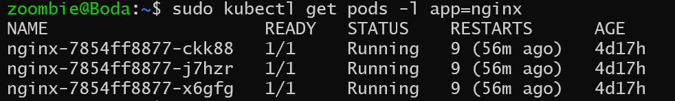
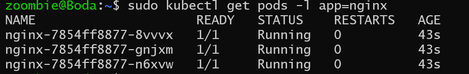

> # Deleting pods and other objects

- Deleting a single pod
  ```bash
    kubectl delete po kubia
    # To skip the wait, run the command with the --wait=false option.
  ```
- Deleting multiple pods with a single command

  ```bash
    kubectl delete po kubia-init kubia-init-slow
  ```

- Deleting objects by specifying the manifest file
  ```shell
    kubectl delete -f kubia-ssl.yaml
  ```
- Deleting objects from multiple manifest files
  ```shell
  kubectl delete -f kubia.yaml,kubia-ssl.yaml
  ```
- Deleting all pods
  ```shell
    kubectl delete po --all
  ```

## When you delete your pods

**when I try to delete a pods for deployment app=nginx**

1. Show these pods for this deployment

   ```shell
   # Using this command
   # The -l flag in the kubectl get pods command stands for "label selector." It allows you to filter the list of pods based on their labels
   sudo kubectl get pods -l app=nginx
   ```

   <p align="center">
   
   </p>

2. Delete these pods
    <p align="center">
   
   </p>
3. Show it again
    <p align="center">
   
   </p>

That was unexpected! Three pods are still running. If you look closely at their names, you’ll see that these aren’t the Three you’ve just deleted. The AGE column also indicates that these are new pods. You can try to delete them as well, but you’ll see that no matter how often you delete them, new pods are created to replace them.

**The Reason:**

The reason why these pods keep popping up is because of the Deployment object. The controller responsible for bringing Deployment objects to life must ensure that the number of pods always matches the desired number of replicas specified in the object.

**How to delete them ?!**

To delete these pods, you must either scale the Deployment to zero or delete the object altogether. This would indicate that you no longer want this deployment or its pods to exist in your cluster.

## Deleting objects of most kinds

The first all in the command indicates that you want to delete objects of all types. The --all option indicates that you want to delete all instances of each object type. You used this option in the previous section when you tried to delete all pods.

```shell
kubectl delete all --all
```

You can specify multiple object types in the delete command. For example, you can use kubectl delete events,all --all to delete events along with all object kinds included in all.

```shell
sudo kubectl delete events,all --all
```
