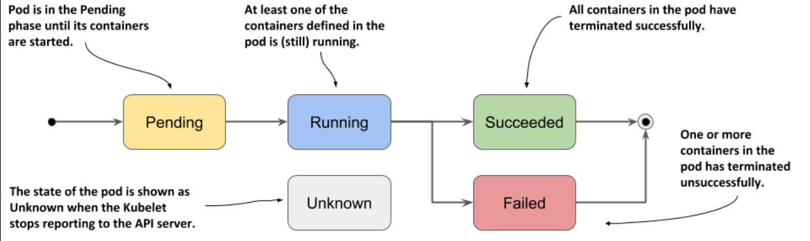
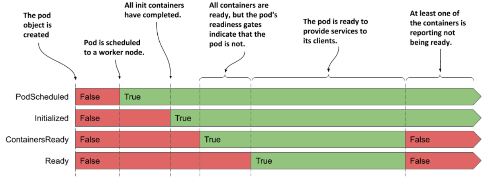

> # Understanding the pod's status

Pod’s status section contains the following information:

- The IP addresses of the pod and the worker node that hosts it
- When the pod was started
- The pod’s quality-of-service (QoS) class
- That phase the pod is in,
- The conditions of the pod, and
- The state of its individual containers.

## Understanding the pod phase

  

   
   

## Understanding pod conditions

Four condition types are known at the time of writing. They are explained in the following table:

- `PodScheduled: `Indicates whether or not the pod has been scheduled to a node.
- `Initialized: `The pod’s init containers have all completed successfully.
- `ContainersReady: `All containers in the pod indicate that they are ready. This is a necessary but not sufficient condition for the entire pod to be ready.
- `Ready: `The pod is ready to provide services to its clients. The containers in the pod and the pod’s readiness gates are all reporting that they are ready.

The transitions of the pod’s conditions during its lifecycle

- **PodScheduled and Initialized** conditions start as unfulfilled but become fulfilled shortly after the pod's creation and remain fulfilled throughout the pod's life.
- **Ready and ContainersReady** conditions can fluctuate between fulfilled and unfulfilled multiple times during the pod's lifetime, indicating changes in the pod's readiness state.

  

   
   

`Hint for you: `Do you remember the conditions you can find in a node object? They are MemoryPressure, DiskPressure, PIDPressure and Ready. As you can see, each object has its own set of condition types, but many contain the generic Ready condition, which typically indicates whether everything is fine with the object.

Each condition in a Kubernetes pod has a status field that can be True, False, or Unknown. For the kubia pod, all conditions have a status of True, indicating they are fulfilled. Each condition may also include a reason field for the last status change and a message field explaining the change in detail. The lastTransitionTime field records when the status last changed, and the lastProbeTime indicates when the condition was last checked.

## Understanding the status of the containers

The state field indicates the container’s current state, whereas the lastState field shows the state of the previous container after it has terminated. The container status also indicates the internal ID of the container (containerID), the image and imageID the container is running, whether the container is ready or not and how often it has been restarted (restartCount).

  

   
   

