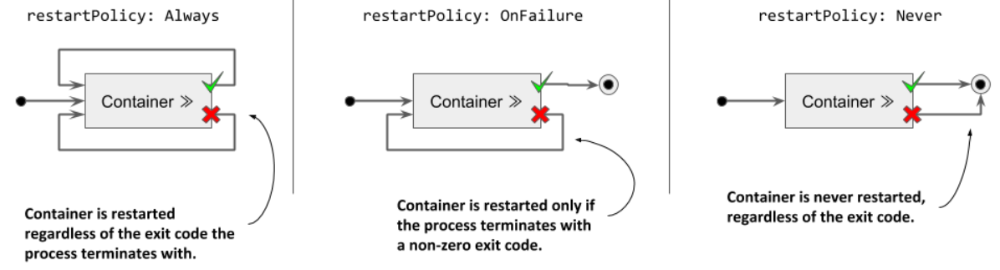
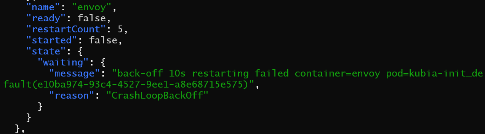
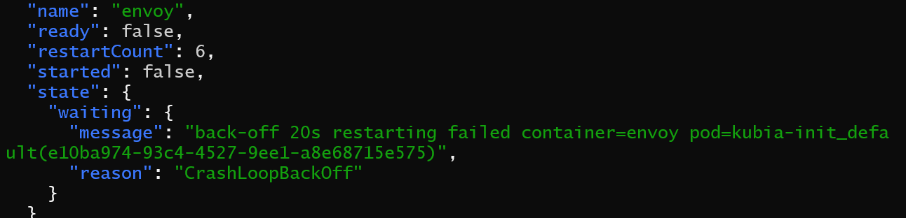
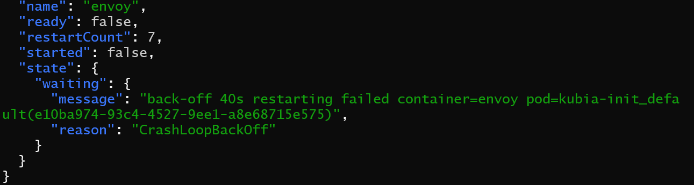
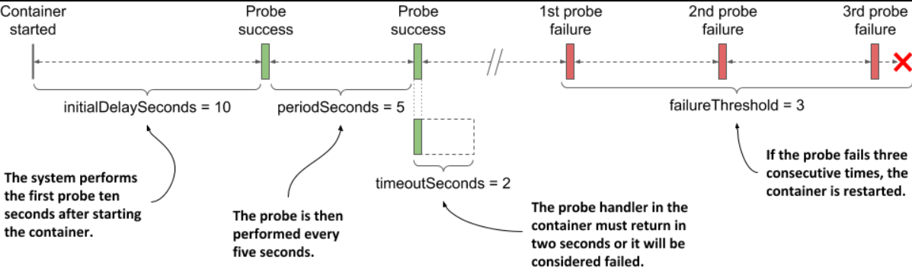
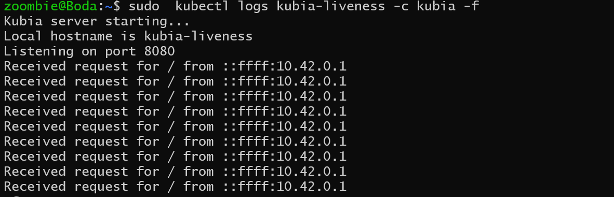
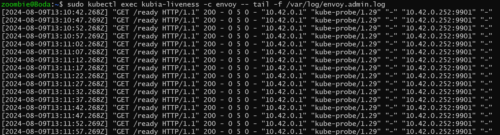
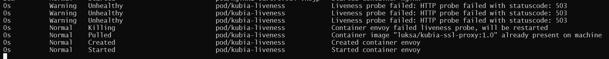
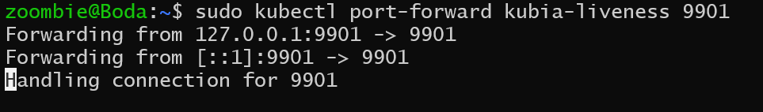
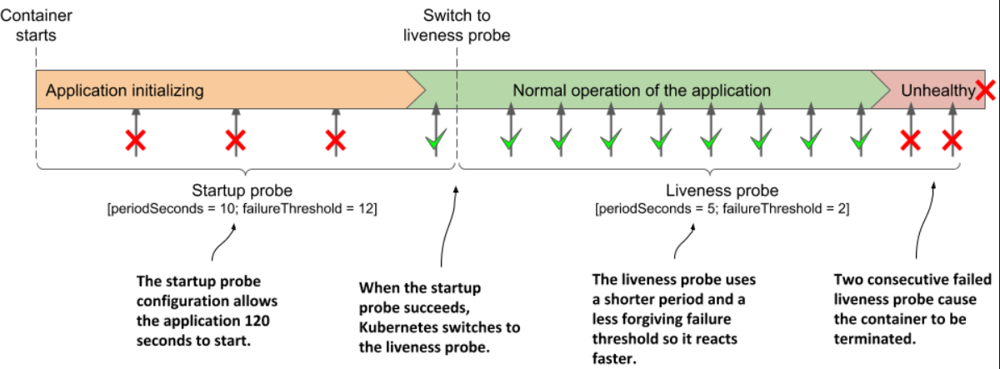

> # Keeping containers healthy

## Understanding container auto-restart

When a pod is scheduled to a node, the Kubelet on that node starts its containers and ensures they keep running as long as the pod exists. If the main process in a container terminates, the Kubelet restarts the container. This means that if an application crashes, Kubernetes automatically restarts it, providing self-healing capabilities without needing any special configuration in the application.

## Configuring the pod’s restart policy

By default, Kubernetes restarts the container regardless of whether the process in the container exits with a zero or non-zero exit code - in other words, whether the container completes successfully or fails. This behavior can be changed by setting the restartPolicy field in the pod’s spec.

<p align="center">
  
</p>

`Hint for you: `
The restart policy is configured at the pod level and applies to all its containers. It can’t be configured for each container individually.

## Understanding the time delay inserted before a container is restarted

If you call Envoy’s /quitquitquit endpoint several times, you’ll notice that each time it takes longer to restart the container after it terminates. The pod’s status is displayed as either NotReady or

As shown in the following figure, the first time a container terminates, it is restarted immediately. The next time, however, Kubernetes waits ten seconds before restarting it again. This delay is then doubled to 20, 40, 80 and then to 160 seconds after each subsequent termination. From then on, the delay is kept at five minutes. This delay that doubles between attempts is called exponential back-off.

[Let's use an example from Chapter 5, Section 4](../chapter_5/5_4.md/#communicating-with-the-application):

Let's try terminating the Envoy container using the following command:

```shell
curl -X POST http://localhost:9901/quitquitquit
```

- First termination time
    <p align="center">
    
    </p>

- Second termination time
    <p align="center">
    
    </p>

- Third termination time

    <p align="center">
    
    </p>

## Checking the container’s health using liveness probes

**Let's get a quick overview of issues that are not easily detectable**

- Memory Leaks: An application might continue running while encountering errors such as OutOfMemoryError, which don't cause the process to terminate but do affect its functionality.

- Infinite Loops or Deadlocks: These situations can cause an application to stop responding, but since the process itself is still running, Kubernetes won't automatically restart it.

In such cases, the application might not be able to detect these on its own, so external monitoring is needed to assess the application's state and trigger a restart if necessary. This ensures the application remains healthy and responsive.

# liveness probes

Kubernetes can use liveness probes to check if an application is still functioning properly. Each container in a pod can have a liveness probe defined, which Kubernetes runs periodically to check the application's health. If the application fails to respond, returns an error, or gives a negative response, the container is marked as unhealthy and terminated. The container is then restarted if the restart policy permits it.

## Types of liveness probes

**Kubernetes can probe a container with one of the following three mechanisms:**

- An `HTTP GET` probe sends a GET request to the container’s IP address, on the network port and path you specify. If the probe receives a response, and the response code doesn’t represent an error (in other words, if the HTTP response code is 2xx or 3xx), the probe is considered successful. If the server returns an error response code, or if it doesn’t respond in time, the probe is considered to have failed.

- A `TCP Socket` probe attempts to open a TCP connection to the specified port of the container. If the connection is successfully established, the probe is considered successful. If the connection can’t be established in time, the probe is considered failed.
- An `Exec probe` executes a command inside the container and checks the exit code it terminates with. If the exit code is zero, the probe is successful. A non-zero exit code is considered a failure. The probe is also considered to have failed if the command fails to terminate in time.

## Define liveness probes in the pod manifest and specifically explain the httpGet type

Adding a liveness probe to a pod: kubia-liveness.yaml

```yaml
apiVersion: v1
kind: Pod
metadata:
  name: kubia-liveness
  namespace: default # Ensure the namespace is specified if needed
spec:
  containers:
    - name: kubia
      image: luksa/kubia:1.0
      ports:
        - name: http
          containerPort: 8080
      livenessProbe: # A
        httpGet: # A
          path: / # A
          port: 8080 # A
    - name: envoy
      image: luksa/kubia-ssl-proxy:1.0
      ports:
        - name: https
          containerPort: 8443
        - name: admin
          containerPort: 9901
      livenessProbe: # B
        httpGet: # B
          path: /ready # B
          port: 9901 # B
        initialDelaySeconds: 10 # B
        periodSeconds: 5 # B
        timeoutSeconds: 2 # B
        failureThreshold: 3 # B
```

**let us talk with details about options for probe**

<p align="center">
    
    </p>

The parameter initialDelaySeconds determines how long Kubernetes should delay the execution of the first probe after starting the container. The periodSeconds field specifies the amount of time between the execution of two consecutive probes, whereas the timeoutSeconds field specifies how long to wait for a response before the probe attempt counts as failed. The failureThreshold field specifies how many times the probe must fail for the container to be considered unhealthy and potentially restarted.

- #A The liveness probe definition for the container running Node.js

  The liveness probe for the kubia container is the simplest version of a probe for HTTP-based applications. The probe simply sends an HTTP GET request for the path / on port 8080 to determine if the container can still serve requests. If the application responds with an HTTP status between 200 and 399, the application is considered healthy.

  The probe doesn’t specify any other fields, so the default settings are used. The first request is sent 10s after the container starts and is repeated every 10s. If the application doesn’t respond within one second, the probe attempt is considered failed. If it fails three times in a row, the container is considered unhealthy and is terminated.

- #B The liveness probe for the Envoy proxy

  The administration interface of the Envoy proxy provides the special endpoint /ready through which it exposes its health status. Instead of targeting port 8443, which is the port through which Envoy forwards HTTPS requests to Node.js, the liveness probe for the envoy container targets this special endpoint on the admin port, which is port number 9901

### Observing a successful liveness probe

Apply the manifest for the pod named kubia-liveness

```shell
sudo kubectl apply -f kubia-liveness.yaml
```

- Check the probe specified for the kubia container
  The Node.js application in the kubia container prints a line to the standard output every time it handles an HTTP request. This includes the liveness probe requests, so you can display them using the following command:

  ```shell
  # Continuous Streaming: The -f flag allows you to continuously stream the logs from the specified container (kubia in this case) within the pod (kubia-liveness).
  sudo kubectl logs pod kubia-liveness -c kubia -f
  ```

  <p align="center">
    
    </p>

- Check the probe specified for the envoy container
  The liveness probe for the envoy container is configured to send HTTP requests to Envoy’s administration interface, which doesn’t log HTTP requests to the standard output, but to the file /var/log/envoy.admin.log in the container’s filesystem. To display the log file, you use the following command:

  ```shell
  kubectl exec kubia-liveness -c envoy -- tail -f /var/log/envoy.admin.log
  ```

  <p align="center">
    
    </p>

### Observing the liveness probe fail

`Hint: ` Each step requires a separate terminal

1.  Start watching events by executing the following command in a separate terminal:

    ```shell
    kubectl get events -w
    ```

    <p align="center">
    
    </p>

2.  make port forwarding to can make request to envoy in admin that has port 9901

    <p align="center">
        
        </p>

3.  To make it fail, open URL http://localhost:9901 in your browser and click the healthcheck/fail button or use the following curl command:

        ```shell
        curl -X POST localhost:9901/healthcheck/fail
        ```

`Remember` that the probe failure threshold is set to three, so when the probe fails three times in a row, the container is stopped and restarted

### Understanding how a container that fails its liveness probe is restarted

To determine if the main process in a container was stopped gracefully or killed forcibly, check the pod's status by retrieving the full manifest with kubectl get or kubectl describe.

The exit code zero shown in the listing implies that the application process gracefully exited on its own. If it had been killed, the exit code would have been 137.

**Status codes:**
128 + n

- KILL : 128 + 9 = 137
- TERM : 128 + 15 = 143

**You can request the logs of the previous container using the --previous or -p flag:**

```shell
kubectl logs kubia-liveness -c envoy -p
```

## Define liveness probes in the pod manifest and specifically explain the tcpSocket type

For applications that accept non-HTTP TCP connections, a tcpSocket liveness probe can be configured. Kubernetes tries to open a socket to the TCP port and if the connection is established, the probe is considered a success, otherwise it's considered a failure.

```yaml
livenessProbe:
  tcpSocket: #A
    port: 1234 #A
  periodSeconds: 2 #B
  failureThreshold: 1 #C
```

The probe in the listing is configured to check if the container’s network port 1234 is open. An attempt to establish a connection is made every two seconds and a single failed attempt is enough to consider the container as unhealthy.

## Define liveness probes in the pod manifest and specifically explain the tcpSocket type

Applications that do not accept TCP connections may provide a command to check their status. For these applications, an exec liveness probe is used.

The command is executed inside the container and must therefore be available on the container’s file system.

```yaml
livenessProbe:
  exec:
    command: #A
      - /usr/bin/healthcheck #A
  periodSeconds: 2 #B
  timeoutSeconds: 1 #C
  failureThreshold: 1 #D
```

If the command returns exit code zero, the container is considered healthy. If it returns a non-zero exit code or fails to complete within one second as specified in the timeoutSeconds

# Using a startup probe when an application is slow to start

The default liveness probe settings in Kubernetes can cause an application with a long startup time to repeatedly restart if it doesn't respond quickly enough, leading to a restart loop; increasing the liveness probe's initialDelaySeconds, periodSeconds, or failureThreshold can prevent this, but it also delays detection of actual failures during normal operation, which is problematic for applications with lengthy startup times.

## Introducing startup probes

Kubernetes provides startup probes to handle applications with long startup times; these probes run only at startup to account for slow initialization and, upon success, switch to liveness probes to quickly detect when an application becomes unhealthy during steady-state operation.

## Adding a startup probe to a pod’s manifest

Imagine that the kubia Node.js application needs more than a minute to warm up, but you want it to be restarted within 10 seconds after it has become unhealthy during normal operation.

startup probe solve this issue

```yaml
containers:
  - name: kubia
    image: luksa/kubia:1.0
    ports:
      - name: http
        containerPort: 8080
    startupProbe:
      httpGet:
        path: / #A
        port: http #A
      periodSeconds: 10 #B
      failureThreshold: 12 #B
    livenessProbe:
      httpGet:
        path: / #A
        port: http #A
      periodSeconds: 5 #C
      failureThreshold: 2 #C
```

#A The startup and the liveness probes typically use the same endpoint

#B The application gets 120 seconds to start

#C After startup, the application’s health is checked every 5 seconds, and is restarted when it fails the liveness probe twice

**Fast detection of application health problems using a combination of startup and liveness probe**

<p align="center">
        
        </p>
