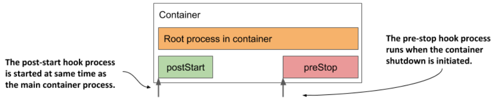

> # Executing actions at container start-up and shutdown

In Kubernetes, lifecycle hooks allow you to run additional processes during specific phases of a container's lifecycle. There are two types of hooks:

- `Post-start Hooks`: These hooks are executed immediately after a container starts. They can be used to run initialization tasks or scripts that need to be completed before the main container process begins.

- `Pre-stop Hooks`: These hooks are executed just before a container stops. They can be used to perform cleanup tasks, save state, or gracefully shut down services.

Lifecycle hooks provide more control over the container's behavior during its start and stop phases, enhancing the management of application lifecycle events.

<p align="center">
   
   </p>

Like liveness probes, lifecycle hooks can be used to either

- execute a command inside the container, or
- send an HTTP GET request to the application in the container.

## Using post-start hooks to perform actions when the container starts

The post-start lifecycle hook is invoked right after a container is created. It can be used to perform initialization tasks using two methods:

- Exec Hook: Executes an additional process inside the container as the main process starts.
- HttpGet Hook: Sends an HTTP request to the application running in the container to perform initialization or warm-up procedures.

These hooks help ensure that necessary setup tasks are completed before the main application begins processing.

A post-start hook allows you to perform initialization tasks without modifying the application code or its container image, providing a simple alternative for existing applications you did not create.

### Using a post-start container lifecycle hook to run a command in the container

In the 1990s, the fortune command on Unix systems like Solaris amused users with random messages at login, and while it's less common today, it can still be installed and run for entertainment on Unix/Linux systems.

```shell
fortune
```

In the following exercise, you’ll combine the fortune program with the Nginx web server to create a web-based fortune service.

- Objective: Develop a service where the fortune command writes a message to a file, which is then served by Nginx. Initially, the same message will be returned with every request, serving as a starting point for iterative improvements.
- Use Nginx Container Image: Utilize the Nginx web server, available as a container image, to serve the message file.

- Install fortune Command: Since the fortune command is not available in the Nginx image, typically, you would build a new image based on the Nginx image and install the fortune package during the container build process.

- Simplify Installation and Execution: For simplicity, both install and run the fortune command when the container starts. This approach is generally not recommended for production environments.

- Implement Post-Start Hook: Use a post-start hook in the pod manifest to install and execute the fortune command when the container starts. This setup allows the service to generate the message dynamically each time the container is initiated.

```yaml
apiVersion: v1
kind: Pod
metadata:
  name: fortune-poststart #A
spec:
  containers:
    - name: nginx #B
      image: nginx:alpine #B
      lifecycle: #C
        postStart: #C
          exec: #C
            command: #C
              - sh #D
              - -c #D
              - "apk add fortune && fortune > /usr/share/nginx/html/quote" #D
      ports: #E
        - name: http #E
          containerPort: 80 #E
```

**Let's explain the command that will be executed in the post-start hook**

```shell
sh -c "apk add fortune && fortune > /usr/share/nginx/html/quote"
```

- The apk add fortune command runs the Alpine Linux package management tool, which is part of the image that nginx:alpine is based on, to install the fortune package in the container.
- The fortune command is executed, and its output is redirected to the /usr/share/nginx/html/quote file.

### Understanding how a post-start hook affects the container

- While the post-start hook is executing, the container remains in the "Waiting" state with the reason "ContainerCreating," and the pod's phase is "Pending," preventing kubectl logs from displaying logs.
- A post-start hook can cause a container to restart if the command fails to execute or returns a non-zero exit code.

### Capturing the output produced by the process invoked via a post-start hook

The output of a successful post-start hook command isn't logged, so to view it, the command must write to a file, which can then be inspected.

```shell
kubectl exec my-pod -- cat logfile.txt
```

## Using an HTTP GET post-start hook

you can have Kubernetes send an HTTP GET request when it starts the container by using an httpGet post-start hook.

```yaml
lifecycle: #A
  postStart: #A
    httpGet: #A
      port: 80 #B
      path: /warmup #B
```

A post-start hook can be used to send an initial request to a web application container to initialize caches or warm up components, improving the response time for the first client request.

An HTTP GET post-start hook executes immediately when the container's main process starts, which can cause issues if the process is slow to start, potentially leading to container restarts if the hook fails.

## Running a process just before the container terminates

A pre-stop hook is executed before a container is terminated, allowing Kubernetes to run custom commands before sending the TERM signal to the container's main process, which instructs it to shut down.

A pre-stop hook can be used to initiate a graceful shutdown of the container or to perform additional operations without having to implement them in the application itself. As with post-start hooks, you can either execute a command within the container or send an HTTP request to the application running in it.

### Using a pre-stop lifecycle hook to shut down a container gracefully

The Nginx web server in the fortune pod responds to the TERM signal by immediately closing connections and terminating, which can disrupt ongoing client requests. To enable a graceful shutdown, you can use the nginx -s quit command, which allows Nginx to stop accepting new connections, process existing requests, and then shut down. You can use a pre-stop lifecycle hook to run this command and ensure that the pod shuts down gracefully.

```yaml
lifecycle: #A
  preStop: #A
    exec: #B
      command: #B
        - nginx #C
        - -s #C
        - quit #C
```

`Hint`

Unlike the post-start hook, a failure in the pre-stop hook does not prevent container termination; a FailedPreStopHook warning event will appear if the hook fails, but it might not be visible if you only monitor the pod's status.
