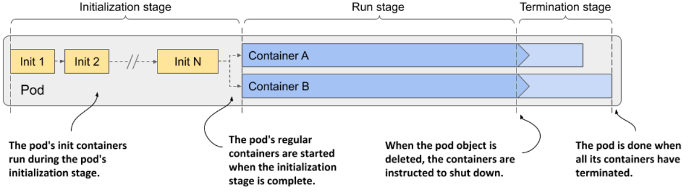
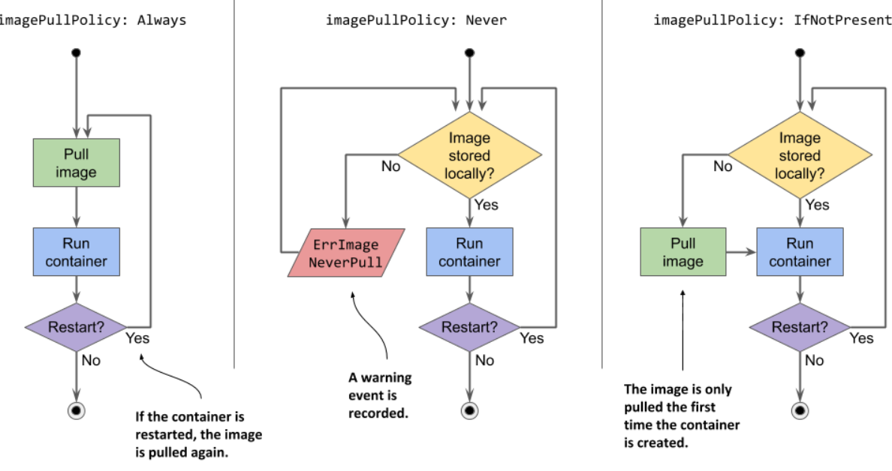
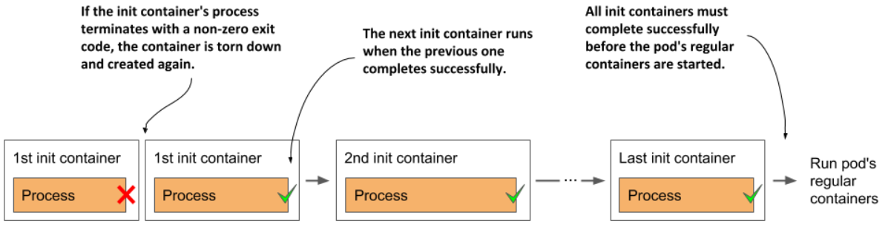
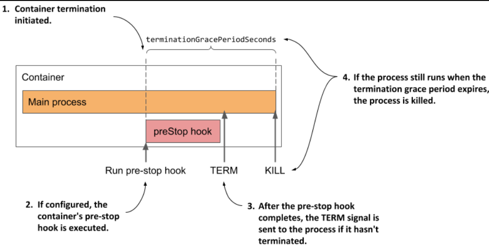
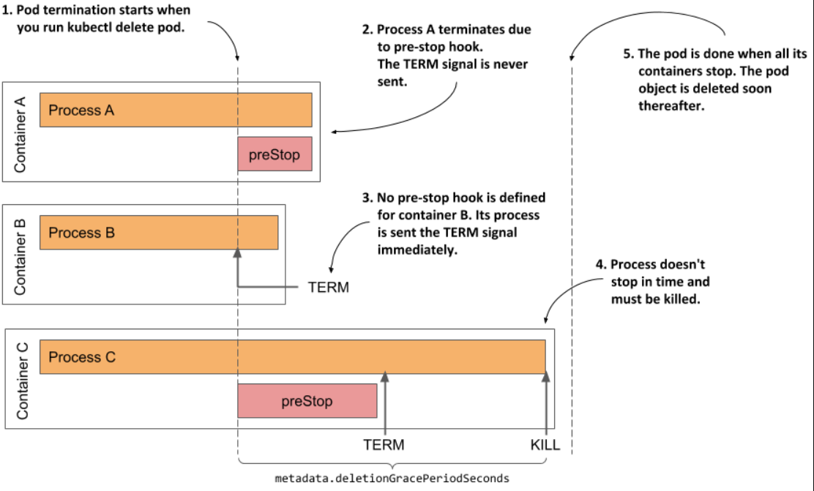
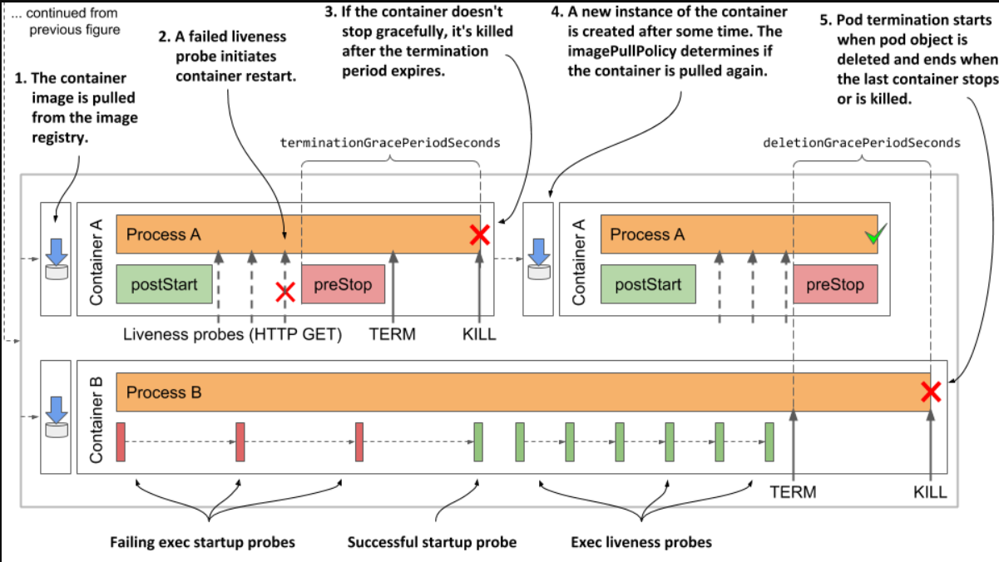

> # Understanding the pod lifecycle

When you create a pod object, Kubernetes schedules it to a worker node that then runs its containers. The pod’s lifecycle is divided into the three stages shown in the next figure:

<p align="center">
   
   </p>

# Understanding the initialization stage

The pod’s init containers run first. They run in the order specified in the initContainers field in the pod’s spec

## Pulling the container image

Before each init container is started, its container image is pulled to the worker node. The imagePullPolicy field in the container definition in the pod specification determines whether the image is pulled every time, only the first time, or never.

image pull policy options:

- `IfNotPresent: ` The Image is pulled if it is not already present on the worker node. This ensures that the image is only pulled the first time it’s required.
- `Never:  ` The image is never pulled from the registry; Kubernetes expects the image to already be present on the node. This is typically used in environments where you manage your own image distribution or if you’re using local image repositories.
- `Always: ` The image is pulled every time the container is (re)started. If the locally cached image matches the one in the registry, it is not downloaded again, but the registry still needs to be contacted.

    <p align="center">
    
    </p>

**`Hint`**

If the `imagePullPolicy` is set to `Always` and the image registry is offline, the container will not run even if the same image is already stored locally. A registry that is unavailable may therefore prevent your application from (re)starting.

## Running the containers

When the first container image is downloaded to the node, the container is started. When the first init container is complete, the image for the next init container is pulled and the container is started. This process is repeated until all init containers are successfully completed. Containers that fail might be restarted.

<p align="center">

</p>

## Restarting failed init containers

1. Case 1: Restart Policy is Always or OnFailure
   - Behavior: If an init container terminates with an error, the failed init container is restarted.
   - Outcome: The pod attempts to recover by restarting the failed init container.
2. Case 2: Restart Policy is Never
   - Behavior: If an init container terminates with an error, the subsequent init containers and the pod’s regular containers are never started.
   - Outcome: The pod’s status is displayed as Init
     indefinitely.
   - Action Required: You must delete and recreate the pod object to restart the application.

## Re-executing the pod’s init containers

Init containers in Kubernetes are typically executed once per pod, but they may be re-executed if the entire pod is restarted, so their operations should be idempotent to handle such cases.

`Idempotent` is a property where an operation can be applied multiple times without changing the result beyond the initial application.

# Understanding the run stage

When all init containers are successfully completed, the pod’s regular containers are all created in parallel. In theory, the lifecycle of each container should be independent of the other containers in the pod, but this is not quite true

1. Sequential Container Start:

   - The Kubelet starts containers in a pod one by one, in the order they are listed in the pod's specification.
   - Containers are not all started at the same time.

2. Post-Start Hook:

   - A post-start hook is a custom command or script that runs after a container is created.
   - It starts running as soon as the container is created.

3. Asynchronous Execution:

   - The post-start hook runs independently of the main process inside the container.
   - This means the main application in the container can begin running while the post-start hook is still executing.

4. Blocking Subsequent Containers:

   - Even though the post-start hook runs asynchronously with the main process, it must finish before the Kubelet will start the next container in the pod.
   - The execution of the post-start hook effectively blocks the start of any containers listed after it in the pod's spec.

`Pre-Stop Hook`

During container termination in Kubernetes, the pre-stop hooks for all containers in a pod are executed simultaneously. While a long-running pre-stop hook will delay the shutdown of its specific container, it does not affect the shutdown timing of other containers in the pod.

**Now, let’s go over the steps involved in the running process**

The following sequence runs independently for each container. First, the container image is pulled, and the container is started. When the container terminates, it is restarted, if this is provided for in the pod’s restart policy. The container continues to run until the termination of the pod is initiated.

## Pulling the container image

Before the container is created, its image is pulled from the image registry, following the pod’s imagePullPolicy. Once the image is pulled, the container is created.

`NOTE`

If one of the container images can’t be pulled, the other containers run anyway.

## Running the container

## Terminating and restarting the container on failures

If the startup or the liveness probe fails so often that it reaches the configured failure threshold, the container is terminated. As with init containers, the pod’s restartPolicy determines whether the container is then restarted or not.

Perhaps surprisingly, if the restart policy is set to Never and the startup hook fails, the pod’s status is shown as Completed even though the post-start hook failed.

## Introducing the termination grace period

If a container must be terminated, the container’s pre-stop hook is called so that the application can shut down gracefully. When the pre-stop hook is completed, or if no pre-stop hook is defined, the TERM signal is sent to the main container process. This is another hint to the application that it should shut down.

The application is given a configurable grace period (default 30 seconds) to terminate after receiving a TERM signal or executing a pre-stop hook; if it does not terminate within this period, it is forcibly terminated with a KILL signal.

<p align="center">

</p>

# Understanding the termination stage

The pod’s containers continue to run until you finally delete the pod object. When this happens, termination of all containers in the pod is initiated and its status is changed to Terminating.

## Introducing the deletion grace period

The termination of each container at pod shutdown follows the same sequence as when the container is terminated because it has failed its liveness probe, except that instead of the termination grace period, the pod’s deletion grace period determines how much time is available to the containers to shut down on their own.

This grace period is defined in the pod’s `metadata.deletionGracePeriodSeconds` field, which gets initialized when you delete the pod. By default, it gets its value from the `spec.terminationGracePeriodSeconds` field, but you can specify a different value in the kubectl delete command.

## Understanding how the pod’s containers are terminated

the pod’s containers are terminated in parallel. For each of the pod’s containers, the container’s pre-stop hook is called, the TERM signal is then sent to the main container process, and finally the process is terminated using the KILL signal if the deletion grace period expires before the process stops by itself. After all the containers in the pod have stopped running, the pod object is deleted.

<p align="center">

</p>

## Inspecting the slow shutdown of a pod

Examine the final stage of the pod’s lifecycle with one of the pods you created earlier. If the kubia-ssl pod is not running in your cluster, recreate it. Deleting the pod with kubectl delete pod kubia-ssl takes a significant amount of time.

The kubia-ssl pod takes about 30 seconds to delete because both containers in the pod must stop before deletion. Since there are no pre-stop hooks defined, the containers receive a TERM signal immediately upon pod deletion. The 30-second(`spec.terminationGracePeriodSeconds`) delay corresponds to the default termination grace period, suggesting that one or both containers are not stopping promptly and are being killed after the grace period expires.

**Let's determine the reason for the long termination time**

The reason for the delay is that spec.terminationGracePeriodSeconds defaults to 30 seconds. Let's change this value in the manifest file for the pod named kubia-init

1. First Method to Change terminationGracePeriodSeconds

   ```yaml
   apiVersion: v1
   kind: Pod
   metadata:
   name: kubia-ssl-shortgraceperiod
   spec:
   terminationGracePeriodSeconds: 5 #A
   containers:
   ```

2. Second Method
   Use this command when you delete the pod
   ```yaml
   kubectl delete po kubia-ssl --grace-period 10
   ```

## Fixing the shutdown behavior of the kubia application

To identify which container isn’t terminating properly, recreate the pod and stream the logs(`sudo kubectl logs kubia-init -c <container-name>`) for each container using kubectl logs. The logs will reveal that while the Envoy proxy terminates immediately, the Node.js application does not respond to the TERM signal. To resolve this, add the provided code to the end of the app.js file, found in the Chapter06/kubia-v2-image directory of the code archive.

```js
process.on("SIGTERM", function () {
  console.log("Received SIGTERM. Server shutting down...");
  server.close(function () {
    process.exit(0);
  });
});
```

## Visualizing the full lifecycle of the pod’s containers

<p align="center">

</p>
