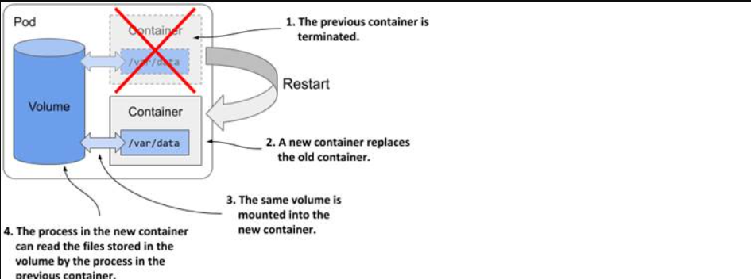
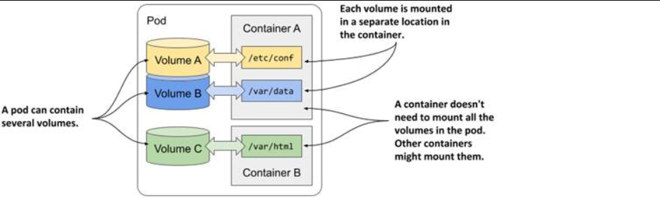
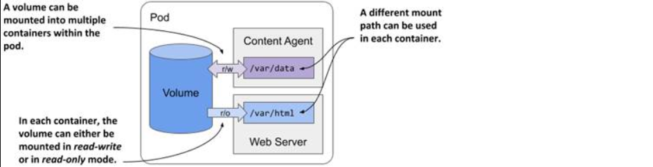
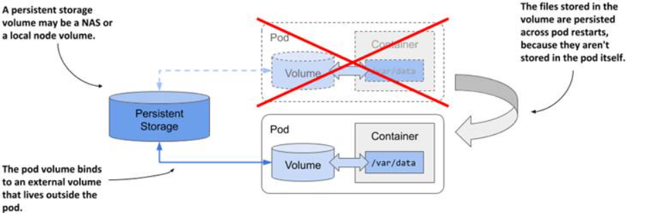
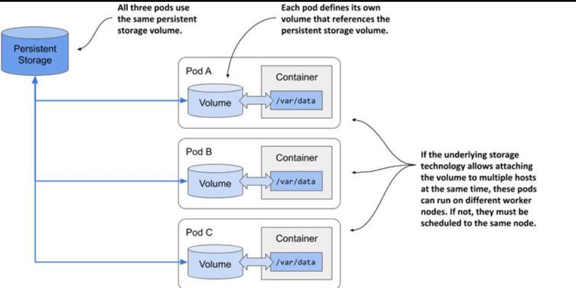

> # Introducing volumes

A pod is a small logical computer running a single application composed of one or more containers that share computing resources like CPU and RAM, but each container has its own isolated filesystem from the container image.

When a container is restarted, any changes made to its filesystem are lost because the container is replaced, not restarted, meaning that applications needing persistent data must find a way to preserve filesystem changes across restarts.

To solve the problem of losing filesystem changes upon container restart, a volume is added to the pod and mounted into the container to preserve data.

**Mounting** is the act of attaching the filesystem of some storage device or volume into a specific location in the operating system’s file tree

## Understanding how volumes fit into pods

Like containers, volumes aren’t top-level resources like pods or nodes, but are a component within the pod and thus share its lifecycle

The lifecycle of a volume is tied to the lifecycle of the entire pod and is independent of the lifecycle of the container in which it is mounted. Due to this fact, volumes are also used to persist data across container restarts.

### Persisting files across container restarts

**Problem:**

- When a container is restarted, its entire filesystem is recreated from the container image, resulting in the loss of any data written by the application since the filesystem is ephemeral without a volume.

**Solution:**

- Add a volume to the pod and mount it inside the container to persist data across container restarts.
- Volumes are created when the pod is set up and torn down when the pod shuts down, allowing the application to read and write data to a volume, which remains accessible even after the container restarts.

Not all data within a container needs to be preserved. The application's author should decide which data is important to retain, such as data representing the application's state, while other data, like temporary cached data, may not need to be preserved. Preserving only essential data helps ensure that the application can start fresh and recover from issues like cache corruption.

### Mounting multiple volumes in a container

A pod can have multiple volumes and each container can mount zero or more of these volumes in different locations

The reason why you might want to mount multiple volumes in one container is that these volumes may serve different purposes and can be of different types with different performance characteristics.

In pods with more than one container, some volumes can be mounted in some containers but not in others. This is especially useful when a volume contains sensitive information that should only be accessible to some containers.

### Sharing files between multiple containers

A volume can be mounted in multiple containers within a pod, allowing applications in those containers, including the main application and its sidecar containers, to share and access the same files when needed.

**Example:**

you could create a pod that combines a web server running in one container with a content-producing agent running in another container.

By adding a volume to a pod and mounting it in both a web server container and a content-producing agent container, you enable the containers to share files, with the agent generating content and the server delivering it to clients.

The volume mounts in each container can be set as read/write or read-only; in this case, the content agent needs write access while the web server only requires read access. Configuring the web server's mount as read-only enhances security by preventing potential vulnerabilities from allowing unauthorized file writes.

### Persisting data across pod restarts

A volume's lifecycle is tied to the pod, but depending on its type, it can map to persistent storage outside the pod, such as network-attached storage (NAS). This allows data to remain intact and accessible even after the pod is replaced or moved to a different node, ensuring persistence beyond the pod's lifecycle.

If the pod is deleted and a new pod is created to replace it, the same network-attached storage volume can be attached to the new pod instance so that it can access the data stored there by the previous instance.

### Sharing data between pods

Depending on the technology that provides the external storage volume, the same external volume can be attached to multiple pods simultaneously, allowing them to share data.

**Use cases for sharing data between pods include:**

- persistent storage volume could be a local directory on a worker node's filesystem, allowing multiple pods running on the same node to share files through that directory.

- If the persistent storage is a network-attached storage volume, the pods may be able to use it even when they are deployed to different nodes.

- Technologies like Network File System (NFS) enable attaching a volume in read/write mode across multiple computers, while cloud-based solutions like Google Compute Engine Persistent Disk allow the volume to be used either in read/write mode on a single node or in read-only mode on multiple nodes.

## Introducing volume types

- emptyDir: A temporary directory that is created when a pod is assigned to a node and exists as long as the pod is running. It is useful for sharing data between containers within the same pod.

- hostPath: A directory or file on the host node’s filesystem that is mounted into a pod. It allows access to files on the host but ties the volume's lifecycle to the specific node.

- NFS (Network File System): A volume that allows pods to mount a directory from an NFS server, enabling shared access to files across multiple pods or nodes.

- PersistentVolume (PV) and PersistentVolumeClaim (PVC): PV is a piece of storage in the cluster, and PVC is a request for storage by a user. Together, they provide a way to manage and provision storage resources independently from pods, offering persistence beyond the lifecycle of individual pods.

- ConfigMap: Used to store configuration data in key-value pairs that can be consumed by pods as environment variables, command-line arguments, or configuration files.

- Secret: Similar to ConfigMap, but used to store sensitive data like passwords and tokens, which are encoded and accessed securely by pods.

- Azure Disk, Google Persistent Disk, AWS EBS: Cloud provider-specific volumes that provide persistent storage, with different modes of access (read/write or read-only) based on the provider’s capabilities.

- CSI (Container Storage Interface): A standard interface for exposing block and file storage systems to containerized workloads, allowing integration with various storage systems.
