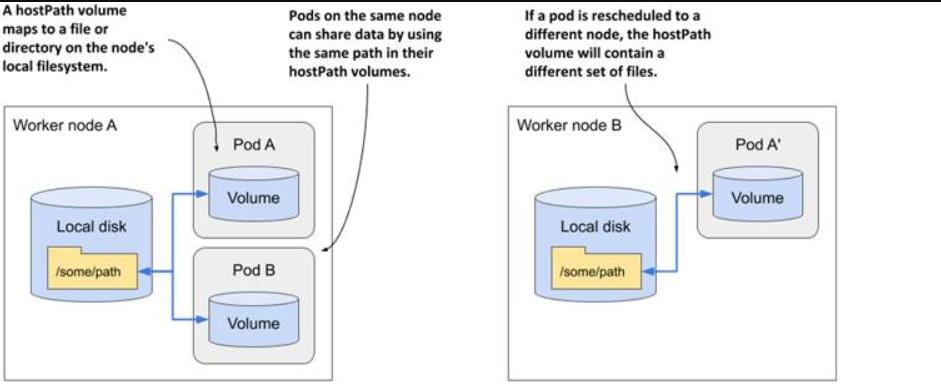

> # Accessing files on the worker node’s filesystem

Most pods are host-agnostic and do not access the node's filesystem, but system-level pods may need to interact with the node's files or devices, which can be facilitated using the hostPath volume type.

## Introducing the hostPath volume

A hostPath volume points to a specific file or directory in the filesystem of the host node. Pods running on the same node and using the same path in their hostPath volume.

<p align = "center">

</p>

A hostPath volume is not a good place to store the data of a database. Because the contents of the volume are stored on the filesystem of a specific node, the database pod will not be able to see the data if it gets rescheduled to another node.

Typically, a hostPath volume is used in cases where the pod actually needs to read or write files written or read by the node itself, such as system-level logs.

The hostPath volume type in Kubernetes is dangerous because it lets pods access files on the node's system. If used without restrictions, it can give users control over the entire node. For example, they could use it to connect to the Docker socket, allowing them to run commands on the host as an administrator. Therefore, it should only be used by trusted, privileged pods to prevent security risks.

## Using a hostPath volume

To demonstrate how dangerous hostPath volumes are, let’s deploy a pod that allows you to explore the entire filesystem of the host node from within the pod

```yaml
apiVersion: v1
kind: Pod
metadata:
  name: node-explorer
spec:
  volumes:
    - name: host-root
      hostPath:
        path: /
  containers:
    - name: node-explorer
      image: alpine
      command: ["sleep", "9999999999"]
      volumeMounts:
        - name: host-root
          mountPath: /host
```

a hostPath volume must specify the path on the host that it wants to mount. The volume in the listing will point to the root directory on the node’s filesystem, providing access to the entire filesystem of the node the pod is scheduled to.

**You can access the pod using this command:**

```shell
kubectl exec -it node-explorer -- sh
```

**You can navigate to the root directory of the node's filesystem by executing the following command:**

```shell
cd /host
```

From here, you can explore the files on the host node. Since the container and the shell command are running as root, you can modify any file on the worker node. Be careful not to break anything.

## Specifying the type for a hostPath volume

you only specified the path for the hostPath volume, but you can also specify the type to ensure that the path represents what that the process in the container expects (a file, a directory, or something else).

- `< empty >:`Kubernetes performs no checks before it mounts the volume.
- `Directory:` Kubernetes checks if a directory exists at the specified path. You use this type if you want to mount a pre-existing directory into the pod and want to prevent the pod from running if the directory doesn’t exist.
- `DirectoryOrCreate:` Same as Directory, but if nothing exists at the specified path, an empty directory is created.
- `File:` The specified path must be a file.
- `FileOrCreate:` Same as File, but if nothing exists at the specified path, an empty file is created.
- `BlockDevice:` The specified path must be a block device.
- `CharDevice:` The specified path must be a character device.
- `Socket:` The specified path must be a UNIX socket.

**Note that if you use FileOrCreate or DirectoryOrCreate, the specified file or directory will be created if it does not already exist**

When the type is FileOrCreate or DirectoryOrCreate and Kubernetes needs to create the file/directory, its file permissions are set to 644 (rw-r--r--) and 755 (rwxr-xr-x), respectively. In either case, the file/directory is owned by the user and group used to run the Kubelet.
