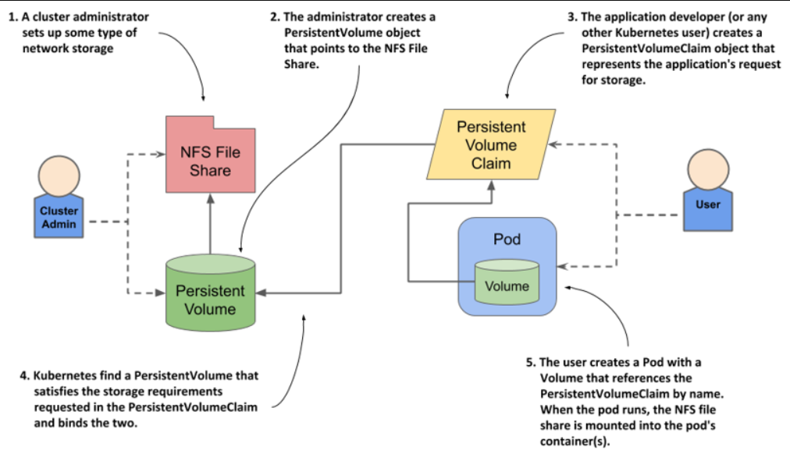

> # Decoupling pods from the underlying storage technology

In Kubernetes, developers should not need to know the underlying storage technology or physical servers, as this is managed by the cluster administrators. Therefore, PersistentVolumes are used to abstract the storage details from the pod manifest, allowing it to remain independent of specific infrastructure information.

## Introducing persistent volumes and claims

**Let's discuss this issue to understand the main reasons for using PersistentVolumes and PersistentVolumeClaims.**

Using an NFS file share in a pod ties the pod definition to a specific cluster due to its reliance on the NFS server's IP and file path, making the pod non-portable across different clusters and requiring modification each time it's deployed elsewhere.

### Introducing persistent volumes

To make a pod definition portable, you should move environment-specific details into a PersistentVolume object, which represents a storage volume in the cluster and separates storage information from the pod configuration

`"portable"` means that the pod definition can be easily moved and used across different Kubernetes clusters without requiring modifications.

`"underlying storage"` refers to the actual physical or virtual storage system where data is saved, like a hard drive or cloud storage

Because the pod manifest no longer contains infrastructure-specific information, it can be used to deploy pods in different clusters. each cluster must now contain a PersistentVolume object with this information.

Now, you're saying that nothing has changed except that the information has been moved from the pod to another file, and the main problem remains unresolved.

but you’ll see later that this new approach enables things that weren’t possible before.

### Introducing persistent volume claims

A pod does not directly reference a PersistentVolume; instead, it references a PersistentVolumeClaim, which in turn references the PersistentVolume and its underlying storage. This setup decouples the ownership of the persistent volume from the pod's lifecycle.

pod -> PersistentVolumeClaim -> PersistentVolume

`PersistentVolumeClaim` object represents a user’s claim on the persistent volume.

The user releases a volume by deleting the PersistentVolumeClaim object that was previously used.

### Using a persistent volume claim in a pod

To use the persistent volume in a pod, you simply reference the persistent volume claim bound to the volume in your pod definition by name.

By creating a PersistentVolumeClaim bound to an NFS file share, you can attach the share to your pod using a volume definition that only includes the claim's name, without needing infrastructure-specific details. Kubernetes then uses the PersistentVolume object referenced by the claim to mount the NFS file share in the pod's container when scheduled to a worker node.

This system with three objects is clearly more complex than what we had in the previous chapter, where the pod simply referred to the NFS File Share directly. Why is this approach better? You’ll find out in the next section.

### Understanding the benefits of using persistent volumes and claims

**Let's understand why we use this complex approach**

The biggest advantage of using persistent volumes and claims is that the infrastructure-specific details are now decoupled from the application represented by the pod. Cluster administrators, who know the data center better than anyone else, can create the PersistentVolume objects with all their infrastructure-related low-level details, while software developers focus solely on describing the applications and their needs via the Pod and PersistentVolumeClaim objects.

Instead of the developer adding a technology-specific volume to their pod, the cluster administrator sets up the underlying storage and then registers it in Kubernetes by creating a PersistentVolume object through the Kubernetes API.

A cluster user creates a PersistentVolumeClaim to request persistent storage, either by specifying a volume name or by defining the required size and access mode. Kubernetes then binds a matching PersistentVolume to the claim, which is referenced in a pod's volume definition. When the pod runs, the storage is attached to the node and mounted into the pod’s containers.

Abstraction allows application developers to create Pod and PersistentVolumeClaim manifests without needing to know the underlying infrastructure, while cluster administrators can provision storage volumes of different sizes without knowing the specifics of the applications that will use them.

**Important information:**

Furthermore, by using dynamic provisioning of persistent volumes, as discussed later in this chapter, administrators don’t need to pre-provision volumes at all. If an automated volume provisioner is installed in the cluster, the physical storage volume and the PersistentVolume object are created on demand for each PersistentVolumeClaim object that users create.
