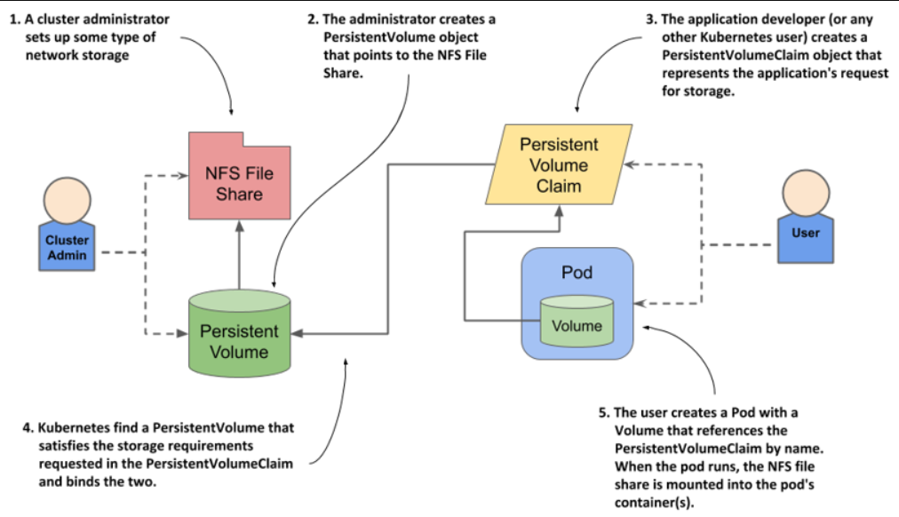

> # Creating persistent volumes and claims

Now that you understand persistent volumes and claims, let's revisit the MongoDB pod from the previous chapter and reconfigure it to use a persistent volume. You'll first act as a cluster administrator to create the persistent volume, and then as a regular user to create the claim and deploy the pod.

## Creating a PersistentVolume object

If you use Google Kubernetes Engine to run these examples, you’ll create a persistent volume that points to a GCE Persistent Disk. You can use the GCE PD that you provisioned in the previous chapter.

### Creating a persistent volume with GCE Persistent Disk as the underlying storage

After you set up the physical volume, you can create a manifest file for the PersistentVolume object.

```yaml
apiVersion: v1
kind: PersistentVolume
metadata:
  name: mongodb-pv #A
spec:
  capacity: #B
    storage: 1Gi #B
  accessModes: #C
    - ReadWriteOnce #C
  gcePersistentDisk: #D
    pdName: mongodb #D
    fsType: ext4 #D
#A The name of this persistent volume

#B The storage capacity of this volume

#C Whether a single node or many nodes can access this volume in read/write or read-only mode.

#D This persistent volume uses the GCE Persistent Disk created in the previous chapter
```

The spec section of a PersistentVolume object defines the volume's storage capacity, access modes, and underlying storage technology details, such as the resource name, filesystem type, and partition name for GCE Persistent Disks

### Creating persistent volumes backed by other storage technologies

If your Kubernetes cluster is on a different cloud provider or uses Minikube, kind, or another setup, you can modify the PersistentVolume manifest to use alternative storage options, such as local directories with hostPath, instead of GCE Persistent Disks.

```yaml
apiVersion: v1 #A
kind: PersistentVolume #A
metadata: #A
  name: mongodb-pv #A
spec: #A
  capacity: #A
    storage: 1Gi #A
  accessModes: #A
    - ReadWriteOnce #A
  hostPath: #B
    path: /tmp/mongodb #B
#A These lines are identical to the GCE PD example from the previous listing

#B Instead of a GCE Persistent Disk, this persistent volume uses a local directory on the host node to store files
```

You’ll notice that the two persistent volume manifests in this and the previous listing differ only in the part that specifies which underlying storage method to use.

`Hint: `to list all other supported technologies that you can use in a persistent volume, run kubectl explain pv.spec

### Specifying the volume capacity

The volume's capacity specifies its size, and each PersistentVolume must declare this capacity so Kubernetes can verify if it meets the requirements of a PersistentVolumeClaim before binding them

### Specifying volume access modes

Each persistent volume must specify a list of accessModes it supports. Depending on the underlying technology, a persistent volume may or may not be mounted by multiple worker nodes simultaneously in read/write or read-only mode. Kubernetes inspects the persistent volume’s access modes to determine if it meets the requirements of the claim.

- `ReadWriteOnce => RWO: `The volume can be mounted by a single worker node in read/write mode. While it’s mounted to the node, other nodes can’t mount the volume.
- `ReadOnlyMany => ROX: ` The volume can be mounted on multiple worker nodes simultaneously in read-only mode.
- `ReadWriteMany => RWX: `The volume can be mounted in read/write mode on multiple worker nodes at the same time.

### Using persistent volumes as block devices

### Creating and inspecting the persistent volume

- Creation

  You can now create the PersistentVolume object by posting the manifest to the Kubernetes API using the now well-known command kubectl apply

  ```shell
  sudo kubectl apply -f <persistent-volume-file-name>.yaml
  ```

- Listing persistent volumes

  ```shell
  #The shorthand for PersistentVolume is pv.
  sudo kubectl get persistentVolume
  ```

- To display a specific PersistentVolume (PV), use the following command.

  ```shell
  sudo kubectl get pv <pv-name> -o yaml
  ```

- To describe a specific PersistentVolume (PV) with more details than the get command, use the following command.

  ```shell
  sudo kubectl describe pv <pv-name>
  ```

The STATUS column shows the persistent volume as Available since it is not yet bound to a PersistentVolumeClaim, as indicated by the empty CLAIM column, and it also displays the volume’s capacity and abbreviated access modes.

## Claiming a persistent volume

Previously, you deployed a MongoDB pod that directly referenced a GCE Persistent Disk; now, to use the same disk through the PersistentVolume object, you must first claim the persistent volume.

### Creating a PersistentVolumeClaim object

To claim a persistent volume, the application developer creates a PersistentVolumeClaim object specifying the required minimum capacity and access modes, as these requirements are dictated by the application, not the cluster administrator.

```yaml
apiVersion: v1
kind: PersistentVolumeClaim
metadata:
  name: mongodb-pvc #A
spec:
  resources:
    requests: #B
      storage: 1Gi #B
  accessModes: #C
    - ReadWriteOnce #C
  storageClassName: "" #D
#A The name of this claim. The pod will reference the claim using this name.
#B The volume must provide at least 1 GiB of storage space.

#C The volume must support mounting by a single node for both reading and writing.

#D Must be set to empty string to disable dynamic provisioning.
```

The field storageClassName is used for dynamic provisioning of persistent volumes. It must be set to an empty string if you want Kubernetes to bind the pre-provisioned persistent volume to this claim instead of dynamically provisioning a new persistent volume.

- Creation

  You can now create the PersistentVolumeClaim object by posting the manifest to the Kubernetes API using the now well-known command kubectl apply

  ```shell
  sudo kubectl apply -f <persistent-volume-claim-file-name>.yaml
  ```

- Listing persistent volume claims

  ```shell
  #The shorthand for PersistentVolume is pv.
  sudo kubectl get persistentVolumeClaim
  ```

- To display a specific PersistentVolumeClaim (PVC), use the following command.

  ```shell
  sudo kubectl get pvc <pvc-name> -o yaml
  ```

- To describe a specific PersistentVolumeClaim (PVC) with more details than the get command, use the following command.

  ```shell
  sudo kubectl describe pvc <pvc-name>
  ```

`Hint: `You can also instruct Kubernetes to bind the claim to a specific persistent volume by specifying its name in the claim’s spec.volumeName field.

```shell
$ kubectl get pv
NAME        CAPACITY  ACCESS MODES  ...  STATUS  CLAIM                ...
mongodb-pv  10Gi      RWO,ROX       ...  Bound   default/mongodb-pvc  ...
```

`Hint: `You may wonder what the word default(`default/mongodb-pvc`) means in the claim name. This is the namespace in which the PersistentVolumeClaim object is located. Namespaces allow objects to be organized into disjoint sets

## Using a persistent volume in a pod

By claiming a persistent volume, your pods gain exclusive access to it until the PersistentVolumeClaim is deleted; to use the volume, refer to the claim in the pod's volume definition.

```yaml
apiVersion: v1
kind: Pod
metadata:
  name: mongodb
spec:
  volumes:
    - name: mongodb-data #A
      persistentVolumeClaim: #B
        claimName: mongodb-pvc #B
  containers:
    - image: mongo
      name: mongodb
      volumeMounts: #C
        - name: mongodb-data #C
          mountPath: /data/db #C
#A The internal name of the volume (applies only within the pod)
#B The volume points to a PersistentVolumeClaim named mongodb-pvc
#C The volume is mounted the same way that other volumes are typically mounted
```

The volume is defined as a persistentVolumeClaim rather than specifying the storage technology, as the application in the pod only requires that the mounted volume meets the requirements in the PersistentVolumeClaim.

## Releasing and re-using persistent volumes

When you delete a pod, the persistent volume remains bound to the PersistentVolumeClaim, allowing access to the same volume and its files if referenced by another pod; to remove the volume and its files, delete the claim, but recreating the claim will not provide access to the same volume.

### Releasing a persistent volume

**Let’s delete the pod and the claim and see what happens:**

```shell
$ kubectl delete pod mongodb
pod "mongodb" deleted
$ kubectl delete pvc mongodb-pvc
persistentvolumeclaim "mongodb-pvc" deleted
```

**Now check the status of the persistent volume:**

```shell
$ kubectl get pv
NAME         ...   RECLAIM POLICY   STATUS     CLAIM
mongodb-pv   ...   Retain           Released   default/mongodb-pvc
```

he STATUS column shows the volume as Released rather than Available, as before the claim was created. The CLAIM column still shows the mongodb-pvc claim to which it was previously bound, even if the claim no longer exists. You’ll understand why in a minute.

### Attempting to bind to a released persistent volume

What happens if you create the claim again? Is the persistent volume bound to the claim so that it can be reused in a pod? Run the following commands to see if this is the case.

```shell
$ kubectl apply -f mongodb-pvc.yaml
persistentvolumeclaim/mongodb-pvc created
$ kubectl get pvc
NAME          STATUS   VOLUME   CAPACITY   ACCESSMODES   STORAGECLASS   AGE
mongodb-pvc   Pending
```

The claim is displayed as Pending because the volume, which has been used and may contain data that needs to be erased, is in a Released state rather than Available; this status indicates that the data may need to be cleared before the volume can be safely claimed again, and the claim name remains on the volume to inform the cluster administrator.

### Making a released persistent volume available for re-use

Deleting and recreating the PersistentVolume object only changes the pointer to the data on the GCE Persistent Disk, ensuring that the data remains intact and accessible, which is crucial for restoring services like MongoDB without data loss.

```yaml
$ kubectl delete pv mongodb-pv
persistentvolume "mongodb-pv" deleted
$ kubectl apply -f mongodb-pv-gcepd.yaml
persistentvolume/mongodb-pv created
$ kubectl get pv
NAME         ...   RECLAIM POLICY   STATUS      CLAIM   ...
mongodb-pv   ...   Retain           Available           ...
```

The persistent volume is now Available again, and since the unbound PersistentVolumeClaim still exists, Kubernetes will soon bind this newly created volume to the claim; you can confirm this by listing the volumes again.

```yaml
$ kubectl get pv
NAME         ...   RECLAIM POLICY   STATUS      CLAIM                 ...
mongodb-pv   ...   Retain           Bound       default/mongodb-pvc   ...
```

There it is. The persistent volume is again bound to the claim. If you now deploy and query MongoDB again, you’ll see that the data in underlying GCE Persistent Disk has not been lost.

`Hint`[❌] how???!!
An alternative way of making the persistent volume available again is to edit the PersistentVolume object and remove the claimRef from the spec section.

```yaml
apiVersion: v1
kind: PersistentVolume
metadata:
  name: example-pv
spec:
  capacity:
    storage: 1Gi
  accessModes:
    - ReadWriteOnce
  hostPath:
    path: /mnt/data
  # claimRef removed to make the volume Available
```

### Configuring the reclaim policy on persistent volumes

When a persistent volume is released, what happens to it depends on its reclaim policy, set in the `.spec.persistentVolumeReclaimPolicy` field of the PersistentVolume object. Here are the three policies:

- Retain: The volume is kept even after the PersistentVolumeClaim is deleted. The cluster administrator must manually handle the volume. This is the default for manually created volumes.
- Delete: Both the PersistentVolume object and the underlying storage are automatically deleted when the claim is deleted. This is the default for dynamically provisioned volumes.
- Recycle: This option is deprecated and should not be used. It typically deletes all files on the volume and makes the volume available again, but support for this option may be unreliable.

## Understanding the lifecycle of manually provisioned persistent volumes and claims

<p align = "center">

</p>

- Manual Provisioning: With manually provisioned persistent volumes, the volume’s lifecycle is separate from the PersistentVolume object; it starts as Available and binds to a PersistentVolumeClaim when it meets the claim’s requirements.

- Pod Usage: Once bound, one or more pods can use the volume through the claim; the volume is mounted in the pods' containers, and the PersistentVolumeClaim can be deleted when pods are done with it.

- Claim Deletion: After a claim is deleted, the reclaim policy determines whether the PersistentVolume object is deleted or marked as Released, preventing further binding.

- Data Retention: Deleting the PersistentVolume object does not affect the underlying volume or its data, which can be accessed again by creating a new PersistentVolume object referencing the same volume.
