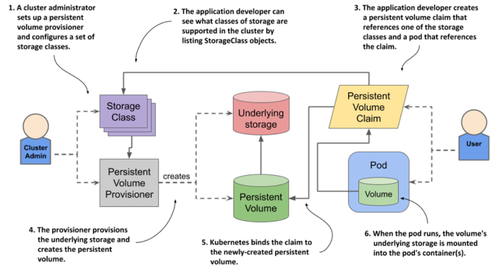
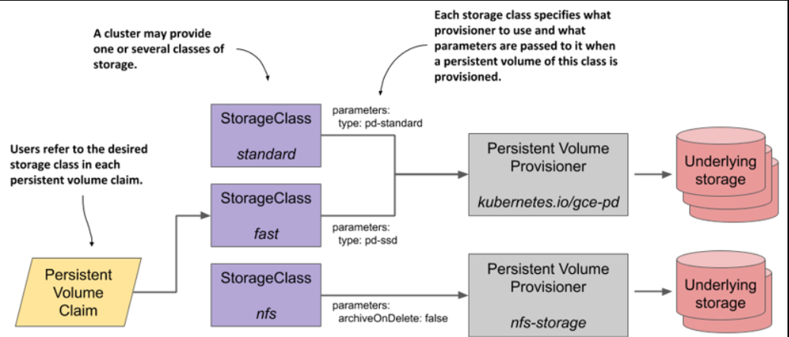
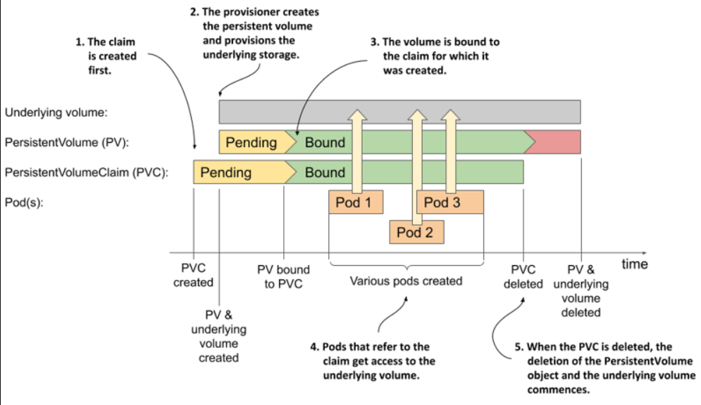

> # Dynamic provisioning of persistent volumes

Dynamic provisioning of persistent volumes in Kubernetes automates the creation and management of storage resources, eliminating the need for manual pre-provisioning, tracking, and cleanup by administrators.

With dynamic provisioning, instead of provisioning persistent volumes in advance (and manually), the cluster admin deploys a persistent volume provisioner to automate the just-in-time provisioning process,

<p align = "center">

</p>

In contrast to static provisioning, the order in which the claim and the volume arise is reversed. When a user creates a persistent volume claim, the dynamic provisioner provisions the underlying storage and creates the PersistentVolume object for that particular claim. The two objects are then bound.

## Introducing the StorageClass object

The persistent volume claim definition you created in the previous section specifies the minimum size and the required access modes of the volume, but it also contains a field named storageClassName, which wasn’t discussed yet.

A Kubernetes cluster can run multiple persistent volume provisioners, and a single provisioner may support several different types of storage volumes. When creating a claim, you use the storageClassName field to specify which storage class you want.

- Listing storage classes

  The storage classes available in the cluster are represented by StorageClass API objects. You can list them with the kubectl get command:

  ```shell
  kubectl get sc
  ```

  In most clusters, a default storage class, often named "standard," is automatically used for provisioning persistent volumes when no specific storage class is specified in the claim.

  `NOTE`

  Remember that omitting the storageClassName field causes the default storage class to be used, whereas explicitly setting the field to "" disables dynamic provisioning and causes an existing volume to be selected and bound to the claim.

- Inspecting the default storage class

  Let’s get to know the StorageClass object kind by looking at the YAML definition of the standard storage class using the kubectl get command. The output of the command is shown in the following listing.

  ```shell
  kubectl get sc standard -o yaml
  ```

  ```yaml
  apiVersion: storage.k8s.io/v1
  kind: StorageClass
  metadata:
  annotations:
    storageclass.kubernetes.io/is-default-class: "true" #A
  name: standard #B
  ---
  provisioner: rancher.io/local-path #C
  reclaimPolicy: Delete #D
  volumeBindingMode: WaitForFirstConsumer #E
  #A This marks the storage class as default.
  #B The name of this storage class
  #C The name of the provisioner that gets called to provision persistent volumes of this class.
  #D The reclaim policy for persistent volumes of this class.
  #E How volumes of this class are provisioned and bound.
  ```

  - To display detailed information about a specific StorageClass

  ```shell
  sudo kubectl explain sc <sc-name>
  ```

`NOTE`
You’ll notice that StorageClass objects have no spec or status sections. This is because the object only contains static information

**Explanation of the `volumeBindingMode` section in the StorageClass**

If volumeBindingMode is set to `WaitForFirstConsumer`, the Persistent Volume (PV) will be created only when a pod that requires it is scheduled, ensuring that the storage is provisioned in the correct availability zone or node. If it's not set or is set to `Immediate`, the PV is created immediately when the Persistent Volume Claim (PVC) is submitted, regardless of whether a pod is using it.

A StorageClass defines the type of storage to be dynamically provisioned, specifying the provisioner and parameters, allowing users to select the appropriate storage class for their persistent volume claims.

<p align = "center">

</p>

## Dynamic provisioning using the default storage class

### Creating a claim with dynamic provisioning

To dynamically provision a persistent volume using the storage class from the previous section, create a PersistentVolumeClaim with the storageClassName field set to "standard," or omit the field entirely to default to "standard," as shown in the following example.

- Manifest for PersistentVolumeClaim:

  ```yaml
  apiVersion: v1
  kind: PersistentVolumeClaim
  metadata:
  name: mongodb-pvc-default
  spec: #A
  resources: #A
    requests: #A
    storage: 1Gi #A
  accessModes: #A
    - ReadWriteOnce #A
  ```

- Let's create this PersistentVolumeClaim using the following YAML file.

  ```shell
  sudo kubectl apply -f pvcYaml.yaml
  ```

- Let's show this PersistentVolumeClaim.

  ```shell
  sudo kubectl get pvc mongodb-pvc-default
  # ouput
    NAME                 STATUS   VOLUME  CAPACITY  ACCESS MODES   STORAGECLASS
    mongodb-pvc-default  Pending                                   standard
  ```

  As expected and as indicated in the STORAGECLASS column, the claim you just created uses the standard storage class.

### Understanding why a claim’s status is Pending

The PersistentVolumeClaim may appear as "Pending" if no matching PersistentVolume exists. However, with dynamic provisioning, the claim remains in "Pending" until a pod that uses the claim is created. The claim's pending status is not due to provisioning delay but because the volume is only created once the claim is used by a pod.

## Creating storage classes

Kubernetes clusters deployed with the kind tool have a single storage class, and GKE clusters also use one storage class, but with a different provisioner that creates GCE Persistent Disks instead of local volumes.

- The standard storage class in GKE

  ```yaml
  apiVersion: storage.k8s.io/v1
  kind: StorageClass
  metadata:
  name: standard
  annotations:
      storageclass.kubernetes.io/is-default-class: "true"
      ...
  provisioner: kubernetes.io/gce-pd       #A
  parameters:                             #B
    type: pd-standard                     #B
  volumeBindingMode: Immediate
  allowVolumeExpansion: true
  reclaimPolicy: Delete

  #A The provisioner used to provision volumes of this storage class
  #B This type parameter is passed to the provisioner
  ```

  `type: pd-standard` indicates the type of Persistent Disk to be provisioned by the kubernetes.io/gce-pd provisioner. Here, pd-standard refers to a standard (non-SSD) Persistent Disk type provided by Google Cloud Engine (GCE). This parameter directs the provisioner to create disks of this type when fulfilling Persistent Volume Claims.

- Using an SSD persistent disk in GKE

  ```yaml
  apiVersion: storage.k8s.io/v1 #A
  kind: StorageClass #A
  metadata:
  name: fast #B
  provisioner: kubernetes.io/gce-pd #C
  parameters:
  type: pd-ssd #D
  #A This manifest defines a StorageClass object
  #B The name of this storage class
  #C The provisioner to use
  #D Tells the provisioner to provision an SSD disk
  ```

## Claiming a volume of a specific storage class

In this YAML file, you specify the storage class name and set it to "fast." Here is the YAML file with that name: [fast](./8_3.md/#creating-storage-classes)

```yaml
apiVersion: v1
kind: PersistentVolumeClaim
metadata:
  name: mongodb-pvc-fast
spec:
  storageClassName: fast #A
  resources:
    requests:
      storage: 1Gi
  accessModes:
    - ReadWriteOnce
#A This claim requests that this specific storage class be used to provision the volume.
```

## Resizing persistent volumes

### Requesting a larger volume in an existing persistent volume claim

With dynamic provisioning, you can increase the size of a persistent volume by requesting a larger capacity in the associated PersistentVolumeClaim, such as the mongodb-pvc-default claim in your cluster.

To modify the claim, either edit the manifest file directly or create a copy and update it to change the desired size.

```yaml
metadata:
  name: mongodb-pvc-default #A
spec:
  resources: #B
    requests: #B
      storage: 10Gi
#A Ensure that the name matches the name of the existing claim.

#B Request a larger amount of storage.
```

When you apply this file with the kubectl apply command, the existing PersistentVolumeClaim object is updated. Use the kubectl get pvc command to see if the volume’s capacity has increased.

The CAPACITY column in claim listings shows the size of the bound volume, not the requested size. If the size hasn't changed, it indicates that the volume's size hasn't been updated. Let's investigate further.

### Determining why the volume hasn’t been resized

To understand why the volume size hasn't changed despite updating the claim, inspect the claim using kubectl describe, where you'll find a condition explaining why the volume wasn't resized.

```shell
$ kubectl describe pvc mongodb-pvc-default
...
Conditions:
  Type                      Status  ... Message
  ----                      ------  ... -------
  FileSystemResizePending   True        Waiting for user to (re-)start a
                                        pod to finish file system resize of
                                        volume on node.
```

To resize the persistent volume, you need to delete and recreate the pod that uses the claim.

### Allowing and disallowing volume expansion in the storage class

Cluster users can increase the size of a bound persistent volume by updating the PersistentVolumeClaim, but only if supported by the provisioner and storage class. The spec.allowVolumeExpansion field in the storage class determines if resizing is allowed, and attempts to expand a non-expandable volume will be immediately rejected by the API server.

[For example, take a look at the StorageClass YAML](./8_3.md/#creating-storage-classes)

## Understanding the benefits of dynamic provisioning

This section on dynamic provisioning should convince you that automating the provisioning of persistent volumes benefits both the cluster administrator and anyone who uses the cluster to deploy applications. By setting up the dynamic volume provisioner and configuring several storage classes with different performance or other features, the administrator gives cluster users the ability to provision as many persistent volumes of any type as they want. Each developer decides which storage class is best suited for each claim they create.

`NOTE`

Remember that persistent volume claims are usually part of the application manifest and are written by application developers.

## Understanding the lifecycle of dynamically provisioned persistent volumes

<p align = "center">

</p>
