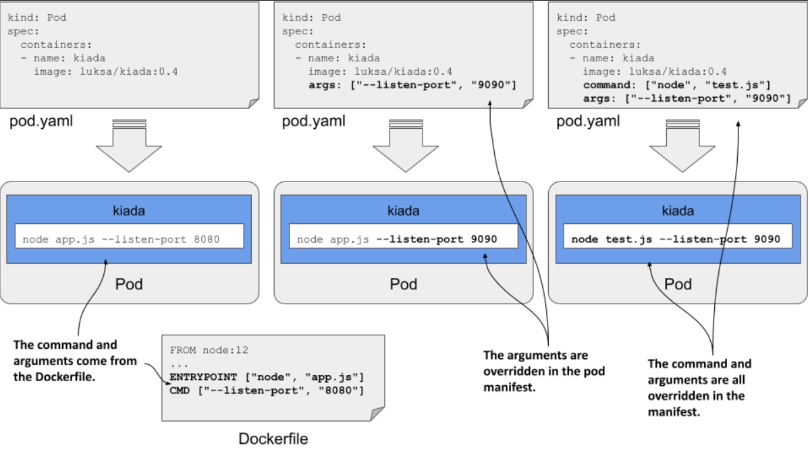
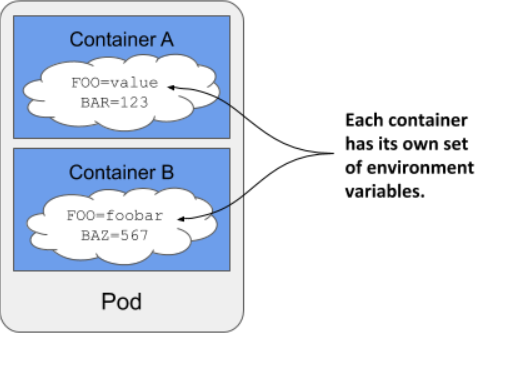
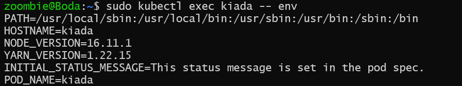
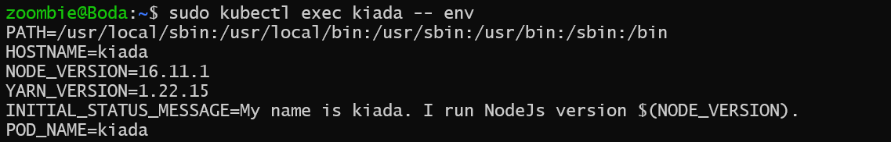

> # Setting the command, arguments, and environment variables

## Setting the command and arguments

### Why use command and args in a Kubernetes manifest, and what are they?

**Before proceeding, let's review the difference between ENTRYPOINT and CMD.**

- ENTRYPOINT: Defines the main command that will always be run when the container starts. It is used to set up the executable for the container.

- CMD: Provides default arguments to the ENTRYPOINT command or specifies the command to run if ENTRYPOINT is not set. It can be overridden at runtime.

**New Important Information:**

In Kubernetes, you can specify configurations equivalent to Docker's ENTRYPOINT and CMD using the command and args fields in a Pod's container specification.

**Let's discuss some issues:**

If you need to rewrite the command in the Dockerfile that specifies how your container should run in the pod, you will need to change the Dockerfile every time.

**Ask yourself: Is this the best practice?**

Logically, the answer should be no, as changing the Dockerfile every time you want to modify the command is inefficient. Instead, the best solution is to use the command and args fields in the Kubernetes manifest file, which allows you to specify the command and its arguments without altering the Dockerfile.

**Consider the following scenario: if you specify a command both in the Dockerfile(ENTRYPOINT and CMD) and in the Kubernetes manifest(command and args), what will happen?**

If you specify both ENTRYPOINT and CMD in a Dockerfile and then provide command and args in a Kubernetes manifest, Kubernetes will use the command and args fields from the manifest file, which will override the ENTRYPOINT and CMD settings in the Dockerfile.

**Overriding the command and arguments in the pod manifest**

<p align = "center">

</p>

### Setting the command

**Problem:**

To enable CPU and heap profiling for the Kiada application, you can pass --cpu-prof and --heap-prof arguments to the node command. Instead of modifying the Dockerfile and rebuilding the image, you can achieve this by updating the pod manifest.

**Solution:**

```yaml
kind: Pod
spec:
  containers:
    - name: kiada
      image: luksa/kiada:0.4
      command: ["node", "--cpu-prof", "--heap-prof", "app.js"]
```

**Another way to specify the command is:**

The command field in the Kubernetes manifest, similar to its Dockerfile counterpart, accepts an array of strings for the command to execute. While array notation is useful for a few elements, it becomes cumbersome with more elements, and an alternative notation may be preferred for better readability.

```yaml
command:
  - node
  - --cpu-prof
  - --heap-prof
  - app.js
```

## Setting environment variables in a container

Containerized applications are often configured using environment variables. Just like the command and arguments, you can set environment variables for each of the pod’s containers.

<p align = "center">

</p>

`NOTE`

As I write this, environment variables can only be set for each container individually. It isn’t possible to set a global set of environment variables for the entire pod and have them inherited by all its containers.

### Setting a literal value to an environment variable

To set the environment variable, you could add the ENV directive to the Dockerfile and rebuild the image, but the faster way is to add the env field to the container definition in the pod manifest

```yaml
apiVersion: v1
kind: Pod
metadata:
  name: kiada
spec:
  containers:
    - name: kiada
      image: luksa/kiada:0.4
      env:
        - name: POD_NAME
          value: kiada
        - name: INITIAL_STATUS_MESSAGE
          value: This status message is set in the pod spec.
```

**Apply this manifest:**

```bash
sudo kubectl apply -f  pod.yaml
```

**Output of environment variables :**

<p align = "center">

</p>

### Using variable references in environment variable values

you set a fixed value for the environment variable INITIAL_STATUS_MESSAGE, but you can also reference other environment variables in the value by using the syntax $(VAR_NAME).

```yaml
env:
  - name: POD_NAME
    value: kiada
  - name: INITIAL_STATUS_MESSAGE
    value: My name is $(POD_NAME). I run NodeJS version $(NODE_VERSION).
```

**Reapply the above manifest with the changes in the env section:**

```bash
sudo kubectl apply -f  pod.yaml
```

**Output of environment variables :**

<p align = "center">

</p>

As you can see, the reference to NODE_VERSION isn’t resolved. This is because you can only use the $(VAR_NAME) syntax to refer to variables defined in the same manifest. The referenced variable must be defined before the variable that references it. Since NODE_VERSION is defined in the NodeJS image’s Dockerfile and not in the pod manifest

### Using variable references in the command and arguments

You can refer to environment variables defined in the manifest not only in other variables, but also in the command and args fields you learned about in the previous section

```yaml
spec:
  containers:
    - name: kiada
      image: luksa/kiada:0.4
      args:
        - --listen-port
        - $(LISTEN_PORT)
      env:
        - name: LISTEN_PORT
          value: "8080"
```

### Referring to environment variables that aren’t in the manifest

Use $VAR_NAME or ${VAR_NAME} in a bash shell to resolve variables instead of $(VAR_NAME)

```yaml
containers:
  - name: main
    image: alpine
    command:
      - sh
      - -c
      - 'echo "Hostname is $HOSTNAME."; sleep infinity'
```
