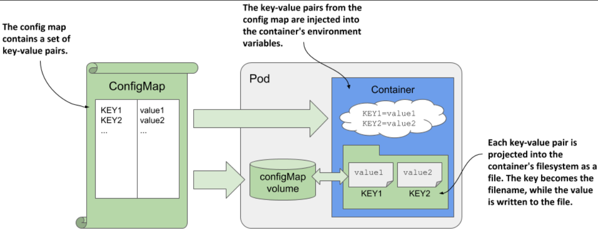
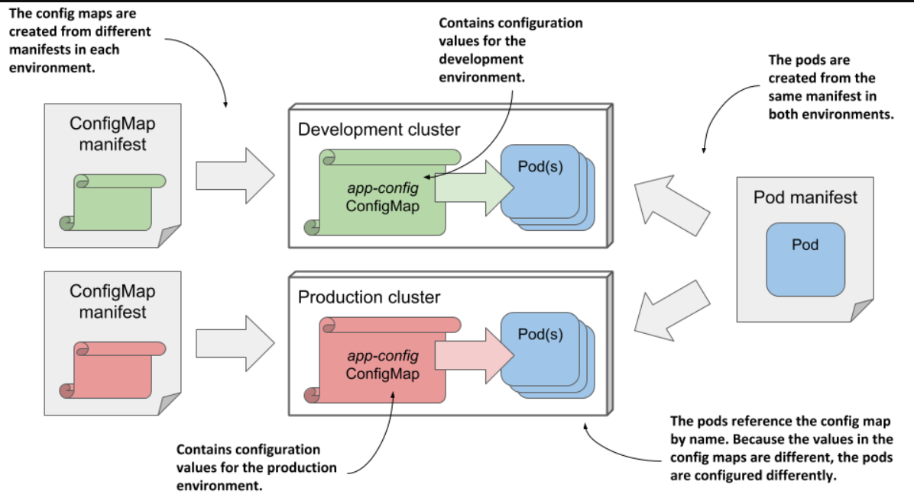

> # Using a config map to decouple configuration from the pod

You learned how to hardcode configuration directly into your pod manifests. While this is much better than hard-coding in the container image, it’s still not ideal because it means you might need a separate version of the pod manifest for each environment you deploy the pod to, such as your development, staging, or production cluster.

To reuse the same pod definition in multiple environments, it’s better to decouple the configuration from the pod manifest. One way to do this is to move the configuration into a ConfigMap object, which you then reference in the pod manifest

## Introducing ConfigMaps

A ConfigMap is a Kubernetes API object that simply contains a list of key/value pairs.

To keep apps independent of Kubernetes, they don't directly read ConfigMaps using Kubernetes APIs. Instead, the key/value pairs in a ConfigMap are given to containers as environment variables or mounted as files inside the container.

<p align = "center">

</p>

By storing configuration in a separate ConfigMap, you can maintain different settings for each environment while using **the same pod manifest**. Since pods reference the **ConfigMap by name**, you can deploy the same pod manifest across all environments and apply different configurations by using separate ConfigMap manifests for each environment.

<p align = "center">

</p>

## Creating a ConfigMap object

`NOTE`

Keys in a config map may only consist of alphanumeric characters, dashes, underscores, or dots. Other characters are not allowed.

- Creating a config map with the kubectl create config-map command

  ```yaml
  sudo kubectl create configmap kiada-config --from-literal port-number=9090
  ```

  - `--from-literal: `Inserts a key and a literal value into the config map. Example: --from-literal mykey=myvalue.
  - `--from-file: `Inserts the contents of a file into the config map. The behavior depends on the argument that comes after --from-file:

- Creating a config map from a YAML manifest
  ```yaml
  apiVersion: v1
  kind: ConfigMap
  metadata:
    name: kiada-config
  data:
    status-message: This status message is set in the kiada-config config map
  ```
- Listing config maps and displaying their contents

  ```bash
  sudo kubectl get cm
  # You can display the entries in the config map by instructing kubectl to print its YAML manifest
  sudo kubectl get cm <config-map-name> -o yaml
  #To display only the key/value pairs, combine kubectl with jq

  kubectl get cm kiada-config -o json | jq .data
  ```

## Injecting config map values into environment variables

To inject the single config map entry into an environment variable

```yaml
spec:
  containers:
    - name: kiada
      env:
        - name: INITIAL_STATUS_MESSAGE
          valueFrom:
            configMapKeyRef:
              name: kiada-config
              key: status-message
              optional: true
```

`NOTE`

If a config map or key referenced in the container definition is missing and not marked as `optional`, the pod will still be scheduled normally. The other containers in the pod are started normally. The container that references the missing config map key is started as soon as you create the config map with the referenced key.

- Injecting the entire config map

  By using the envFrom field instead of the env field, you can inject all the entries from the ConfigMap into the container

  ```yaml
  spec:
  containers:
    - name: kiada
      envFrom:
        - configMapRef:
            name: kiada-config
            optional: true
  ```

**Replace the config map with the one in the file by running the following command:**

```bash
kubectl replace -f cm.kiada-config.envFrom.yaml
```

## Updating and deleting config maps

- In-place editing of API objects using kubectl edit

  When you want to make a quick change to an API object, such as a ConfigMap, you can use the kubectl edit command

  ```yaml
  sudo kubectl edit configmap kiada-envoy-config
  ```

- Preventing a config map from being updated

  To prevent users from changing the values in a config map, you can mark the config map as immutable

  ```yaml
  kind: ConfigMap
  metadata:
    name: my-immutable-configmap
  data:
    mykey: myvalue
    another-key: another-value
  immutable: true
  ```

- Deleting a config map

  ```bash
  sudo kubectl delete <config-map-name>
  ```
