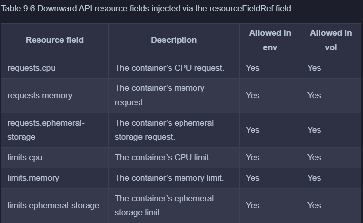

> # Passing pod metadata to the application via the Downward API

## Introducing the Downward API

- The useful aspects of the Kubernetes Downward API are:

  - Expose Pod and Container Metadata: It allows you to access metadata about the pod and container.
  - Environment Variables or Files: You can pass this metadata via environment variables or files, avoiding repetition in container definitions.

- Understanding what the Downward API
  The Downward API isn’t a REST endpoint that your app needs to call to get the data. It’s simply a way to inject values from the pod’s metadata, spec, or status fields down into the container.

    <p align = "center">
    
    </p>

  As you can see, this is no different from setting environment variables or projecting files from config maps and secrets, except that the values come from the pod object itself.

- Understanding what metadata can be injected

  - Using `fieldRef`

    <p align = "center">
    
    </p>

  - Using `resourceFieldRef`

    <p align = "center">
    
    </p>

## Injecting pod metadata into environment variables

- Injecting pod object fields

  ```yaml
  apiVersion: v1
  kind: Pod
  metadata:
  name: kiada-ssl
  spec:
  containers:
    - name: kiada
      image: luksa/kiada:0.4
      env:
        # use downward api to get metadata.name, status.podIp, ...
        - name: POD_NAME
          valueFrom:
            fieldRef:
              fieldPath: metadata.name
        - name: POD_IP
          valueFrom:
            fieldRef:
              fieldPath: status.podIP
        - name: NODE_NAME
          valueFrom:
            fieldRef:
              fieldPath: spec.nodeName
        - name: NODE_IP
          valueFrom:
            fieldRef:
              fieldPath: status.hostIP
      ports:
        - containerPort: 80
  ```

- Injecting container resource fields
  ```yaml
  env:
    - name: MAX_CPU_CORES
      valueFrom:
        resourceFieldRef:
          resource: limits.cpu
    - name: MAX_MEMORY_KB
      valueFrom:
        resourceFieldRef:
          resource: limits.memory
          divisor: 1k
  ```
