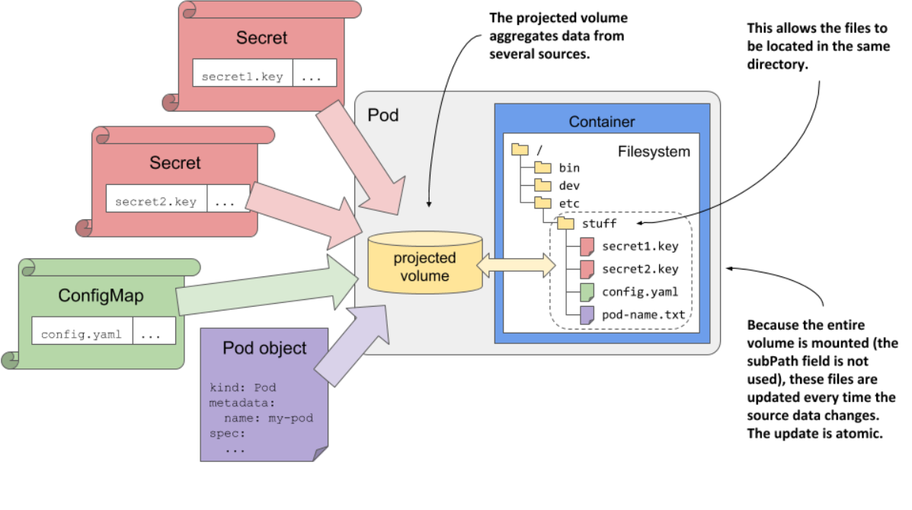

# > Using projected volumes to combine volumes into one

In Kubernetes, while you can use volumes to inject data from ConfigMaps, Secrets, and Pods, you can't combine multiple sources into the same directory without using subPath. However, subPath doesn't support dynamic updates when the source data changes. To combine data from multiple sources into a single volume with dynamic updates, use the projected volume type

## Introducing the projected volume type

Projected volumes allow you to combine information from multiple config maps, secrets, and the Downward API into a single pod volume that you can then mount in the pod’s containers. They behave exactly like the configMap, secret, and downwardAPI volumes

  

    
    

